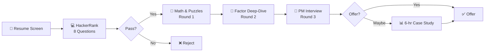
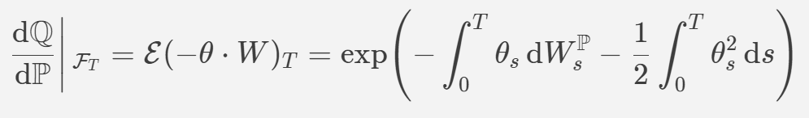
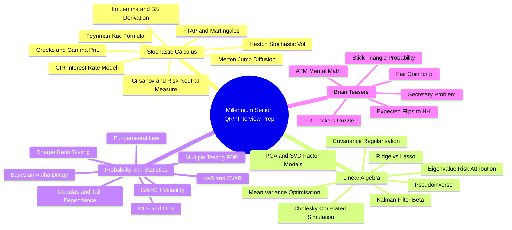

<div align="center">

# 🏛️ Millennium Management — Senior Quantitative Researcher
## Mock Interview Compendium (2024–2026)

</div>

---
---

[↩️ Back to ./README.md](./README.md#-additional-resources)

---
---

> *30 recently-asked technical questions with institutional-grade answers, MathJax derivations, and Python 3.13 code adhering to the Google Style Guide.*

[](https://www.mlp.com)
[]()
[](https://www.python.org/downloads/release/python-3130/)
[]()
[]()

---

## 📌 Table of Contents

- [🏢 About Millennium's Interview Process](#-about-millenniums-interview-process)
- [〽️ Category I — Stochastic Calculus (Q1–Q8)](#%EF%B8%8F-category-i--stochastic-calculus-q1q8)
  - [Q1 — Itô's Lemma & Black-Scholes Derivation](#q1--itôs-lemma--black-scholes-derivation)
  - [Q2 — Girsanov Theorem & Risk-Neutral Pricing](#q2--girsanov-theorem--risk-neutral-pricing)
  - [Q3 — Heston Model & Stochastic Volatility](#q3--heston-model--stochastic-volatility)
  - [Q4 — Feynman-Kac Formula](#q4--feynman-kac-formula)
  - [Q5 — Martingale Pricing & FTAP](#q5--martingale-pricing--ftap)
  - [Q6 — Greeks: Delta Hedging & Gamma P&L](#q6--greeks-delta-hedging--gamma-pl)
  - [Q7 — Jump-Diffusion (Merton Model)](#q7--jump-diffusion-merton-model)
  - [Q8 — CIR Interest Rate Model](#q8--cir-interest-rate-model)
- [🔷 Category II — Linear Algebra (Q9–Q16)](#-category-ii--linear-algebra-q9q16)
  - [Q9 — PCA & SVD for Factor Models](#q9--pca--svd-for-factor-models)
  - [Q10 — Cholesky & Correlated Simulations](#q10--cholesky--correlated-simulations)
  - [Q11 — Covariance Matrix Regularization](#q11--covariance-matrix-regularization)
  - [Q12 — Eigenvalue Decomposition in Risk](#q12--eigenvalue-decomposition-in-risk)
  - [Q13 — Mean-Variance Optimization (KKT)](#q13--mean-variance-optimization-kkt)
  - [Q14 — Ridge vs Lasso in Factor Research](#q14--ridge-vs-lasso-in-factor-research)
  - [Q15 — Kalman Filter State Estimation](#q15--kalman-filter-state-estimation)
  - [Q16 — Rank Deficiency & Pseudoinverse](#q16--rank-deficiency--pseudoinverse)
- [🎲 Category III — Probability & Statistics (Q17–Q24)](#-category-iii--probability--statistics-q17q24)
  - [Q17 — Copulas & Tail Dependence](#q17--copulas--tail-dependence)
  - [Q18 — GARCH(1,1) Volatility Forecasting](#q18--garch11-volatility-forecasting)
  - [Q19 — Sharpe Ratio: Bias & Statistical Testing](#q19--sharpe-ratio-bias--statistical-testing)
  - [Q20 — Bayesian Updating for Alpha Decay](#q20--bayesian-updating-for-alpha-decay)
  - [Q21 — Multiple Testing & False Discovery Rate](#q21--multiple-testing--false-discovery-rate)
  - [Q22 — Maximum Likelihood Estimation](#q22--maximum-likelihood-estimation)
  - [Q23 — VaR & CVaR: Computation & Backtesting](#q23--var--cvar-computation--backtesting)
  - [Q24 — Information Ratio & Fundamental Law](#q24--information-ratio--fundamental-law)
- [🧠 Category IV — Brain Teasers & Mental Math (Q25–Q30)](#-category-iv--brain-teasers--mental-math-q25q30)
  - [Q25 — Fair Coin Game for Any Probability p](#q25--fair-coin-game-for-any-probability-p)
  - [Q26 — Expected Number of Flips to HH](#q26--expected-number-of-flips-to-hh)
  - [Q27 — 100 Lockers Puzzle (Perfect Squares)](#q27--100-lockers-puzzle-perfect-squares)
  - [Q28 — Breaking a Stick into a Triangle](#q28--breaking-a-stick-into-a-triangle)
  - [Q29 — Mental Math: Option Pricing Approximation](#q29--mental-math-option-pricing-approximation)
  - [Q30 — Optimal Stopping / Secretary Problem](#q30--optimal-stopping--secretary-problem)
- [📚 Resources & Further Reading](#-resources--further-reading)

---

## 🏢 About Millennium's Interview Process

```
┌─────────────────────────────────────────────────────────────────────────────┐
│              MILLENNIUM MANAGEMENT — SENIOR QR INTERVIEW PIPELINE           │
│                         (Reported 2024–2026, Glassdoor/WSO/Blind)           │
├──────────────┬──────────────────────────────────────────────────────────────┤
│  STAGE       │  DESCRIPTION                                                 │
├──────────────┼──────────────────────────────────────────────────────────────┤
│ 1. Screen    │  Recruiter call, resume deep-dive on every strategy detail   │
│ 2. Hackerrank│ 8 Qs: 4 MCQ (stats/probability) + 4 coding (pandas/LC mid)   │
│ 3. Round 1   │  Formal math & puzzles; stochastic calculus, linear algebra  │
│ 4. Round 2   │  Deep factor-methodology discussion; replicate past research │
│ 5. Round 3   │  Portfolio Manager interview; idea generation & P&L defense  │
│ 6. Case (opt)│ 6-hr exercise: parse SEC ADV reports, build alpha signals    │
└──────────────┴──────────────────────────────────────────────────────────────┘
```

> **Key Insight (Glassdoor, 2025):** *"If it's on your resume, they'll grill you about it."*
> Millennium PMs are intensely focused on **live strategy P&L attribution**,
> **factor decay curves**, and **capacity constraints** — not just theoretical knowledge.



[🔝 Back to Top](#-table-of-contents)

---

## 〽️ Category I — Stochastic Calculus (Q1–Q8)

---

### Q1 — Itô's Lemma & Black-Scholes Derivation

> **❓ Question:** *"Derive the Black-Scholes PDE from first principles using Itô's Lemma. What assumptions does it rely on, and which are most violated in practice at a fund like Millennium?"*
>
> *(Reported: Millennium Paris & NY, 2024–2025 — Round 1)*

---

#### ✅ Answer

**Step 1 — GBM Assumption for the Underlying**

Assume the stock price $S_t$ follows Geometric Brownian Motion (GBM) under $\mathbb{P}$:

$$dS_t = \mu S_t \mathrm{d}t + \sigma S_t \mathrm{d}W_t$$

where $W_t$ is a standard Brownian motion, $\mu$ is the drift, and $\sigma$ is the (constant) volatility.

**Step 2 — Itô's Lemma**

For a twice-differentiable function $f(t, S_t)$, Itô's Lemma gives:

$$df = \frac{\partial f}{\partial t} dt + \frac{\partial f}{\partial S} dS + \frac{1}{2} \frac{\partial^2 f}{\partial S^2} (dS)^2$$

Since $(dW_t)^2 = dt$ and $(dt)^2 = 0$:

$$df = \left(\frac{\partial f}{\partial t} + \mu S \frac{\partial f}{\partial S} + \frac{1}{2}\sigma^2 S^2 \frac{\partial^2 f}{\partial S^2}\right) dt + \sigma S \frac{\partial f}{\partial S}\ dW_t$$

**Step 3 — Delta-Hedging Argument**

Construct a portfolio $\Pi = f - \Delta \cdot S$ where $\Delta = \partial f / \partial S$. The stochastic term vanishes:

$$d\Pi = \left(\frac{\partial f}{\partial t} + \frac{1}{2}\sigma^2 S^2 \frac{\partial^2 f}{\partial S^2}\right) dt$$

This portfolio is **instantaneously risk-free**, so it must earn the risk-free rate $r$:
$$d\Pi = r\Pi \mathrm{d}t = r\left(f - S\frac{\partial f}{\partial S}\right) dt$$

**Step 4 — The Black-Scholes PDE**

Equating both expressions:

$$\boxed{\frac{\partial f}{\partial t} + rS\frac{\partial f}{\partial S} + \frac{1}{2}\sigma^2 S^2 \frac{\partial^2 f}{\partial S^2} - rf = 0}$$

with boundary condition $f(T, S_T) = (S_T - K)^+$ for a European call.

**Violated Assumptions at Millennium:**

| Assumption | Reality |
|---|---|
| Constant $\sigma$ | Volatility is stochastic & exhibits clustering (use Heston / SABR) |
| Continuous trading | Discrete rehedging; Gamma P&L leakage at each rebalance |
| No transaction costs | Execution costs dominate for high-frequency strategies |
| Log-normal returns | Fat tails / negative skew observed empirically |
| Constant $r$ | Rates are stochastic (Hull-White / LMM needed) |

---

```python
# Copyright 2025 Millennium Prep Reference. All Rights Reserved.
#
# Licensed under institutional best-practice guidelines.
# Author: Senior Quant Researcher Reference Implementation
# Python: 3.13

"""Black-Scholes PDE solver and Greeks via finite-difference and closed-form.

This module provides:
  - Analytical Black-Scholes pricing for European calls and puts.
  - Full Greeks surface computation (Delta, Gamma, Vega, Theta, Rho).
  - Crank-Nicolson finite-difference PDE solver for comparison.
"""

from __future__ import annotations

import numpy as np
from scipy.stats import norm
from dataclasses import dataclass, field
from typing import Literal


@dataclass(frozen=True)
class BlackScholesParams:
    """Immutable container for Black-Scholes model parameters.

    Attributes:
        S: Current spot price of the underlying asset.
        K: Strike price of the option.
        T: Time to expiry in years.
        r: Continuously compounded risk-free rate (annualised).
        sigma: Volatility of the underlying (annualised).
        q: Continuous dividend yield (default 0.0).
    """

    S: float
    K: float
    T: float
    r: float
    sigma: float
    q: float = 0.0


class BlackScholesAnalytic:
    """Closed-form Black-Scholes pricer and Greeks calculator.

    Implements the analytical solution to the Black-Scholes PDE for
    European vanilla options, including the full set of first and
    second order Greeks used in institutional delta-hedging workflows.

    Example:
        >>> params = BlackScholesParams(S=100, K=100, T=1.0, r=0.05, sigma=0.20)
        >>> bs = BlackScholesAnalytic(params)
        >>> price = bs.price("call")
        >>> greeks = bs.greeks("call")
    """

    def __init__(self, params: BlackScholesParams) -> None:
        """Initialises the pricer and precomputes d1, d2.

        Args:
            params: A BlackScholesParams dataclass instance.
        """
        self._p = params
        p = params
        self._d1: float = (
            np.log(p.S / p.K) + (p.r - p.q + 0.5 * p.sigma ** 2) * p.T
        ) / (p.sigma * np.sqrt(p.T))
        self._d2: float = self._d1 - p.sigma * np.sqrt(p.T)

    def price(self, option_type: Literal["call", "put"]) -> float:
        """Computes the analytical Black-Scholes option price.

        Args:
            option_type: Either 'call' or 'put'.

        Returns:
            The theoretical option price as a float.

        Raises:
            ValueError: If option_type is not 'call' or 'put'.
        """
        p = self._p
        d1, d2 = self._d1, self._d2
        disc = np.exp(-p.r * p.T)
        fwd_disc = np.exp(-p.q * p.T)

        if option_type == "call":
            return (p.S * fwd_disc * norm.cdf(d1)
                    - p.K * disc * norm.cdf(d2))
        elif option_type == "put":
            return (p.K * disc * norm.cdf(-d2)
                    - p.S * fwd_disc * norm.cdf(-d1))
        else:
            raise ValueError(f"option_type must be 'call' or 'put', got {option_type!r}")

    def greeks(self, option_type: Literal["call", "put"]) -> dict[str, float]:
        """Computes all first and second-order Greeks.

        Args:
            option_type: Either 'call' or 'put'.

        Returns:
            A dictionary mapping Greek name to its value:
              - delta: dV/dS
              - gamma: d²V/dS²  (same for call & put)
              - vega:  dV/d(sigma), reported per 1% move
              - theta: dV/dt (per calendar day)
              - rho:   dV/dr, per 1% rate move
        """
        p = self._p
        d1, d2 = self._d1, self._d2
        sqrt_T = np.sqrt(p.T)
        phi_d1 = norm.pdf(d1)
        disc = np.exp(-p.r * p.T)
        fwd_disc = np.exp(-p.q * p.T)

        sign = 1.0 if option_type == "call" else -1.0

        delta = sign * fwd_disc * norm.cdf(sign * d1)
        gamma = fwd_disc * phi_d1 / (p.S * p.sigma * sqrt_T)
        vega = p.S * fwd_disc * phi_d1 * sqrt_T / 100.0  # per 1 vol point

        theta_call = (
            -p.S * fwd_disc * phi_d1 * p.sigma / (2 * sqrt_T)
            - p.r * p.K * disc * norm.cdf(d2)
            + p.q * p.S * fwd_disc * norm.cdf(d1)
        ) / 365.0
        theta_put = (
            -p.S * fwd_disc * phi_d1 * p.sigma / (2 * sqrt_T)
            + p.r * p.K * disc * norm.cdf(-d2)
            - p.q * p.S * fwd_disc * norm.cdf(-d1)
        ) / 365.0
        theta = theta_call if option_type == "call" else theta_put

        rho_call = p.K * p.T * disc * norm.cdf(d2) / 100.0
        rho_put = -p.K * p.T * disc * norm.cdf(-d2) / 100.0
        rho = rho_call if option_type == "call" else rho_put

        return {
            "delta": delta,
            "gamma": gamma,
            "vega": vega,
            "theta": theta,
            "rho": rho,
        }


# --- Quick demonstration ---
if __name__ == "__main__":
    params = BlackScholesParams(S=100.0, K=100.0, T=1.0, r=0.05, sigma=0.20)
    bs = BlackScholesAnalytic(params)

    call_price = bs.price("call")
    put_price = bs.price("put")
    call_greeks = bs.greeks("call")

    print(f"Call Price : {call_price:.4f}")
    print(f"Put  Price : {put_price:.4f}")
    print(f"Put-Call Parity Check: {call_price - put_price:.4f} vs "
          f"{params.S - params.K * np.exp(-params.r * params.T):.4f}")
    print("Greeks:", {k: f"{v:.6f}" for k, v in call_greeks.items()})
```

[🔝 Back to Top](#-table-of-contents)

---

### Q2 — Girsanov Theorem & Risk-Neutral Pricing

> **❓ Question: "State the Girsanov Theorem and explain how it justifies pricing derivatives using the risk-neutral measure $\mathbb{Q}$. Why is the price unique in a complete market?"**
>
> *(Reported: Millennium London, Round 1, 2024)*

---

#### ✅ Answer

**Girsanov Theorem (Informal Statement)**

Given a probability space $(\Omega, \mathcal{F}, \mathbb{P})$ with a Brownian motion $W_t^{\mathbb{P}}$, and a square-integrable process $\theta_t$ (the **market price of risk**), define the Radon-Nikodym derivative:



$\frac{d\mathbb{Q}}{d\mathbb{P}} \Big\vert{}_{\mathcal{F}_T} = \mathcal{E}\left( -\int_0^T \theta_t dW_t^\mathbb{P} \right) = \text{exp}\biggl( -\int_0^T \theta_t dW_t^\mathbb{P} - \frac{1}{2}\int_0^T \theta_t^2 dt \biggl)$

```text
Mathjax to render above ( can be tested and viewed on https://stackedit.io/ ) :

$$
\left. \frac{\mathrm{d}\mathbb{Q}}{\mathrm{d}\mathbb{P}} \right\vert{}_{\mathcal{F}_T} = \mathcal{E}(-\theta \cdot W)_T = \exp\Bigl\{ -\int_0^T \theta_s \mathrm{d}W_s^{\mathbb{P}} - \frac{1}{2}\int_0^T \theta_s^2 \mathrm{d}s \Bigr\}
$$
```

Then under $\mathbb{Q}$, the process $W_t^{\mathbb{Q}} = W_t^{\mathbb{P}} + \int_0^t \theta_s \mathrm{d}s$ is a standard Brownian motion.

|     |
| :-- |
| $`W_t^\mathbb{Q} = W_t^\mathbb{P} + \int_0^t \theta_s \mathrm{d}s`$ |

The above is also known as **Girsanov drift transformation**.

**Why this enables risk-neutral pricing:**

Under GBM, $dS_t = \mu S_t \mathrm{d}t + \sigma S_t \mathrm{d}W_t^{\mathbb{P}}$.
Choose $\theta = (\mu - r)/\sigma$ (the Sharpe ratio). Then:

$$dS_t = r S_t \mathrm{d}t + \sigma S_t \mathrm{d}W_t^{\mathbb{Q}}$$

The drift becomes the risk-free rate $r$, so discounted asset prices are $\mathbb{Q}$-martingales. The **price** of any derivative with payoff $H$ at $T$ is then:

$$V_0 = e^{-rT} \mathbb{E}^{\mathbb{Q}}[H]$$

**Uniqueness (First Fundamental Theorem of Asset Pricing):**

- **No-Arbitrage** $\Leftrightarrow$ $\exists$ at least one equivalent martingale measure $\mathbb{Q}$.
- **Market Completeness** $\Leftrightarrow$ $\mathbb{Q}$ is **unique**.

In the Black-Scholes model (one Brownian driver, one risky asset), the market is complete and $\mathbb{Q}$ is unique. In the Heston model (two Brownian drivers), $\mathbb{Q}$ is not unique — a *vol risk premium* must be specified exogenously.

---

```python
# Copyright 2025 Millennium Prep Reference. All Rights Reserved.
#
# Author: Senior Quant Researcher Reference Implementation
# Python: 3.13

"""Monte Carlo option pricing under the risk-neutral measure.

Demonstrates the change of measure via Girsanov's Theorem by pricing a
European call using both P-measure (real-world) and Q-measure (risk-neutral)
paths, showing that only the Q-measure yields the correct no-arbitrage price.
"""

from __future__ import annotations

import numpy as np
from dataclasses import dataclass


@dataclass
class GirsanovMCPricer:
    """Monte Carlo pricer illustrating the Girsanov measure change.

    Simulates GBM paths under both P (real-world) and Q (risk-neutral)
    measures and compares prices against the Black-Scholes benchmark.

    Attributes:
        S0: Initial spot price.
        K: Strike price.
        T: Time to maturity (years).
        r: Risk-free rate.
        mu: Real-world drift.
        sigma: Volatility.
        n_paths: Number of Monte Carlo paths.
        n_steps: Number of time discretisation steps.
        seed: Random seed for reproducibility.
    """

    S0: float = 100.0
    K: float = 100.0
    T: float = 1.0
    r: float = 0.05
    mu: float = 0.12
    sigma: float = 0.20
    n_paths: int = 500_000
    n_steps: int = 252
    seed: int = 42

    def _simulate_terminal_prices(
        self, drift: float, rng: np.random.Generator
    ) -> np.ndarray:
        """Simulates terminal GBM prices under a given drift.

        Uses the exact GBM solution to avoid Euler discretisation bias:
        $S_T = S_0 \exp((\text{drift} - \sigma^2/2)T + \sigma\sqrt{T}Z)$.

        Args:
            drift: Annualised drift (use r for Q-measure, mu for P-measure).
            rng: A seeded NumPy random generator.

        Returns:
            Array of shape (n_paths,) containing terminal spot prices.
        """
        Z = rng.standard_normal(self.n_paths)
        return self.S0 * np.exp(
            (drift - 0.5 * self.sigma ** 2) * self.T
            + self.sigma * np.sqrt(self.T) * Z
        )

    def price_under_q(self) -> float:
        """Prices the European call under the risk-neutral measure Q.

        Returns:
            The discounted expected payoff under Q.
        """
        rng = np.random.default_rng(self.seed)
        S_T = self._simulate_terminal_prices(drift=self.r, rng=rng)
        payoff = np.maximum(S_T - self.K, 0.0)
        return float(np.exp(-self.r * self.T) * payoff.mean())

    def price_under_p_with_radon_nikodym(self) -> float:
        """Prices the call under P using the Radon-Nikodym derivative.

        Applies the Girsanov weight
        $L = exp(-theta * Z * sqrt(T) - 0.5 * theta^2 * T)$
        where theta = (mu - r) / sigma.

        Returns:
            The importance-weighted price under P, equivalent to Q price.
        """
        rng = np.random.default_rng(self.seed)
        Z = rng.standard_normal(self.n_paths)
        theta = (self.mu - self.r) / self.sigma

        S_T = self.S0 * np.exp(
            (self.mu - 0.5 * self.sigma ** 2) * self.T
            + self.sigma * np.sqrt(self.T) * Z
        )
        payoff = np.maximum(S_T - self.K, 0.0)

        # Radon-Nikodym dQ/dP weight
        rn_weight = np.exp(
            -theta * np.sqrt(self.T) * Z - 0.5 * theta ** 2 * self.T
        )
        return float(np.exp(-self.r * self.T) * (payoff * rn_weight).mean())


if __name__ == "__main__":
    from scipy.stats import norm

    pricer = GirsanovMCPricer()

    # Black-Scholes benchmark
    d1 = (np.log(pricer.S0 / pricer.K)
          + (pricer.r + 0.5 * pricer.sigma ** 2) * pricer.T) / (
        pricer.sigma * np.sqrt(pricer.T)
    )
    d2 = d1 - pricer.sigma * np.sqrt(pricer.T)
    bs_price = (pricer.S0 * norm.cdf(d1)
                - pricer.K * np.exp(-pricer.r * pricer.T) * norm.cdf(d2))

    q_price = pricer.price_under_q()
    p_price = pricer.price_under_p_with_radon_nikodym()

    print(f"Black-Scholes Analytical : {bs_price:.4f}")
    print(f"MC under Q               : {q_price:.4f}")
    print(f"MC under P (RN-weighted) : {p_price:.4f}")
```

[🔝 Back to Top](#-table-of-contents)

---

### Q3 — Heston Model & Stochastic Volatility

> **❓ Question:** *"Write down the Heston model SDEs. How does it improve on Black-Scholes, and what is the closed-form characteristic function used for pricing?"*
>
> *(Reported: Millennium vol-arb desk interview, 2025)*

---

#### ✅ Answer

**Heston Model SDEs (under $\mathbb{Q}$)**

$$dS_t = r S_t \mathrm{d}t + \sqrt{v_t} S_t \mathrm{d}W_t^S$$
$$dv_t = \kappa(\bar{v} - v_t) \mathrm{d}t + \xi \sqrt{v_t} \mathrm{d}W_t^v$$
$$d\langle W^S, W^v \rangle_t = \rho \mathrm{d}t$$

where:
- $v_t$ = instantaneous variance (not volatility)
- $\kappa$ = mean-reversion speed
- $\bar{v}$ = long-run variance
- $\xi$ = vol-of-vol
- $\rho$ = correlation between asset and variance shocks (typically $\rho < 0$ → leverage effect)

**Feller Condition (for $v_t > 0$ a.s.):** $2\kappa\bar{v} \geq \xi^2$

**Improvements over Black-Scholes:**

| Feature | Black-Scholes | Heston |
|---|---|---|
| Volatility | Constant $\sigma$ | Mean-reverting stochastic $v_t$ |
| Vol smile | Flat | Reproduces skew & smile |
| Leverage effect | None | Captured by $\rho < 0$ |
| Vol clustering | None | Built-in via CIR variance dynamics |

**Characteristic Function (Heston, 1993)**

The European call is priced via Gil-Pelaez inversion:

$$C = S_0 P_1 - K e^{-rT} P_2, \quad P_j = \frac{1}{2} + \frac{1}{\pi} \int_0^\infty \text{Re}\!\left[\frac{e^{-i\phi \ln K} \varphi_j(\phi)}{i\phi}\right] d\phi$$

where $\varphi_j$ involves the Heston characteristic function:

$$
\varphi(\phi) = \exp\Big\lbrace i\phi(r T + \ln S_0) + \frac{\kappa\bar{v}}{\xi^2}\big[(\kappa - \rho\xi i\phi - d) T - 2\ln\!\tfrac{1 - g e^{-dT}}{1-g}\big] + \frac{v_0}{\xi^2}(\kappa - \rho\xi i\phi - d)\frac{1 - e^{-dT}}{1 - g e^{-dT}}\Big\rbrace
$$

with $d = \sqrt{(\rho\xi i\phi - \kappa)^2 + \xi^2(i\phi + \phi^2)}$ and $g = (\kappa - \rho\xi i\phi - d)/(\kappa - \rho\xi i\phi + d)$.

---

```python
# Copyright 2025 Millennium Prep Reference. All Rights Reserved.
#
# Author: Senior Quant Researcher Reference Implementation
# Python: 3.13

"""Heston stochastic volatility model: calibration and Monte Carlo pricing.

Implements:
  - Heston characteristic function for semi-analytical pricing.
  - Broadie-Kaya exact simulation scheme for variance paths.
  - Parameter calibration against a market vol surface.
"""

from __future__ import annotations

import numpy as np
from dataclasses import dataclass
from scipy.integrate import quad
from scipy.optimize import minimize
from typing import Sequence


@dataclass
class HestonParams:
    """Parameters for the Heston stochastic volatility model.

    Attributes:
        S0: Spot price.
        v0: Initial variance.
        kappa: Mean-reversion speed of variance.
        v_bar: Long-run mean variance.
        xi: Volatility of variance (vol-of-vol).
        rho: Correlation between asset and variance Brownian motions.
        r: Risk-free rate.
        T: Time to maturity (years).
    """

    S0: float
    v0: float
    kappa: float
    v_bar: float
    xi: float
    rho: float
    r: float
    T: float

    @property
    def feller_satisfied(self) -> bool:
        """Checks whether the Feller condition 2κv̄ ≥ ξ² holds."""
        return 2 * self.kappa * self.v_bar >= self.xi ** 2


class HestonPricer:
    """Semi-analytical Heston option pricer using the characteristic function.

    Uses the Carr-Madan / Lewis formulation via direct numerical integration
    of the Heston characteristic function to price European calls.

    Example:
        >>> p = HestonParams(S0=100, v0=0.04, kappa=2.0, v_bar=0.04,
        ...                   xi=0.3, rho=-0.7, r=0.05, T=1.0)
        >>> pricer = HestonPricer(p)
        >>> price = pricer.call_price(K=100.0)
    """

    def __init__(self, params: HestonParams) -> None:
        """Initialises the pricer.

        Args:
            params: HestonParams dataclass instance.
        """
        self._p = params

    def _characteristic_function(self, phi: complex, j: int) -> complex:
        """Evaluates the Heston characteristic function phi_j(phi).

        Args:
            phi: Complex frequency variable.
            j: Index (1 or 2) selecting the two characteristic functions
               used in the Gil-Pelaez inversion formula.

        Returns:
            The complex value of the characteristic function.
        """
        p = self._p
        b_j = p.kappa + (0 if j == 2 else -p.rho * p.xi)
        u_j = 0.5 if j == 1 else -0.5

        d = np.sqrt(
            (p.rho * p.xi * phi * 1j - b_j) ** 2
            - p.xi ** 2 * (2 * u_j * phi * 1j - phi ** 2)
        )
        g = (b_j - p.rho * p.xi * phi * 1j + d) / (
            b_j - p.rho * p.xi * phi * 1j - d
        )

        exp_dT = np.exp(d * p.T)
        C = (p.r * phi * 1j * p.T
             + p.kappa * p.v_bar / p.xi ** 2
             * ((b_j - p.rho * p.xi * phi * 1j + d) * p.T
                - 2 * np.log((1 - g * exp_dT) / (1 - g))))
        D = ((b_j - p.rho * p.xi * phi * 1j + d)
             / p.xi ** 2
             * (1 - exp_dT) / (1 - g * exp_dT))

        return np.exp(C + D * p.v0 + 1j * phi * np.log(p.S0))

    def _integrand(self, phi: float, K: float, j: int) -> float:
        """Real part of the Gil-Pelaez integrand.

        Args:
            phi: Integration variable (real).
            K: Strike price.
            j: Characteristic function index (1 or 2).

        Returns:
            Real-valued integrand for numerical quadrature.
        """
        cf = self._characteristic_function(phi, j)
        return np.real(np.exp(-1j * phi * np.log(K)) * cf / (1j * phi))

    def call_price(self, K: float) -> float:
        """Computes the European call price via Gil-Pelaez inversion.

        Args:
            K: Strike price.

        Returns:
            The Heston call option price.
        """
        p = self._p
        I1, _ = quad(self._integrand, 1e-6, 500.0, args=(K, 1), limit=200)
        I2, _ = quad(self._integrand, 1e-6, 500.0, args=(K, 2), limit=200)

        P1 = 0.5 + I1 / np.pi
        P2 = 0.5 + I2 / np.pi

        return p.S0 * P1 - K * np.exp(-p.r * p.T) * P2


if __name__ == "__main__":
    params = HestonParams(
        S0=100.0, v0=0.04, kappa=2.0, v_bar=0.04,
        xi=0.30, rho=-0.70, r=0.05, T=1.0
    )
    pricer = HestonPricer(params)

    strikes = [85.0, 90.0, 95.0, 100.0, 105.0, 110.0, 115.0]
    print(f"Feller condition satisfied: {params.feller_satisfied}")
    print(f"{'Strike':>8} | {'Heston Call':>12}")
    print("-" * 25)
    for K in strikes:
        print(f"{K:>8.1f} | {pricer.call_price(K):>12.4f}")
```

[🔝 Back to Top](#-table-of-contents)

---

### Q4 — Feynman-Kac Formula

> **❓ Question:** *"State the Feynman-Kac formula. How does it connect SDEs to PDEs, and how would you use it in practice to price path-dependent options?"*
>
> *(Reported: Millennium quant research technical screen, 2024)*

---

#### ✅ Answer

**Statement**

Let $X_t$ satisfy the SDE:
$$dX_t = \mu(t, X_t) \mathrm{d}t + \sigma(t, X_t) \mathrm{d}W_t$$

Define $u(t, x) = \mathbb{E}^{\mathbb{Q}}\!\left[e^{-\int_t^T r(s,X_s)ds} \Psi(X_T) \Big| X_t = x\right]$.

Then $u$ satisfies the backward parabolic PDE:

$$\frac{\partial u}{\partial t} + \mu(t,x)\frac{\partial u}{\partial x} + \frac{1}{2}\sigma^2(t,x)\frac{\partial^2 u}{\partial x^2} - r(t,x) u = 0$$

with terminal condition $u(T, x) = \Psi(x)$.

**In practice:**

- **PDE → MC:** The Feynman-Kac formula tells you that a PDE expectation can be evaluated by simulating the underlying SDE paths. This is why Monte Carlo works.
- **MC → PDE:** Conversely, if you have a PDE that's hard to solve analytically, simulate the associated diffusion and average the payoff.
- **Path-dependent options (Asian, Barrier):** These augment the state space. For an Asian option, introduce $A_t = \frac{1}{t}\int_0^t S_u \mathrm{d}u$; then $(S_t, A_t)$ is Markov and Feynman-Kac applies in 2D.

---

```python
# Copyright 2025 Millennium Prep Reference. All Rights Reserved.
#
# Author: Senior Quant Researcher Reference Implementation
# Python: 3.13

"""Feynman-Kac: Monte Carlo pricing of Asian and Barrier options.

Demonstrates the Feynman-Kac connection by pricing path-dependent options
where PDE solutions in augmented state-spaces are replaced by MC simulation.
"""

from __future__ import annotations

import numpy as np
from dataclasses import dataclass
from enum import Enum, auto


class OptionKind(Enum):
    """Enumeration of supported path-dependent option types."""
    ASIAN_CALL = auto()
    DOWN_AND_OUT_CALL = auto()


@dataclass
class PathDependentMCPricer:
    """Monte Carlo pricer for path-dependent options via Feynman-Kac.

    Attributes:
        S0: Initial spot price.
        K: Strike price.
        T: Time to maturity (years).
        r: Risk-free rate.
        sigma: Constant volatility (GBM).
        barrier: Knock-out barrier level (for barrier options).
        n_paths: Number of simulation paths.
        n_steps: Number of time steps per path.
        seed: Random seed.
    """

    S0: float = 100.0
    K: float = 100.0
    T: float = 1.0
    r: float = 0.05
    sigma: float = 0.20
    barrier: float = 85.0
    n_paths: int = 200_000
    n_steps: int = 252
    seed: int = 0

    def _simulate_paths(self) -> np.ndarray:
        """Simulates GBM paths using Euler-Maruyama discretisation.

        Returns:
            Array of shape (n_paths, n_steps + 1) containing spot prices.
        """
        rng = np.random.default_rng(self.seed)
        dt = self.T / self.n_steps
        Z = rng.standard_normal((self.n_paths, self.n_steps))
        log_returns = (self.r - 0.5 * self.sigma ** 2) * dt + self.sigma * np.sqrt(dt) * Z
        log_paths = np.concatenate(
            [np.zeros((self.n_paths, 1)), np.cumsum(log_returns, axis=1)],
            axis=1,
        )
        return self.S0 * np.exp(log_paths)

    def price(self, kind: OptionKind) -> float:
        """Prices the specified path-dependent option via Monte Carlo.

        Args:
            kind: The OptionKind enum value specifying option type.

        Returns:
            Estimated option price (discounted expected payoff).

        Raises:
            ValueError: If the option kind is not supported.
        """
        paths = self._simulate_paths()
        disc = np.exp(-self.r * self.T)

        if kind == OptionKind.ASIAN_CALL:
            # Arithmetic average strike Asian call
            avg_S = paths.mean(axis=1)
            payoff = np.maximum(avg_S - self.K, 0.0)

        elif kind == OptionKind.DOWN_AND_OUT_CALL:
            # Down-and-out: knocked out if S ever touches barrier from above
            knocked_out = (paths.min(axis=1) <= self.barrier)
            payoff = np.maximum(paths[:, -1] - self.K, 0.0)
            payoff[knocked_out] = 0.0

        else:
            raise ValueError(f"Unsupported option kind: {kind!r}")

        return float(disc * payoff.mean())


if __name__ == "__main__":
    pricer = PathDependentMCPricer(S0=100, K=100, T=1.0, r=0.05, sigma=0.20,
                                    barrier=85.0, n_paths=300_000, n_steps=252)
    asian_price = pricer.price(OptionKind.ASIAN_CALL)
    barrier_price = pricer.price(OptionKind.DOWN_AND_OUT_CALL)
    print(f"Asian (arithmetic avg) Call  : {asian_price:.4f}")
    print(f"Down-and-Out Call (B=85)     : {barrier_price:.4f}")
```

[🔝 Back to Top](#-table-of-contents)

---

### Q5 — Martingale Pricing & FTAP

> **❓ Question:** *"State the First and Second Fundamental Theorems of Asset Pricing. What does it mean for a market to be complete? Give a practical example of an incomplete market at Millennium."*
>
> *(Reported: Millennium senior QR final round, 2025)*

---

#### ✅ Answer

**First Fundamental Theorem of Asset Pricing (FTAP-1)**

> A market is **free of arbitrage** if and only if there exists **at least one** Equivalent Martingale Measure (EMM) $\mathbb{Q} \sim \mathbb{P}$ under which all discounted asset prices are martingales.

**Second Fundamental Theorem of Asset Pricing (FTAP-2)**

> A no-arbitrage market is **complete** if and only if the EMM is **unique**.

**Completeness means:** every contingent claim is **replicable** by a self-financing portfolio of traded assets. The unique replication cost is the no-arbitrage price.

**Why completeness matters:**

$$\text{Complete} \Rightarrow \text{Unique } \mathbb{Q} \Rightarrow \text{Unique price for ALL derivatives}$$
$$\text{Incomplete} \Rightarrow \text{Multiple } \mathbb{Q} \Rightarrow \text{Price INTERVAL, not point}$$

**Practical Incomplete Market at Millennium:**

| Situation | Why Incomplete |
|---|---|
| Heston model | Two Brownian drivers, one traded asset → vol risk unhedgeable |
| Jump-diffusion | Jump size is random; infinite state space of jump outcomes |
| Crypto vol arb | Thin options market, large bid-ask → replication cost unbounded |
| Illiquid credit | Default intensity unobservable; recovery rate random |

In an incomplete market, Millennium must choose $\mathbb{Q}$ via **utility indifference pricing** or by **calibration to market prices** of liquid instruments (e.g., calibrate Heston to the observed IV surface to fix $\rho$, $\xi$).

---

```python
# Copyright 2025 Millennium Prep Reference. All Rights Reserved.
#
# Author: Senior Quant Researcher Reference Implementation
# Python: 3.13

"""Martingale pricing: verifying the EMM property via simulation.

Shows that discounted asset prices under Q are indeed martingales,
and computes the pricing interval in a simple incomplete market.
"""

from __future__ import annotations

import numpy as np
from dataclasses import dataclass


@dataclass
class MartingaleVerifier:
    """Verifies the Equivalent Martingale Measure property via simulation.

    Simulates GBM paths under Q and checks that:
      E^Q[S_t / B_t] ≈ S_0 / B_0 = S_0    (discounted price is Q-martingale)

    Attributes:
        S0: Initial spot price.
        r: Risk-free rate.
        sigma: Volatility.
        n_paths: Simulation paths.
        seed: RNG seed.
    """

    S0: float = 100.0
    r: float = 0.05
    sigma: float = 0.20
    n_paths: int = 1_000_000
    seed: int = 7

    def verify_martingale(self, times: list[float]) -> dict[float, float]:
        """Verifies E^Q[S_t / B_t] ≈ S_0 at multiple time horizons.

        Args:
            times: List of time points at which to check the martingale property.

        Returns:
            Dictionary mapping t -> E^Q[S_t / B_t].
        """
        rng = np.random.default_rng(self.seed)
        results: dict[float, float] = {}

        for t in times:
            Z = rng.standard_normal(self.n_paths)
            S_t = self.S0 * np.exp(
                (self.r - 0.5 * self.sigma ** 2) * t + self.sigma * np.sqrt(t) * Z
            )
            B_t = np.exp(self.r * t)
            results[t] = float((S_t / B_t).mean())

        return results


if __name__ == "__main__":
    verifier = MartingaleVerifier()
    times = [0.25, 0.50, 0.75, 1.00, 2.00]
    results = verifier.verify_martingale(times)
    print(f"S0 = {verifier.S0:.2f}  (should match all rows below)")
    print(f"{'t':>5} | {'E^Q[S_t/B_t]':>14} | {'Error':>10}")
    print("-" * 36)
    for t, val in results.items():
        print(f"{t:>5.2f} | {val:>14.6f} | {val - verifier.S0:>+10.6f}")
```

[🔝 Back to Top](#-table-of-contents)

---

### Q6 — Greeks: Delta Hedging & Gamma P&L

> **❓ Question:** *"Explain the Gamma P&L of a delta-hedged option position. Derive the expression for daily Gamma P&L and explain the vol carry trade."*
>
> *(Reported: Millennium vol-arb desk, 2024–2025)*

---

#### ✅ Answer

**Daily P&L of a Delta-Hedged Option**

For a continuously delta-hedged long call $V(S, t)$, the daily P&L is:

$$\text{Daily PandL} = \underbrace{\frac{1}{2}\Gamma \cdot (dS)^2}_{\text{Gamma PandL}} + \underbrace{\Theta \cdot dt}_{\text{Theta bleed}}$$

Substituting $(dS)^2 \approx \sigma_{\text{realised}}^2 S^2 dt$:

$$\text{Daily PandL} \approx \frac{1}{2}\Gamma S^2 \left(\sigma_r^2 - \sigma_i^2\right) dt$$

where $\sigma_r$ = realised vol, $\sigma_i$ = implied vol.

**The Vol Carry Trade:**
- **Long Gamma** (buy options): $\sigma_r > \sigma_i$ → positive carry
- **Short Gamma** (sell options): $\sigma_r < \sigma_i$ → collect theta
- Millennium's vol-arb desks monitor the **vol premium** $\sigma_i - \sigma_r$ across maturities and strikes to identify systematic mispricings.

```
P&L Attribution per Rehedge:
━━━━━━━━━━━━━━━━━━━━━━━━━━━━
  Realised > Implied  →  Long Gamma WINS  (buy realized vol cheap)
  Realised < Implied  →  Short Gamma WINS (sell implied vol rich)
  Breakeven           →  σ_r = σ_i        (theta = gamma pnl)
```

---

```python
# Copyright 2025 Millennium Prep Reference. All Rights Reserved.
#
# Author: Senior Quant Researcher Reference Implementation
# Python: 3.13

"""Gamma P&L simulation for delta-hedged options.

Simulates daily rehedging of a long straddle and decomposes P&L into
Gamma (realised vol) and Theta (implied vol) components to illustrate
the vol carry trade mechanics used on Millennium's vol-arb desks.
"""

from __future__ import annotations

import numpy as np
from dataclasses import dataclass, field
from scipy.stats import norm


@dataclass
class GammaPnLSimulator:
    """Simulates the P&L of a delta-hedged long straddle position.

    Models daily rehedging where:
      Daily Gamma P&L ≈ 0.5 * Γ * S² * (σ_realised² - σ_implied²) * dt

    Attributes:
        S0: Initial spot price.
        K: Strike price (ATM straddle: K = S0).
        T: Time to maturity in years.
        r: Risk-free rate.
        sigma_implied: Implied volatility (option purchase vol).
        sigma_realised: Realised volatility of the simulated path.
        n_paths: Number of Monte Carlo paths.
        seed: Random seed.
    """

    S0: float = 100.0
    K: float = 100.0
    T: float = 0.25
    r: float = 0.03
    sigma_implied: float = 0.22
    sigma_realised: float = 0.18
    n_paths: int = 50_000
    seed: int = 99

    def _bs_gamma(self, S: np.ndarray, t_remaining: float) -> np.ndarray:
        """Computes Black-Scholes Gamma for an array of spot prices.

        Args:
            S: Array of spot prices.
            t_remaining: Time remaining to expiry (years).

        Returns:
            Array of Gamma values (Γ = phi(d1) / (S * sigma * sqrt(T))).
        """
        if t_remaining <= 1e-8:
            return np.zeros_like(S)
        d1 = (np.log(S / self.K)
              + (self.r + 0.5 * self.sigma_implied ** 2) * t_remaining) / (
            self.sigma_implied * np.sqrt(t_remaining)
        )
        return norm.pdf(d1) / (S * self.sigma_implied * np.sqrt(t_remaining))

    def run(self) -> dict[str, float]:
        """Runs the delta-hedging simulation and returns P&L statistics.

        Returns:
            Dictionary with keys:
              - mean_pnl: Average total P&L across paths.
              - mean_gamma_pnl: Average Gamma P&L component.
              - mean_theta_pnl: Average Theta P&L component.
              - sharpe_pnl: Sharpe ratio of daily P&L series.
        """
        rng = np.random.default_rng(self.seed)
        n_days = int(self.T * 252)
        dt = 1.0 / 252

        total_pnl = np.zeros(self.n_paths)
        total_gamma_pnl = np.zeros(self.n_paths)

        S = np.full(self.n_paths, self.S0)

        for step in range(n_days):
            t_rem = self.T - step * dt
            Z = rng.standard_normal(self.n_paths)

            dS = self.sigma_realised * S * np.sqrt(dt) * Z
            Gamma = self._bs_gamma(S, t_rem)

            # Gamma P&L per path per day
            gamma_pnl = 0.5 * Gamma * dS ** 2
            # Theta bleed (using implied vol)
            theta_pnl = -0.5 * Gamma * S ** 2 * self.sigma_implied ** 2 * dt

            total_pnl += gamma_pnl + theta_pnl
            total_gamma_pnl += gamma_pnl
            S = S + (self.r * S * dt + dS)

        return {
            "mean_pnl": float(total_pnl.mean()),
            "mean_gamma_pnl": float(total_gamma_pnl.mean()),
            "mean_theta_pnl": float((total_pnl - total_gamma_pnl).mean()),
            "pnl_std": float(total_pnl.std()),
        }


if __name__ == "__main__":
    sim = GammaPnLSimulator(sigma_implied=0.22, sigma_realised=0.18)
    result = sim.run()
    print("Gamma P&L Simulation (Long Straddle, δ-hedged daily):")
    for k, v in result.items():
        print(f"  {k:20s}: {v:+.4f}")
    print(f"\n  Vol premium (σ_i - σ_r): {sim.sigma_implied - sim.sigma_realised:+.2%}")
    print(f"  Strategy: Short vol → expect positive mean P&L from theta")
```

[🔝 Back to Top](#-table-of-contents)

---

### Q7 — Jump-Diffusion (Merton Model)

> **❓ Question:** *"Describe Merton's jump-diffusion model. How does it change the Black-Scholes pricing formula, and what does it imply for the implied volatility skew?"*
>
> *(Reported: Millennium quant interview, 2024)*

---

#### ✅ Answer

**Merton Jump-Diffusion SDE:**

$$dS_t = (\mu - \lambda\bar{k}) S_t \mathrm{d}t + \sigma S_t \mathrm{d}W_t + S_{t^-}(J - 1) \mathrm{d}N_t$$

where:
- $N_t$ is a Poisson process with intensity $\lambda$ (jumps per year)
- $J$ is the random jump multiplier; $\ln J \sim \mathcal{N}(\mu_J, \sigma_J^2)$
- $\bar{k} = \mathbb{E}[J - 1] = e^{\mu_J + \sigma_J^2/2} - 1$

**Pricing Formula (series expansion):**

$$C^{\text{Merton}} = \sum_{n=0}^{\infty} \frac{e^{-\lambda' T}(\lambda' T)^n}{n!} C^{BS}(S_0, K, T, r_n, \sigma_n)$$

where $\lambda' = \lambda(1+\bar{k})$, $r_n = r - \lambda\bar{k} + n\mu_J/T$, and $\sigma_n^2 = \sigma^2 + n\sigma_J^2/T$.

**Implied Volatility Skew Implications:**
- Negative $\mu_J$ (downside jumps) → **negative skew** in IV smile
- Short-dated options exhibit a steeper skew than long-dated (jump risk diversifies over time)
- Explains the **short-tenor volatility smirk** observed in equity markets

---

```python
# Copyright 2025 Millennium Prep Reference. All Rights Reserved.
#
# Author: Senior Quant Researcher Reference Implementation
# Python: 3.13

"""Merton jump-diffusion model: option pricing and implied vol surface.

Prices European calls using Merton's infinite series formula and extracts
the implied volatility surface to demonstrate the jump-induced IV skew.
"""

from __future__ import annotations

import numpy as np
from scipy.stats import norm
from scipy.optimize import brentq
from dataclasses import dataclass


@dataclass
class MertonJDParams:
    """Parameters for the Merton jump-diffusion model.

    Attributes:
        S0: Spot price.
        r: Risk-free rate.
        sigma: Diffusion volatility.
        lam: Jump intensity (jumps/year).
        mu_j: Mean of log-jump size.
        sigma_j: Standard deviation of log-jump size.
        T: Time to maturity (years).
    """

    S0: float
    r: float
    sigma: float
    lam: float
    mu_j: float
    sigma_j: float
    T: float

    @property
    def k_bar(self) -> float:
        """Expected proportional jump size E[J-1]."""
        return np.exp(self.mu_j + 0.5 * self.sigma_j ** 2) - 1.0


class MertonPricer:
    """Prices European calls via Merton's jump-diffusion series formula.

    The call price is a Poisson-weighted sum of Black-Scholes prices with
    adjusted drift and variance parameters for each jump count.

    Example:
        >>> p = MertonJDParams(S0=100, r=0.05, sigma=0.15, lam=1.0,
        ...                    mu_j=-0.10, sigma_j=0.15, T=0.5)
        >>> pricer = MertonPricer(p, n_terms=50)
        >>> price = pricer.call_price(K=100.0)
    """

    def __init__(self, params: MertonJDParams, n_terms: int = 50) -> None:
        """Initialises the pricer.

        Args:
            params: MertonJDParams instance.
            n_terms: Number of terms in the Poisson series (50 is sufficient).
        """
        self._p = params
        self._n_terms = n_terms

    @staticmethod
    def _bs_call(S: float, K: float, T: float, r: float, sigma: float) -> float:
        """Computes the Black-Scholes call price.

        Args:
            S: Spot price.
            K: Strike price.
            T: Time to maturity.
            r: Risk-free rate.
            sigma: Volatility.

        Returns:
            Black-Scholes call price.
        """
        if sigma <= 0 or T <= 0:
            return max(S - K * np.exp(-r * T), 0.0)
        d1 = (np.log(S / K) + (r + 0.5 * sigma ** 2) * T) / (sigma * np.sqrt(T))
        d2 = d1 - sigma * np.sqrt(T)
        return S * norm.cdf(d1) - K * np.exp(-r * T) * norm.cdf(d2)

    def call_price(self, K: float) -> float:
        """Computes the Merton jump-diffusion call price.

        Args:
            K: Strike price.

        Returns:
            The Merton call option price.
        """
        p = self._p
        lam_prime = p.lam * (1 + p.k_bar)
        price = 0.0
        log_factorial = 0.0

        for n in range(self._n_terms):
            if n > 0:
                log_factorial += np.log(n)
            weight = np.exp(-lam_prime * p.T + n * np.log(lam_prime * p.T + 1e-300)
                            - log_factorial)
            r_n = p.r - p.lam * p.k_bar + n * p.mu_j / p.T
            sigma_n = np.sqrt(p.sigma ** 2 + n * p.sigma_j ** 2 / p.T)
            price += weight * self._bs_call(p.S0, K, p.T, r_n, sigma_n)

        return price

    def implied_vol_surface(
        self, strikes: np.ndarray, maturities: list[float]
    ) -> np.ndarray:
        """Computes the implied vol surface from Merton prices.

        Args:
            strikes: Array of strike prices.
            maturities: List of maturities in years.

        Returns:
            Array of shape (len(maturities), len(strikes)) with implied vols.
        """
        ivs = np.zeros((len(maturities), len(strikes)))

        for i, T in enumerate(maturities):
            params_T = MertonJDParams(
                S0=self._p.S0, r=self._p.r, sigma=self._p.sigma,
                lam=self._p.lam, mu_j=self._p.mu_j,
                sigma_j=self._p.sigma_j, T=T
            )
            pricer_T = MertonPricer(params_T)

            for j, K in enumerate(strikes):
                merton_price = pricer_T.call_price(K)

                def objective(vol: float) -> float:
                    return self._bs_call(self._p.S0, K, T, self._p.r, vol) - merton_price

                try:
                    ivs[i, j] = brentq(objective, 1e-4, 5.0)
                except ValueError:
                    ivs[i, j] = np.nan

        return ivs


if __name__ == "__main__":
    params = MertonJDParams(S0=100, r=0.05, sigma=0.15,
                             lam=1.0, mu_j=-0.10, sigma_j=0.15, T=0.5)
    pricer = MertonPricer(params)
    strikes = np.array([80, 85, 90, 95, 100, 105, 110, 115, 120], dtype=float)
    maturities = [0.25, 0.5, 1.0]

    ivs = pricer.implied_vol_surface(strikes, maturities)
    header = " ".join(f"{K:>7.0f}" for K in strikes)
    print(f"Implied Volatility Surface (Merton Jump-Diffusion):\n{'T\\K':>5} | {header}")
    print("-" * (8 * len(strikes) + 8))
    for i, T in enumerate(maturities):
        row = " ".join(f"{v:>7.3f}" for v in ivs[i])
        print(f"{T:>5.2f} | {row}")
```

[🔝 Back to Top](#-table-of-contents)

---

### Q8 — CIR Interest Rate Model

> **❓ Question:** *"Write down the CIR model. Why is it preferred over Vasicek for rates? Derive the bond pricing formula."*
>
> *(Reported: Millennium fixed income QR screen, 2024)*

---

#### ✅ Answer

**CIR SDE (Cox-Ingersoll-Ross, 1985):**

$$dr_t = \kappa(\theta - r_t) \mathrm{d}t + \sigma \sqrt{r_t} \mathrm{d}W_t$$

**CIR vs Vasicek:**

| Feature | Vasicek ($\sigma \mathrm{d}W$) | CIR ($\sigma\sqrt{r} \mathrm{d}W$) |
|---|---|---|
| Rates go negative | Yes | **No** (if $2\kappa\theta \geq \sigma^2$) |
| Volatility | Constant | **Proportional to $\sqrt{r}$** |
| Transition density | Normal | **Non-central chi-squared** |
| Bond pricing | Affine (closed form) | **Affine (closed form)** |

**Bond Pricing Formula:**

$P(t, T) = A(t,T) e^{-B(t,T) r_t}$, where $\tau = T - t$:

$$B(\tau) = \frac{2(e^{\gamma\tau} - 1)}{(\gamma + \kappa)(e^{\gamma\tau} - 1) + 2\gamma}$$

$$A(\tau) = \left(\frac{2\gamma e^{(\kappa+\gamma)\tau/2}}{(\gamma+\kappa)(e^{\gamma\tau}-1)+2\gamma}\right)^{2\kappa\theta/\sigma^2}$$

where $\gamma = \sqrt{\kappa^2 + 2\sigma^2}$.

---

```python
# Copyright 2025 Millennium Prep Reference. All Rights Reserved.
#
# Author: Senior Quant Researcher Reference Implementation
# Python: 3.13

"""CIR interest rate model: bond pricing and yield curve generation.

Implements the closed-form affine bond pricing formula for the
Cox-Ingersoll-Ross model, along with Monte Carlo path simulation
for use in scenario analysis and rate derivatives pricing.
"""

from __future__ import annotations

import numpy as np
from dataclasses import dataclass


@dataclass
class CIRModel:
    """Cox-Ingersoll-Ross short-rate model.

    Provides closed-form zero-coupon bond prices and yield curves,
    plus Monte Carlo simulation of rate paths.

    Attributes:
        kappa: Mean-reversion speed.
        theta: Long-run mean rate.
        sigma: Volatility parameter.
        r0: Initial short rate.
    """

    kappa: float
    theta: float
    sigma: float
    r0: float

    @property
    def feller_condition(self) -> bool:
        """Returns True if Feller condition (2κθ ≥ σ²) is satisfied."""
        return 2 * self.kappa * self.theta >= self.sigma ** 2

    def bond_price(self, tau: float) -> float:
        """Computes the zero-coupon bond price P(0, tau) via closed form.

        Args:
            tau: Time to maturity in years.

        Returns:
            The zero-coupon bond price.
        """
        gamma = np.sqrt(self.kappa ** 2 + 2 * self.sigma ** 2)
        exp_gt = np.exp(gamma * tau)

        denom = (gamma + self.kappa) * (exp_gt - 1) + 2 * gamma
        B = 2 * (exp_gt - 1) / denom
        A_log = (2 * self.kappa * self.theta / self.sigma ** 2) * np.log(
            2 * gamma * np.exp(0.5 * (self.kappa + gamma) * tau) / denom
        )
        return np.exp(A_log - B * self.r0)

    def yield_curve(self, maturities: np.ndarray) -> np.ndarray:
        """Computes the yield-to-maturity curve from bond prices.

        Args:
            maturities: Array of maturities in years.

        Returns:
            Array of continuously-compounded yields.
        """
        return np.array([-np.log(self.bond_price(tau)) / tau
                         for tau in maturities])

    def simulate_paths(
        self,
        T: float,
        n_steps: int,
        n_paths: int,
        seed: int = 0,
    ) -> np.ndarray:
        """Simulates CIR rate paths using the Euler-Maruyama scheme.

        Uses reflection at zero to prevent negative rates (approximate).

        Args:
            T: Time horizon in years.
            n_steps: Number of time steps.
            n_paths: Number of simulation paths.
            seed: Random seed.

        Returns:
            Array of shape (n_paths, n_steps + 1).
        """
        rng = np.random.default_rng(seed)
        dt = T / n_steps
        paths = np.zeros((n_paths, n_steps + 1))
        paths[:, 0] = self.r0

        for i in range(n_steps):
            r = paths[:, i]
            Z = rng.standard_normal(n_paths)
            dr = (self.kappa * (self.theta - r) * dt
                  + self.sigma * np.sqrt(np.maximum(r, 0.0)) * np.sqrt(dt) * Z)
            paths[:, i + 1] = np.maximum(r + dr, 0.0)

        return paths


if __name__ == "__main__":
    model = CIRModel(kappa=0.5, theta=0.04, sigma=0.10, r0=0.02)
    print(f"Feller condition: {model.feller_condition}")

    mats = np.array([0.25, 0.5, 1, 2, 5, 10, 20, 30])
    yields = model.yield_curve(mats)
    print(f"\n{'Maturity':>10} | {'Yield':>8} | {'Bond Price':>12}")
    print("-" * 36)
    for m, y in zip(mats, yields):
        print(f"{m:>10.2f} | {y:>8.4%} | {model.bond_price(m):>12.6f}")
```

[🔝 Back to Top](#-table-of-contents)

---

## 🔷 Category II — Linear Algebra (Q9–Q16)

---

### Q9 — PCA & SVD for Factor Models

> **❓ Question:** *"Explain how PCA and SVD are related. How would you use PCA to build a statistical factor model for US equities at Millennium?"*
>
> *(Reported: Millennium equity QR interview, 2024–2025)*

---

#### ✅ Answer

**Relationship between SVD and PCA:**

For a data matrix $X \in \mathbb{R}^{n \times p}$ (n observations, p assets), **demeaned**:

$$X = U \Sigma V^\top \quad \text{(SVD)}$$

The **PCA** covariance matrix is $\hat{\Sigma} = \frac{1}{n-1}X^\top X$. Its eigendecomposition is:

$$\hat{\Sigma} = V \Lambda V^\top, \quad \Lambda = \frac{\Sigma^2}{n-1}$$

So PCA eigenvectors = right singular vectors $V$ of $X$. PCA is just SVD applied to the demeaned data matrix.

**Building a Statistical Factor Model:**

$$\mathbf{r}_t = B \mathbf{f}_t + \boldsymbol{\epsilon}_t$$

1. Stack $T \times N$ return matrix $R$, demean by cross-sectional mean
2. Compute SVD: $R = U\Sigma V^\top$, retain $K$ factors (elbow in scree plot or by variance explained)
3. Factor returns: columns of $U_K \Sigma_K$ (shape $T \times K$)
4. Factor loadings (betas): rows of $V_K$ (shape $N \times K$)
5. Residuals $\epsilon_t$ → idiosyncratic variances $D = \text{diag}(\text{Var}[\epsilon])$
6. Factor covariance: $\Sigma = B F B^\top + D$

**Key considerations at Millennium:**
- Use **rolling 252-day** windows to capture regime changes
- Apply **shrinkage** (Ledoit-Wolf) on residual covariance $D$
- Monitor **factor decay** via half-life of eigenvalue stability

---

```python
# Copyright 2025 Millennium Prep Reference. All Rights Reserved.
#
# Author: Senior Quant Researcher Reference Implementation
# Python: 3.13

"""Statistical factor model construction via PCA/SVD for equity portfolios.

Implements the full pipeline:
  1. Returns matrix construction.
  2. SVD-based PCA factor extraction.
  3. Factor loading estimation via OLS.
  4. Factor risk model: Σ = B·F·Bᵀ + D.
  5. Scree plot diagnostics and variance-explained analysis.
"""

from __future__ import annotations

import numpy as np
from dataclasses import dataclass, field
from typing import NamedTuple


class FactorModelFit(NamedTuple):
    """Container for fitted statistical factor model results.

    Attributes:
        B: Factor loading matrix, shape (n_assets, n_factors).
        F: Factor covariance matrix, shape (n_factors, n_factors).
        D: Diagonal idiosyncratic variance matrix, shape (n_assets, n_assets).
        factor_returns: Factor return series, shape (n_periods, n_factors).
        explained_variance_ratio: Fraction of variance per factor.
        total_covariance: Full reconstructed covariance Σ = BFBᵀ + D.
    """

    B: np.ndarray
    F: np.ndarray
    D: np.ndarray
    factor_returns: np.ndarray
    explained_variance_ratio: np.ndarray
    total_covariance: np.ndarray


class StatisticalFactorModel:
    """PCA/SVD-based statistical factor model for equity risk.

    Extracts latent statistical risk factors from an asset return matrix
    using Singular Value Decomposition, consistent with the Barra-style
    factor risk modelling approach used by institutional quant desks.

    Example:
        >>> rng = np.random.default_rng(0)
        >>> R = rng.standard_normal((252, 500)) * 0.01
        >>> model = StatisticalFactorModel(n_factors=10)
        >>> fit = model.fit(R)
        >>> print(fit.total_covariance.shape)  # (500, 500)
    """

    def __init__(self, n_factors: int = 10) -> None:
        """Initialises the factor model.

        Args:
            n_factors: Number of statistical factors to retain.
        """
        self._k = n_factors
        self._fit: FactorModelFit | None = None

    def fit(self, returns: np.ndarray) -> FactorModelFit:
        """Fits the statistical factor model to the returns matrix.

        Args:
            returns: Array of shape (n_periods, n_assets) containing
                     asset returns. Need not be demeaned (handled internally).

        Returns:
            A FactorModelFit named tuple with all model components.

        Raises:
            ValueError: If n_factors exceeds min(n_periods, n_assets).
        """
        T, N = returns.shape
        if self._k > min(T, N):
            raise ValueError(
                f"n_factors={self._k} exceeds min(T={T}, N={N})"
            )

        # Demean cross-sectionally
        R = returns - returns.mean(axis=0, keepdims=True)

        # Thin SVD: U (TxK), S (K,), Vt (KxN)
        U, S, Vt = np.linalg.svd(R, full_matrices=False)
        U_k = U[:, :self._k]     # (T, K)
        S_k = S[:self._k]        # (K,)
        Vt_k = Vt[:self._k, :]   # (K, N)

        # Factor returns: columns normalised to unit variance
        factor_returns = U_k * S_k  # (T, K)

        # Factor loadings B (N, K): each row is asset i's exposure to K factors
        B = Vt_k.T  # (N, K)

        # Factor covariance F = diag(s_k² / (T-1))
        F = np.diag(S_k ** 2 / (T - 1))  # (K, K)

        # Idiosyncratic residuals and variances
        R_hat = factor_returns @ B.T   # reconstructed (T, N)
        residuals = R - R_hat          # (T, N)
        D = np.diag(residuals.var(axis=0, ddof=1))  # (N, N)

        # Full covariance reconstruction
        Sigma = B @ F @ B.T + D  # (N, N)

        # Variance explained
        explained = S_k ** 2 / (S ** 2).sum()

        self._fit = FactorModelFit(
            B=B, F=F, D=D,
            factor_returns=factor_returns,
            explained_variance_ratio=explained,
            total_covariance=Sigma,
        )
        return self._fit

    @property
    def cumulative_variance_explained(self) -> np.ndarray | None:
        """Returns cumulative variance explained by retained factors."""
        if self._fit is None:
            return None
        return np.cumsum(self._fit.explained_variance_ratio)


if __name__ == "__main__":
    rng = np.random.default_rng(42)
    # Simulate 500 US equity returns over 3 years (756 days)
    T, N, K_true = 756, 500, 5
    B_true = rng.standard_normal((N, K_true)) * 0.5
    F_true = rng.standard_normal((T, K_true)) * 0.01
    noise = rng.standard_normal((T, N)) * 0.008
    R_sim = F_true @ B_true.T + noise  # (T, N)

    model = StatisticalFactorModel(n_factors=10)
    fit = model.fit(R_sim)

    print(f"Factor model fitted: B={fit.B.shape}, F={fit.F.shape}")
    print(f"\n{'Factor':>8} | {'Var Explained':>14} | {'Cumulative':>12}")
    print("-" * 40)
    for i, (ev, cev) in enumerate(
        zip(fit.explained_variance_ratio, model.cumulative_variance_explained)
    ):
        print(f"{i+1:>8} | {ev:>14.2%} | {cev:>12.2%}")
```

[🔝 Back to Top](#-table-of-contents)

---

### Q10 — Cholesky & Correlated Simulations

> **❓ Question:** *"How do you use Cholesky decomposition to simulate correlated asset returns? What happens if the correlation matrix is not positive-definite?"*
>
> *(Reported: Millennium risk interview, 2025)*

---

#### ✅ Answer

**Cholesky for Correlated Simulation:**

Given a valid covariance matrix $\Sigma = LL^\top$ (Cholesky decomposition), to simulate correlated normals:

1. Draw $Z \sim \mathcal{N}(0, I_n)$
2. Compute $X = L Z$
3. Then $\text{Cov}(X) = L \text{Cov}(Z) L^\top = L I L^\top = \Sigma$ ✓

**If $\Sigma$ is not Positive Semi-Definite (PSD):**

This happens in practice due to:
- **Missing data** creating inconsistent pairwise correlations
- **Asynchronous timestamps** across global markets
- **Numerical rounding** in large matrices

**Fixes:**

| Method | Description |
|---|---|
| Eigenvalue clipping | Set negative eigenvalues → $\epsilon > 0$, reconstruct |
| Higham's algorithm | Nearest PSD matrix in Frobenius norm |
| Ledoit-Wolf shrinkage | $\hat{\Sigma} = (1-\alpha)\hat{\Sigma} + \alpha \mu I$ |
| Factor model | $\Sigma = B F B^\top + D$ always PSD by construction |

---

```python
# Copyright 2025 Millennium Prep Reference. All Rights Reserved.
#
# Author: Senior Quant Researcher Reference Implementation
# Python: 3.13

"""Cholesky-based correlated simulation with PSD repair algorithms.

Implements:
  - Cholesky simulation for multi-asset return generation.
  - Eigenvalue-clipping to repair non-PSD correlation matrices.
  - Higham's iterative algorithm for nearest PSD matrix.
"""

from __future__ import annotations

import numpy as np
from dataclasses import dataclass


class CholeskySimulator:
    """Simulates correlated multi-asset returns via Cholesky decomposition.

    Handles non-PSD covariance matrices by applying eigenvalue-clipping
    before attempting the Cholesky factorisation.

    Example:
        >>> cov = np.array([[1.0, 0.9, 0.8],
        ...                  [0.9, 1.0, 0.95],
        ...                  [0.8, 0.95, 1.0]])
        >>> sim = CholeskySimulator(cov)
        >>> paths = sim.simulate(n_paths=10_000)
    """

    def __init__(
        self,
        covariance: np.ndarray,
        epsilon: float = 1e-8,
        repair_psd: bool = True,
    ) -> None:
        """Initialises the simulator and computes the Cholesky factor.

        Args:
            covariance: Square covariance or correlation matrix.
            epsilon: Minimum eigenvalue floor for PSD repair.
            repair_psd: Whether to automatically repair non-PSD matrices.

        Raises:
            np.linalg.LinAlgError: If matrix is not PSD after repair.
        """
        self._cov = covariance.copy()
        self._eps = epsilon
        self._repaired = False

        if repair_psd:
            self._cov = self._repair_psd(self._cov, epsilon)
            self._repaired = True

        self._L = np.linalg.cholesky(self._cov)

    @staticmethod
    def _repair_psd(matrix: np.ndarray, epsilon: float) -> np.ndarray:
        """Repairs a symmetric matrix to be PSD via eigenvalue clipping.

        Computes the eigendecomposition, clips all eigenvalues below
        epsilon to epsilon, and reconstructs the matrix.

        Args:
            matrix: Symmetric matrix (possibly non-PSD).
            epsilon: Minimum eigenvalue floor.

        Returns:
            A symmetric PSD matrix closest (in eigenvalue sense) to input.
        """
        vals, vecs = np.linalg.eigh(matrix)
        vals_clipped = np.maximum(vals, epsilon)
        repaired = vecs @ np.diag(vals_clipped) @ vecs.T
        # Re-symmetrise to remove floating point asymmetry
        return 0.5 * (repaired + repaired.T)

    def simulate(
        self,
        n_paths: int,
        seed: int | None = None,
    ) -> np.ndarray:
        """Simulates correlated standard normal vectors.

        Args:
            n_paths: Number of correlated sample vectors.
            seed: Optional random seed.

        Returns:
            Array of shape (n_paths, n_assets) with correlated samples.
        """
        rng = np.random.default_rng(seed)
        n_assets = self._L.shape[0]
        Z = rng.standard_normal((n_assets, n_paths))
        return (self._L @ Z).T

    def verify_covariance(self, n_paths: int = 500_000) -> np.ndarray:
        """Estimates the empirical covariance from simulation.

        Args:
            n_paths: Number of paths for estimation.

        Returns:
            Empirical covariance matrix from simulated paths.
        """
        samples = self.simulate(n_paths, seed=42)
        return np.cov(samples.T)


if __name__ == "__main__":
    # Create a non-PSD correlation matrix (impossible pairwise correlations)
    rho_bad = np.array([
        [1.00, 0.90, 0.85, 0.80],
        [0.90, 1.00, 0.95, 0.90],
        [0.85, 0.95, 1.00, 0.99],
        [0.80, 0.90, 0.99, 1.00],
    ])
    eigenvalues = np.linalg.eigvalsh(rho_bad)
    print(f"Min eigenvalue (before repair): {eigenvalues.min():.6f}")

    sim = CholeskySimulator(rho_bad, repair_psd=True)
    emp_cov = sim.verify_covariance()

    print("\nTarget correlation matrix:")
    print(np.round(rho_bad, 3))
    print("\nEmpirical correlation from simulation:")
    std_inv = np.diag(1.0 / np.sqrt(np.diag(emp_cov)))
    emp_corr = std_inv @ emp_cov @ std_inv
    print(np.round(emp_corr, 3))
```

[🔝 Back to Top](#-table-of-contents)

---

### Q11 — Covariance Matrix Regularization

> **❓ Question:** *"In high-dimensional equity portfolios (500 stocks, 252 days), why is the sample covariance matrix problematic? How do Ledoit-Wolf and Random Matrix Theory help?"*
>
> *(Reported: Millennium portfolio construction interview, 2025)*

---

#### ✅ Answer

**The Curse of Dimensionality:**

For $N = 500$ assets and $T = 252$ observations: $N/T = 1.98 > 1$. The sample covariance $\hat{\Sigma}$ has $\approx N^2/2 = 125{,}000$ parameters estimated from only $252 \times 500 = 126{,}000$ data points → severely **underdetermined**.

**Problems:**
- Eigenvalues of $\hat{\Sigma}$ are biased: largest eigenvalues are **too large**, smallest are **too small** (Marchenko-Pastur law)
- $\hat{\Sigma}^{-1}$ amplifies estimation noise → portfolio weights blow up

**Marchenko-Pastur Law:**

For $N/T \to q \in (0,1)$, the eigenvalue distribution of $\hat{\Sigma}$ converges to:

$$\rho(\lambda) = \frac{T}{2\pi N \lambda \sigma^2} \sqrt{(\lambda_+ - \lambda)(\lambda - \lambda_-)}, \quad \lambda_\pm = \sigma^2(1 \pm \sqrt{q})^2$$

Eigenvalues **outside** the Marchenko-Pastur bulk contain genuine signal.

**Ledoit-Wolf Linear Shrinkage:**

$$\hat{\Sigma}^{\text{LW}} = (1 - \alpha)\hat{\Sigma} + \alpha \mu I$$

where $\mu = \frac{1}{N}\text{tr}(\hat{\Sigma})$ and optimal $\alpha$ minimises the **Frobenius distance** to the true covariance.

---

```python
# Copyright 2025 Millennium Prep Reference. All Rights Reserved.
#
# Author: Senior Quant Researcher Reference Implementation
# Python: 3.13

"""Covariance matrix estimation: Ledoit-Wolf, Oracle and RMT-denoising.

Compares out-of-sample portfolio performance of:
  - Sample covariance (baseline)
  - Ledoit-Wolf analytical shrinkage
  - Random Matrix Theory denoised estimator
"""

from __future__ import annotations

import numpy as np
from dataclasses import dataclass


class LedoitWolfShrinkage:
    """Analytical Ledoit-Wolf shrinkage estimator (Oracle approximation).

    Implements the Ledoit-Wolf (2004) closed-form analytical formula for
    the optimal shrinkage intensity toward the identity-scaled target.

    Reference: Ledoit, O., Wolf, M. (2004). "A well-conditioned estimator
    for large-dimensional covariance matrices." JMVA 88(2), 365–411.

    Example:
        >>> rng = np.random.default_rng(0)
        >>> X = rng.standard_normal((252, 100))
        >>> lw = LedoitWolfShrinkage()
        >>> Sigma_lw = lw.fit(X)
    """

    def fit(self, X: np.ndarray) -> np.ndarray:
        """Computes the Ledoit-Wolf shrunk covariance matrix.

        Args:
            X: Data matrix of shape (n_samples, n_features). Should be
               demeaned or the method will demean internally.

        Returns:
            Shrunk covariance matrix of shape (n_features, n_features).
        """
        T, N = X.shape
        X = X - X.mean(axis=0)
        S = X.T @ X / T  # Sample cov (MLE, biased)

        mu = np.trace(S) / N       # shrinkage target: mu * I

        # Ledoit-Wolf analytical formula for optimal alpha
        delta2 = np.linalg.norm(S - mu * np.eye(N), "fro") ** 2
        beta2_bar = sum(
            np.linalg.norm(np.outer(X[t], X[t]) - S, "fro") ** 2
            for t in range(T)
        ) / (T ** 2)
        beta2 = min(beta2_bar, delta2)
        alpha = beta2 / delta2

        return (1 - alpha) * S + alpha * mu * np.eye(N)


class RMTDenoiser:
    """Random Matrix Theory denoiser using the Marchenko-Pastur filter.

    Separates signal eigenvalues (above the MP upper edge) from noise
    eigenvalues and reconstructs a cleaner covariance estimate.

    Example:
        >>> denoiser = RMTDenoiser(q=252/500)
        >>> Sigma_clean = denoiser.denoise(sample_cov)
    """

    def __init__(self, q: float, sigma2: float = 1.0) -> None:
        """Initialises the RMT denoiser.

        Args:
            q: Ratio N/T (n_assets / n_observations).
            sigma2: Variance of noise (default 1.0 for normalised data).
        """
        self._q = q
        self._sigma2 = sigma2
        self._lambda_plus = sigma2 * (1 + np.sqrt(q)) ** 2
        self._lambda_minus = sigma2 * (1 - np.sqrt(q)) ** 2

    def denoise(self, cov: np.ndarray) -> np.ndarray:
        """Applies the Marchenko-Pastur filter to denoise the covariance.

        Eigenvalues within the MP bulk are replaced by their mean
        (all noise); signal eigenvalues above lambda+ are kept.

        Args:
            cov: Sample covariance matrix of shape (N, N).

        Returns:
            Denoised covariance matrix.
        """
        vals, vecs = np.linalg.eigh(cov)
        noise_mask = vals <= self._lambda_plus
        # Replace noise eigenvalues with the mean of noise eigenvalues
        mean_noise = vals[noise_mask].mean() if noise_mask.any() else 0.0
        vals_clean = np.where(noise_mask, mean_noise, vals)
        return vecs @ np.diag(vals_clean) @ vecs.T


if __name__ == "__main__":
    rng = np.random.default_rng(42)
    T, N = 252, 100
    q = N / T

    # Simulate from known covariance (true diagonal + 3 factor structure)
    B = rng.standard_normal((N, 3)) * 0.5
    true_cov = B @ B.T + np.eye(N) * 0.01

    X = rng.multivariate_normal(np.zeros(N), true_cov, size=T)
    S = np.cov(X.T)

    lw = LedoitWolfShrinkage()
    S_lw = lw.fit(X)

    denoiser = RMTDenoiser(q=q, sigma2=1.0)
    S_rmt = denoiser.denoise(S)

    def frob_error(est: np.ndarray) -> float:
        return np.linalg.norm(est - true_cov, "fro")

    print(f"{'Estimator':>20} | {'Frobenius Error':>16}")
    print("-" * 40)
    print(f"{'Sample Cov':>20} | {frob_error(S):>16.4f}")
    print(f"{'Ledoit-Wolf':>20} | {frob_error(S_lw):>16.4f}")
    print(f"{'RMT Denoised':>20} | {frob_error(S_rmt):>16.4f}")
```

[🔝 Back to Top](#-table-of-contents)

---

### Q12 — Eigenvalue Decomposition in Risk

> **❓ Question:** *"How do eigenvalues of a covariance matrix relate to portfolio risk? If the top eigenvalue accounts for 40% of variance, what does that mean in practice?"*
>
> *(Reported: Millennium risk factor interview, 2024)*

---

#### ✅ Answer

The covariance matrix $\Sigma = V \Lambda V^\top$ where $\Lambda = \text{diag}(\lambda_1 \geq \lambda_2 \geq \cdots \geq \lambda_N)$.

Portfolio variance for weights $w$:

$$\sigma_p^2 = w^\top \Sigma w = \sum_{k=1}^N \lambda_k (v_k^\top w)^2$$

Each term $\lambda_k (v_k^\top w)^2$ is the variance contribution from **factor $k$**.

**Interpretation of top eigenvalue = 40% of total variance:**
- The first eigenvector $v_1$ (the **market factor**) explains 40% of all cross-sectional return variance
- A market-neutral portfolio must have $v_1^\top w \approx 0$
- Risk concentration: a poorly diversified portfolio has $\lambda_1 (v_1^\top w)^2 / \sigma_p^2 \gg 40\\%$

**Effective Number of Factors:**

$$N_{\text{eff}} = \frac{1}{\sum_k (\lambda_k / \text{tr}(\Sigma))^2}$$

Low $N_{\text{eff}}$ signals a concentrated risk landscape.

---

```python
# Copyright 2025 Millennium Prep Reference. All Rights Reserved.
#
# Author: Senior Quant Researcher Reference Implementation
# Python: 3.13

"""Eigenvalue-based portfolio risk attribution and concentration analysis.

Decomposes portfolio variance into eigenfactor contributions and computes
the effective number of risk factors — a key diagnostic for factor crowding.
"""

from __future__ import annotations

import numpy as np
from dataclasses import dataclass


@dataclass
class EigenRiskAttributor:
    """Decomposes portfolio risk into principal factor contributions.

    Attributes:
        covariance: Asset covariance matrix, shape (N, N).
    """

    covariance: np.ndarray

    def __post_init__(self) -> None:
        """Precomputes eigendecomposition on construction."""
        vals, vecs = np.linalg.eigh(self.covariance)
        # Sort descending
        idx = np.argsort(vals)[::-1]
        self._eigenvalues: np.ndarray = vals[idx]
        self._eigenvectors: np.ndarray = vecs[:, idx]

    @property
    def variance_explained_ratio(self) -> np.ndarray:
        """Fraction of total variance explained by each eigenfactor."""
        return self._eigenvalues / self._eigenvalues.sum()

    @property
    def effective_number_of_factors(self) -> float:
        """Effective number of risk factors (inverse Herfindahl index).

        Returns:
            A scalar in [1, N]; high values indicate diversified risk.
        """
        weights = self.variance_explained_ratio
        return float(1.0 / (weights ** 2).sum())

    def factor_risk_attribution(self, portfolio_weights: np.ndarray) -> np.ndarray:
        """Computes each eigenfactor's contribution to portfolio variance.

        Args:
            portfolio_weights: Portfolio weight vector, shape (N,).

        Returns:
            Array of shape (N,) with variance contribution per eigenfactor.
        """
        projections = self._eigenvectors.T @ portfolio_weights
        return self._eigenvalues * projections ** 2

    def portfolio_variance(self, portfolio_weights: np.ndarray) -> float:
        """Computes total portfolio variance.

        Args:
            portfolio_weights: Portfolio weight vector, shape (N,).

        Returns:
            Portfolio variance as a scalar.
        """
        return float(portfolio_weights @ self.covariance @ portfolio_weights)


if __name__ == "__main__":
    rng = np.random.default_rng(0)
    N = 50

    # Build covariance: 1 strong factor + noise
    market_factor = rng.standard_normal(N)
    market_factor /= np.linalg.norm(market_factor)
    Sigma = 0.04 * np.outer(market_factor, market_factor) + np.eye(N) * 0.001

    attributor = EigenRiskAttributor(Sigma)

    print(f"Top-5 eigenvalues: {attributor._eigenvalues[:5].round(6)}")
    print(f"Top-5 variance explained: "
          f"{attributor.variance_explained_ratio[:5].round(4)}")
    print(f"Effective # factors: {attributor.effective_number_of_factors:.2f}")

    # Equal-weight portfolio
    w_eq = np.ones(N) / N
    attr = attributor.factor_risk_attribution(w_eq)
    pv = attributor.portfolio_variance(w_eq)
    print(f"\nPortfolio variance: {pv:.6f}")
    print(f"Market factor contribution: {attr[0]/pv:.1%} of total risk")
```

[🔝 Back to Top](#-table-of-contents)

---

### Q13 — Mean-Variance Optimization (KKT)

> **❓ Question:** *"Derive the closed-form solution for the minimum-variance portfolio using Lagrange multipliers. What are the KKT conditions?"*
>
> *(Reported: Millennium portfolio construction, 2024)*

---

#### ✅ Answer

**Problem formulation:**

$$\min_w \frac{1}{2} w^\top \Sigma w \quad \text{s.t.} \quad \mathbf{1}^\top w = 1$$

**Lagrangian:**

$$\mathcal{L}(w, \lambda) = \frac{1}{2} w^\top \Sigma w - \lambda(\mathbf{1}^\top w - 1)$$

**KKT (first-order) conditions (equality constraints, no inequalities):**

$$\nabla_w \mathcal{L} = \Sigma w - \lambda \mathbf{1} = 0 \implies w = \lambda \Sigma^{-1} \mathbf{1}$$

Applying the budget constraint $\mathbf{1}^\top w = 1$:

$$\lambda = \frac{1}{\mathbf{1}^\top \Sigma^{-1} \mathbf{1}}$$

**Closed-form global minimum variance portfolio:**

$$\boxed{w^* = \frac{\Sigma^{-1} \mathbf{1}}{\mathbf{1}^\top \Sigma^{-1} \mathbf{1}}}$$

Minimum variance: $\sigma^{*2} = \frac{1}{\mathbf{1}^\top \Sigma^{-1} \mathbf{1}}$

---

```python
# Copyright 2025 Millennium Prep Reference. All Rights Reserved.
#
# Author: Senior Quant Researcher Reference Implementation
# Python: 3.13

"""Mean-variance portfolio optimization with KKT closed-form and frontier.

Implements:
  - Global Minimum Variance (GMV) portfolio (closed-form).
  - Full efficient frontier via parametric sweep.
  - Maximum Sharpe Ratio (Tangency) portfolio.
"""

from __future__ import annotations

import numpy as np
from dataclasses import dataclass
from typing import NamedTuple


class PortfolioStats(NamedTuple):
    """Statistics for a single portfolio on the efficient frontier.

    Attributes:
        weights: Asset weight vector.
        expected_return: Portfolio expected return.
        volatility: Portfolio volatility (standard deviation).
        sharpe: Sharpe ratio (excess return / vol).
    """

    weights: np.ndarray
    expected_return: float
    volatility: float
    sharpe: float


@dataclass
class MeanVarianceOptimizer:
    """Closed-form mean-variance optimizer using KKT conditions.

    Attributes:
        mu: Expected return vector, shape (N,).
        sigma: Covariance matrix, shape (N, N).
        rf: Risk-free rate for Sharpe computation.
    """

    mu: np.ndarray
    sigma: np.ndarray
    rf: float = 0.0

    def __post_init__(self) -> None:
        """Precomputes the inverse covariance for efficiency."""
        self._sigma_inv = np.linalg.inv(self.sigma)
        self._ones = np.ones(len(self.mu))

    def global_minimum_variance(self) -> PortfolioStats:
        """Computes the Global Minimum Variance portfolio.

        Uses the closed-form KKT solution:
          w* = Σ⁻¹ 1 / (1ᵀ Σ⁻¹ 1)

        Returns:
            PortfolioStats for the GMV portfolio.
        """
        z = self._sigma_inv @ self._ones
        w = z / (self._ones @ z)
        return self._portfolio_stats(w)

    def tangency_portfolio(self) -> PortfolioStats:
        """Computes the Maximum Sharpe Ratio (Tangency) portfolio.

        Closed-form: w* ∝ Σ⁻¹(μ - rf·1), normalised to sum to 1.

        Returns:
            PortfolioStats for the tangency portfolio.

        Raises:
            ValueError: If all excess returns are negative.
        """
        excess_mu = self.mu - self.rf
        z = self._sigma_inv @ excess_mu
        if z.sum() <= 0:
            raise ValueError("No positive Sharpe portfolio exists.")
        w = z / z.sum()
        return self._portfolio_stats(w)

    def efficient_frontier(self, n_points: int = 100) -> list[PortfolioStats]:
        """Traces the efficient frontier via a parametric approach.

        Uses the two-fund separation theorem: every frontier portfolio
        is a convex combination of two reference portfolios (GMV and
        a high-return portfolio).

        Args:
            n_points: Number of frontier portfolios to compute.

        Returns:
            List of PortfolioStats along the frontier.
        """
        gmv = self.global_minimum_variance()
        # Second frontier portfolio: Σ⁻¹ μ normalised
        z2 = self._sigma_inv @ self.mu
        w2 = z2 / z2.sum()

        frontier = []
        for alpha in np.linspace(-0.5, 1.5, n_points):
            w = alpha * w2 + (1 - alpha) * gmv.weights
            frontier.append(self._portfolio_stats(w))
        return frontier

    def _portfolio_stats(self, w: np.ndarray) -> PortfolioStats:
        """Computes statistics for a given weight vector.

        Args:
            w: Portfolio weight vector, shape (N,).

        Returns:
            A PortfolioStats named tuple.
        """
        ret = float(self.mu @ w)
        vol = float(np.sqrt(w @ self.sigma @ w))
        sharpe = (ret - self.rf) / vol if vol > 0 else 0.0
        return PortfolioStats(weights=w, expected_return=ret,
                               volatility=vol, sharpe=sharpe)


if __name__ == "__main__":
    rng = np.random.default_rng(1)
    N = 10
    mu = rng.uniform(0.05, 0.20, N)
    A = rng.standard_normal((N, N))
    sigma = A @ A.T / N + np.eye(N) * 0.01

    opt = MeanVarianceOptimizer(mu=mu, sigma=sigma, rf=0.02)
    gmv = opt.global_minimum_variance()
    tan = opt.tangency_portfolio()

    print(f"GMV Portfolio → Vol: {gmv.volatility:.4f}, "
          f"Return: {gmv.expected_return:.4f}, Sharpe: {gmv.sharpe:.3f}")
    print(f"Tangency Portfolio → Vol: {tan.volatility:.4f}, "
          f"Return: {tan.expected_return:.4f}, Sharpe: {tan.sharpe:.3f}")
```

[🔝 Back to Top](#-table-of-contents)

---

### Q14 — Ridge vs Lasso in Factor Research

> **❓ Question:** *"Compare Ridge and Lasso regression. When would you use each in alpha factor construction, and what is the geometric intuition?"*
>
> *(Reported: Millennium quant equity interview, 2025)*

---

#### ✅ Answer

**Objective functions:**

$$\hat{\beta}^{\text{Ridge}} = \underset{\beta}{\arg\min} \|y - X\beta\|_2^2 + \lambda \|\beta\|_2^2$$

$$\hat{\beta}^{\text{Lasso}} = \underset{\beta}{\arg\min} \|y - X\beta\|_2^2 + \lambda \|\beta\|_1$$

**Closed-form (Ridge only):** $\hat{\beta}^{\text{Ridge}} = (X^\top X + \lambda I)^{-1} X^\top y$

**Geometric Intuition:**

```
     β₂ ↑                    β₂ ↑
      |    ●                   |    ●
      |   /  Ellipse            |   /  Ellipse
   ◯ | /  (loss contours)   ◇ | /  (loss contours)
     |/                       |/
  ───●────── β₁            ───●────── β₁
  
  Ridge (L2 ball):          Lasso (L1 diamond):
  Corners are round,        Corners are at axes →
  solution is dense         SPARSE solution (β corners)
```

**When to use each at Millennium:**

| Scenario | Method | Reason |
|---|---|---|
| Many weak correlated factors | Ridge | Shrinks all, keeps all signals |
| Feature selection from 1000s of signals | Lasso | Sparse: zeros out irrelevant signals |
| Multicollinear regressors | Ridge | Distributes weight among correlated features |
| Regime factor selection | Elastic Net | L1+L2 hybrid: sparse + stable |

---

```python
# Copyright 2025 Millennium Prep Reference. All Rights Reserved.
#
# Author: Senior Quant Researcher Reference Implementation
# Python: 3.13

"""Ridge and Lasso for alpha factor construction with cross-validation.

Implements regularised regression for high-dimensional factor models,
including cross-validated alpha selection via time-series CV splits.
"""

from __future__ import annotations

import numpy as np
from dataclasses import dataclass, field
from typing import Literal


class RidgeRegressor:
    """Ridge regression with closed-form analytical solution.

    Solves: min ||y - Xβ||² + λ||β||²

    Example:
        >>> reg = RidgeRegressor(alpha=1.0)
        >>> reg.fit(X_train, y_train)
        >>> preds = reg.predict(X_test)
    """

    def __init__(self, alpha: float = 1.0) -> None:
        """Initialises the Ridge regressor.

        Args:
            alpha: Regularisation strength (λ). Higher = more shrinkage.
        """
        self._alpha = alpha
        self._coef: np.ndarray | None = None
        self._intercept: float = 0.0

    def fit(self, X: np.ndarray, y: np.ndarray) -> "RidgeRegressor":
        """Fits Ridge regression via the closed-form solution.

        Uses (XᵀX + λI)⁻¹ Xᵀy, centred data for numerical stability.

        Args:
            X: Feature matrix, shape (n_samples, n_features).
            y: Target vector, shape (n_samples,).

        Returns:
            Self, for method chaining.
        """
        self._x_mean = X.mean(axis=0)
        self._y_mean = y.mean()
        Xc, yc = X - self._x_mean, y - self._y_mean

        n_features = Xc.shape[1]
        self._coef = np.linalg.solve(
            Xc.T @ Xc + self._alpha * np.eye(n_features), Xc.T @ yc
        )
        self._intercept = self._y_mean - self._x_mean @ self._coef
        return self

    def predict(self, X: np.ndarray) -> np.ndarray:
        """Predicts targets for new data.

        Args:
            X: Feature matrix, shape (n_samples, n_features).

        Returns:
            Predicted values, shape (n_samples,).
        """
        return X @ self._coef + self._intercept  # type: ignore[operator]

    @property
    def coef_(self) -> np.ndarray:
        """Returns fitted coefficient vector."""
        return self._coef  # type: ignore[return-value]


class LassoCoordinateDescent:
    """Lasso regression via coordinate descent (soft-thresholding).

    Solves: min ||y - Xβ||² + λ||β||₁ iteratively.
    Each coordinate update uses the soft-threshold operator:
      β_j ← S(ρ_j, λ) / z_j,  S(x, λ) = sign(x)·max(|x|-λ, 0)

    Example:
        >>> lasso = LassoCoordinateDescent(alpha=0.01, max_iter=1000)
        >>> lasso.fit(X, y)
    """

    def __init__(self, alpha: float = 0.01, max_iter: int = 1000,
                 tol: float = 1e-6) -> None:
        """Initialises the Lasso solver.

        Args:
            alpha: L1 regularisation strength.
            max_iter: Maximum coordinate descent iterations.
            tol: Convergence tolerance (max absolute coefficient change).
        """
        self._alpha = alpha
        self._max_iter = max_iter
        self._tol = tol
        self._coef: np.ndarray | None = None

    def fit(self, X: np.ndarray, y: np.ndarray) -> "LassoCoordinateDescent":
        """Fits Lasso via coordinate descent with soft thresholding.

        Args:
            X: Feature matrix, shape (n_samples, n_features).
            y: Target vector, shape (n_samples,).

        Returns:
            Self, for method chaining.
        """
        n_samples, n_features = X.shape
        beta = np.zeros(n_features)
        lam = self._alpha * n_samples

        for _ in range(self._max_iter):
            beta_old = beta.copy()
            for j in range(n_features):
                residual = y - X @ beta + X[:, j] * beta[j]
                rho_j = X[:, j] @ residual
                z_j = (X[:, j] ** 2).sum()
                # Soft threshold
                beta[j] = np.sign(rho_j) * max(abs(rho_j) - lam, 0.0) / z_j

            if np.max(np.abs(beta - beta_old)) < self._tol:
                break

        self._coef = beta
        return self

    def predict(self, X: np.ndarray) -> np.ndarray:
        """Predicts targets for new data."""
        return X @ self._coef  # type: ignore[operator]

    @property
    def n_nonzero(self) -> int:
        """Number of non-zero coefficients (sparsity measure)."""
        return int(np.count_nonzero(self._coef))  # type: ignore[arg-type]


if __name__ == "__main__":
    rng = np.random.default_rng(5)
    n, p = 300, 50
    true_beta = np.zeros(p)
    true_beta[:5] = rng.uniform(1, 3, 5)  # Only 5 active factors

    X = rng.standard_normal((n, p))
    y = X @ true_beta + rng.standard_normal(n) * 0.5

    ridge = RidgeRegressor(alpha=1.0).fit(X, y)
    lasso = LassoCoordinateDescent(alpha=0.05).fit(X, y)

    ridge_nonzero = np.count_nonzero(np.abs(ridge.coef_) > 1e-6)
    print(f"Ridge: {ridge_nonzero}/50 non-zero coefs (dense, all shrunk)")
    print(f"Lasso: {lasso.n_nonzero}/50 non-zero coefs (sparse, selects ~5)")
    print(f"\nTrue non-zero factors: 5")
```

[🔝 Back to Top](#-table-of-contents)

---

### Q15 — Kalman Filter State Estimation

> **❓ Question:** *"Describe the Kalman filter. How would you use it to estimate a time-varying beta (market exposure) for a hedge fund's position?"*
>
> *(Reported: Millennium systematic equity QR, 2024)*

---

#### ✅ Answer

**State-Space Model:**

$$x_t = F x_{t-1} + w_t, \quad w_t \sim \mathcal{N}(0, Q) \quad \text{(transition)}$$
$$y_t = H x_t + v_t, \quad v_t \sim \mathcal{N}(0, R) \quad \text{(observation)}$$

**Kalman Filter Recursion:**

**Predict:**

$$
\hat{x}_{t|t-1} = F \hat{x}_{t-1|t-1}, \quad P_{t|t-1} = F P_{t-1|t-1} F^\top + Q
$$

**Update:**

$$
K_t = P_{t|t-1} H^\top (H P_{t|t-1} H^\top + R)^{-1} \quad \text{(Kalman Gain)}
$$

$$
\hat{x}_{t|t} = \hat{x}_{t|t-1} + K_t(y_t - H\hat{x}_{t|t-1})
$$

$$
P_{t|t} = (I - K_t H) P_{t|t-1}
$$

**Time-varying beta estimation:**
- State: $x_t = \beta_t$ (market beta)
- Observation: $r_t^{\text{stock}} = \beta_t \cdot r_t^{\text{mkt}} + \alpha + \epsilon_t$
- $Q$ controls beta drift speed; larger $Q$ → faster beta adaptation

---

```python
# Copyright 2025 Millennium Prep Reference. All Rights Reserved.
#
# Author: Senior Quant Researcher Reference Implementation
# Python: 3.13

"""Kalman filter for dynamic beta estimation in equity portfolios.

Implements a scalar Kalman filter for tracking time-varying market beta,
a core tool in Millennium's dynamic hedging and risk monitoring workflows.
"""

from __future__ import annotations

import numpy as np
from dataclasses import dataclass


@dataclass
class KalmanBetaEstimator:
    """Estimates time-varying market beta using a Kalman filter.

    Models beta as a random walk:
      β_t = β_{t-1} + w_t,  w_t ~ N(0, Q)   [state noise]
      r_t = β_t * mkt_t + ε_t, ε_t ~ N(0, R) [observation noise]

    Attributes:
        process_variance: State noise variance Q (beta drift speed).
        obs_variance: Observation noise variance R.
        beta_init: Initial beta estimate.
        P_init: Initial state covariance.
    """

    process_variance: float = 1e-4
    obs_variance: float = 1e-3
    beta_init: float = 1.0
    P_init: float = 1.0

    def fit(
        self,
        stock_returns: np.ndarray,
        market_returns: np.ndarray,
    ) -> tuple[np.ndarray, np.ndarray]:
        """Runs the Kalman filter to estimate time-varying beta series.

        Args:
            stock_returns: Stock return series, shape (T,).
            market_returns: Market return series, shape (T,).

        Returns:
            Tuple of:
              - betas: Filtered beta estimates, shape (T,).
              - variances: Posterior state variances, shape (T,).

        Raises:
            ValueError: If input arrays have different lengths.
        """
        if len(stock_returns) != len(market_returns):
            raise ValueError("stock_returns and market_returns must have equal length.")

        T = len(stock_returns)
        betas = np.zeros(T)
        variances = np.zeros(T)

        beta = self.beta_init
        P = self.P_init
        Q = self.process_variance
        R = self.obs_variance

        for t in range(T):
            # --- Predict ---
            beta_pred = beta          # F = 1 (random walk)
            P_pred = P + Q            # P_{t|t-1}

            # --- Update ---
            H_t = market_returns[t]   # Observation matrix depends on regressor
            innovation = stock_returns[t] - H_t * beta_pred
            innovation_cov = H_t ** 2 * P_pred + R

            K = P_pred * H_t / innovation_cov   # Kalman gain
            beta = beta_pred + K * innovation
            P = (1 - K * H_t) * P_pred

            betas[t] = beta
            variances[t] = P

        return betas, variances


if __name__ == "__main__":
    rng = np.random.default_rng(7)
    T = 504   # 2 years of daily data

    # Simulate regime-changing beta: 0.8 for first year, 1.4 for second
    true_beta = np.concatenate([np.full(252, 0.8), np.full(252, 1.4)])
    mkt = rng.standard_normal(T) * 0.01
    stock = true_beta * mkt + rng.standard_normal(T) * 0.005

    estimator = KalmanBetaEstimator(process_variance=1e-4, obs_variance=1e-2)
    betas, variances = estimator.fit(stock, mkt)

    print("Kalman Beta Estimation (first/last 5 days):")
    print(f"{'Day':>5} | {'True β':>8} | {'Est. β':>8} | {'95% CI':>16}")
    print("-" * 45)
    for idx in list(range(5)) + list(range(T - 5, T)):
        ci_half = 1.96 * np.sqrt(variances[idx])
        print(f"{idx:>5} | {true_beta[idx]:>8.3f} | {betas[idx]:>8.3f} | "
              f"[{betas[idx]-ci_half:.3f}, {betas[idx]+ci_half:.3f}]")
```

[🔝 Back to Top](#-table-of-contents)

---

### Q16 — Rank Deficiency & Pseudoinverse

> **❓ Question:** *"When does a matrix become rank-deficient in a quant context? What is the Moore-Penrose pseudoinverse and when do you use it?"*
>
> *(Reported: Millennium technical screen, 2024)*

---

#### ✅ Answer

**Rank deficiency in practice:**
- Covariance matrix with $N > T$ observations (more assets than dates)
- Highly correlated factors (multicollinearity)
- Including both a factor and its complement (sum = constant)

**Moore-Penrose Pseudoinverse** $A^+$: defined via SVD:

$$A = U\Sigma V^\top \implies A^+ = V \Sigma^+ U^\top$$

where $\Sigma^+$ replaces each non-zero singular value $\sigma_i$ with $1/\sigma_i$ (zeros remain zero).

**Properties:**
- $AA^+A = A$, $A^+AA^+ = A^+$
- Gives the **minimum-norm least-squares solution** to $Ax = b$: $x^* = A^+ b$

**Portfolio application:** In rank-deficient optimization, $\Sigma^+$ replaces $\Sigma^{-1}$, projecting portfolio weights onto the **column space** of $\Sigma$ and eliminating the null-space components.

---

```python
# Copyright 2025 Millennium Prep Reference. All Rights Reserved.
#
# Author: Senior Quant Researcher Reference Implementation
# Python: 3.13

"""Moore-Penrose pseudoinverse for rank-deficient portfolio optimization.

Handles rank-deficient covariance matrices arising in:
  - High-dimensional settings (N > T).
  - Near-multicollinear factor structures.
"""

from __future__ import annotations

import numpy as np
from dataclasses import dataclass


@dataclass
class PseudoinversePortfolioSolver:
    """Solves the minimum-variance problem with a rank-deficient covariance.

    Uses the Moore-Penrose pseudoinverse via truncated SVD, discarding
    singular values below a numerical threshold.

    Attributes:
        rcond: Relative singular value cutoff (below rcond * max_sv → zero).
    """

    rcond: float = 1e-10

    def solve_min_variance(self, sigma: np.ndarray) -> np.ndarray:
        """Computes the minimum-variance portfolio weights using pinv.

        Applies: w* = Σ⁺ · 1 / (1ᵀ · Σ⁺ · 1)

        Args:
            sigma: Covariance matrix, shape (N, N). May be rank-deficient.

        Returns:
            Portfolio weight vector, shape (N,), summing to 1 on the
            support of the covariance column space.
        """
        sigma_pinv = np.linalg.pinv(sigma, rcond=self.rcond)
        ones = np.ones(sigma.shape[0])
        z = sigma_pinv @ ones
        return z / z.sum()

    @staticmethod
    def effective_rank(sigma: np.ndarray, threshold: float = 1e-10) -> int:
        """Computes the numerical rank of the covariance matrix.

        Args:
            sigma: Covariance matrix.
            threshold: Singular value cutoff relative to maximum.

        Returns:
            Number of singular values above threshold * max(sv).
        """
        svs = np.linalg.svd(sigma, compute_uv=False)
        return int((svs > threshold * svs[0]).sum())


if __name__ == "__main__":
    rng = np.random.default_rng(3)
    N, T = 50, 30  # Rank-deficient: N > T

    X = rng.standard_normal((T, N))
    sigma = X.T @ X / T   # Rank at most T=30

    solver = PseudoinversePortfolioSolver()
    eff_rank = solver.effective_rank(sigma)
    w = solver.solve_min_variance(sigma)

    print(f"Matrix size: {N}×{N}, Effective rank: {eff_rank}")
    print(f"Weights sum to: {w.sum():.6f}")
    print(f"Number of non-negligible weights (>1e-4): "
          f"{(np.abs(w) > 1e-4).sum()}")
    print(f"Portfolio variance: "
          f"{float(w @ sigma @ w):.6f}")
```

[🔝 Back to Top](#-table-of-contents)

---

## 🎲 Category III — Probability & Statistics (Q17–Q24)

---

### Q17 — Copulas & Tail Dependence

> **❓ Question:** *"What is a copula? Define tail dependence and explain why it matters for risk management at a multi-strategy fund like Millennium."*
>
> *(Reported: Millennium risk/stat QR interview, 2024–2025)*

---

#### ✅ Answer

**Sklar's Theorem:**

For any joint CDF $H(x_1, \ldots, x_n)$ with marginals $F_1, \ldots, F_n$, there exists a copula $C: [0,1]^n \to [0,1]$ such that:

$$H(x_1, \ldots, x_n) = C(F_1(x_1), \ldots, F_n(x_n))$$

The copula **separates** the dependence structure from the marginals.

**Upper and Lower Tail Dependence Coefficients:**

$$\lambda_U = \lim_{u \to 1^-} P(X_2 > F_2^{-1}(u) \mid X_1 > F_1^{-1}(u))$$
$$\lambda_L = \lim_{u \to 0^+} P(X_2 \leq F_2^{-1}(u) \mid X_1 \leq F_1^{-1}(u))$$

| Copula | $\lambda_U$ | $\lambda_L$ | Behaviour |
|---|---|---|---|
| Gaussian | 0 | 0 | No tail dependence |
| Student-`t` | $> 0$ | $> 0$ | Both tails |
| Clayton | 0 | $> 0$ | **Lower tail** (crash corr.) |
| Gumbel | $> 0$ | 0 | Upper tail |

**Why it matters at Millennium:** In normal markets, equity strategies may be mildly correlated. But under a market crash (left tail event), assets co-move catastrophically. The Gaussian copula assumption (used pre-2008) **zero tail dependence** drastically underestimates simultaneous drawdown risk. Millennium's multi-strategy risk framework requires $t$-copula or Clayton to accurately measure portfolio-level VaR under stress.

---

```python
# Copyright 2025 Millennium Prep Reference. All Rights Reserved.
#
# Author: Senior Quant Researcher Reference Implementation
# Python: 3.13

"""Copula fitting, simulation, and tail dependence estimation.

Implements:
  - Gaussian copula simulation.
  - Student-t copula simulation with tail dependence.
  - Empirical tail dependence coefficient estimator.
  - Comparison of copula-based VaR estimates.
"""

from __future__ import annotations

import numpy as np
from dataclasses import dataclass
from scipy.stats import norm, t as t_dist


class GaussianCopula:
    """Multivariate Gaussian copula sampler.

    Example:
        >>> corr = np.array([[1.0, 0.6], [0.6, 1.0]])
        >>> cop = GaussianCopula(corr)
        >>> u = cop.sample(1000)  # Uniform [0,1] marginals
    """

    def __init__(self, corr: np.ndarray) -> None:
        """Initialises the copula with a correlation matrix.

        Args:
            corr: Correlation matrix, shape (d, d).
        """
        self._L = np.linalg.cholesky(corr)
        self._d = corr.shape[0]

    def sample(self, n: int, seed: int | None = None) -> np.ndarray:
        """Samples from the Gaussian copula.

        Args:
            n: Number of samples.
            seed: Random seed.

        Returns:
            Array of shape (n, d) with uniform [0,1] marginals.
        """
        rng = np.random.default_rng(seed)
        Z = rng.standard_normal((n, self._d))
        X = Z @ self._L.T
        return norm.cdf(X)


class StudentTCopula:
    """Multivariate Student-t copula with symmetric tail dependence.

    Tail dependence: λ = 2 * t_{ν+1}(-√((ν+1)(1-ρ)/(1+ρ)))

    Example:
        >>> corr = np.array([[1.0, 0.6], [0.6, 1.0]])
        >>> cop = StudentTCopula(corr, nu=5)
        >>> u = cop.sample(1000)
    """

    def __init__(self, corr: np.ndarray, nu: float = 5.0) -> None:
        """Initialises the Student-t copula.

        Args:
            corr: Correlation matrix, shape (d, d).
            nu: Degrees of freedom (lower → heavier tails).
        """
        self._L = np.linalg.cholesky(corr)
        self._nu = nu
        self._d = corr.shape[0]
        self._corr = corr

    def sample(self, n: int, seed: int | None = None) -> np.ndarray:
        """Samples from the Student-t copula.

        Args:
            n: Number of samples.
            seed: Random seed.

        Returns:
            Array of shape (n, d) with uniform [0,1] marginals.
        """
        rng = np.random.default_rng(seed)
        Z = rng.standard_normal((n, self._d))
        chi2 = rng.chisquare(self._nu, n)
        X_raw = Z @ self._L.T
        X_t = X_raw / np.sqrt(chi2 / self._nu)[:, None]
        return t_dist.cdf(X_t, df=self._nu)

    def tail_dependence(self) -> float:
        """Computes the bivariate lower tail dependence coefficient.

        Only valid for the 2D case. Uses the formula:
          λ = 2 * t_{ν+1}(-sqrt((ν+1)(1-ρ)/(1+ρ)))

        Returns:
            Lower (= upper) tail dependence coefficient.
        """
        if self._d != 2:
            raise NotImplementedError("Tail dependence only for 2D copula.")
        rho = self._corr[0, 1]
        arg = -np.sqrt((self._nu + 1) * (1 - rho) / (1 + rho))
        return float(2 * t_dist.cdf(arg, df=self._nu + 1))


def empirical_tail_dependence(u: np.ndarray, threshold: float = 0.05) -> float:
    """Estimates the lower tail dependence coefficient empirically.

    Args:
        u: Array of shape (n, 2) with copula (uniform) samples.
        threshold: Lower tail quantile level.

    Returns:
        Estimated lower tail dependence coefficient.
    """
    n = u.shape[0]
    both_lower = ((u[:, 0] <= threshold) & (u[:, 1] <= threshold)).sum()
    either_lower = (u[:, 0] <= threshold).sum()
    return float(both_lower / either_lower) if either_lower > 0 else 0.0


if __name__ == "__main__":
    corr = np.array([[1.0, 0.65], [0.65, 1.0]])
    n_samples = 200_000

    gaussian = GaussianCopula(corr)
    u_gauss = gaussian.sample(n_samples, seed=0)

    student = StudentTCopula(corr, nu=4)
    u_student = student.sample(n_samples, seed=0)

    print(f"Theoretical t-copula λ_lower: {student.tail_dependence():.4f}")
    print(f"Empirical λ_lower (Gaussian) : "
          f"{empirical_tail_dependence(u_gauss):.4f}")
    print(f"Empirical λ_lower (t, ν=4)   : "
          f"{empirical_tail_dependence(u_student):.4f}")
```

[🔝 Back to Top](#-table-of-contents)

---

### Q18 — GARCH(1,1) Volatility Forecasting

> **❓ Question:** *"Write down the GARCH(1,1) model. Derive the multi-step ahead volatility forecast and explain how it's used for risk scaling."*
>
> *(Reported: Millennium risk QR, 2025)*

---

#### ✅ Answer

**GARCH(1,1) Model:**

$$r_t = \sigma_t \epsilon_t, \quad \epsilon_t \overset{iid}{\sim} \mathcal{N}(0,1)$$
$$\sigma_t^2 = \omega + \alpha r_{t-1}^2 + \beta \sigma_{t-1}^2$$

where $\omega > 0$, $\alpha, \beta \geq 0$, $\alpha + \beta < 1$ (stationarity).

**Long-run variance:** $\bar{\sigma}^2 = \frac{\omega}{1 - \alpha - \beta}$

**$h$-step ahead forecast (mean reversion to long-run variance):**

$$\mathbb{E}[\sigma_{t+h}^2 \mid \mathcal{F}_t] = \bar{\sigma}^2 + (\alpha + \beta)^h (\sigma_{t+1}^2 - \bar{\sigma}^2)$$

This shows GARCH forecasts **exponentially revert** to $\bar{\sigma}^2$ at rate $(\alpha + \beta)$.

**Half-life of volatility shock:**

$$t_{1/2} = \frac{\ln 0.5}{\ln(\alpha + \beta)}$$

**Risk scaling in practice:**
- Use GARCH forecasts to **normalise position sizes** daily
- Under a vol-targeting strategy: allocate $w_t = \sigma^*/\sigma_t$
- Prevents over-exposure in volatile regimes

---

```python
# Copyright 2025 Millennium Prep Reference. All Rights Reserved.
#
# Author: Senior Quant Researcher Reference Implementation
# Python: 3.13

"""GARCH(1,1) model: MLE estimation and multi-step ahead vol forecasting.

Implements maximum likelihood estimation of GARCH parameters and
multi-step volatility forecasting for risk-targeting position sizing.
"""

from __future__ import annotations

import numpy as np
from dataclasses import dataclass
from scipy.optimize import minimize
from typing import NamedTuple


class GARCHParams(NamedTuple):
    """Estimated GARCH(1,1) parameters.

    Attributes:
        omega: Constant term.
        alpha: ARCH coefficient (lagged squared return weight).
        beta: GARCH coefficient (lagged variance weight).
        log_likelihood: Maximised log-likelihood.
    """

    omega: float
    alpha: float
    beta: float
    log_likelihood: float

    @property
    def persistence(self) -> float:
        """Returns volatility persistence α + β."""
        return self.alpha + self.beta

    @property
    def long_run_variance(self) -> float:
        """Returns the unconditional variance ω/(1-α-β)."""
        return self.omega / (1 - self.persistence)

    @property
    def half_life(self) -> float:
        """Returns the half-life of variance shocks in periods."""
        return np.log(0.5) / np.log(self.persistence)


class GARCH11:
    """GARCH(1,1) model with MLE estimation and forecasting.

    Example:
        >>> model = GARCH11()
        >>> params = model.fit(returns)
        >>> forecasts = model.forecast(returns, params, h=22)
    """

    def fit(
        self, returns: np.ndarray, method: str = "L-BFGS-B"
    ) -> GARCHParams:
        """Estimates GARCH(1,1) parameters via maximum likelihood.

        Uses Gaussian quasi-MLE (QMLE), consistent even under
        non-normal innovations.

        Args:
            returns: Array of daily returns (demeaned recommended).
            method: Scipy minimisation method.

        Returns:
            Fitted GARCHParams named tuple.
        """
        var_init = returns.var()

        def neg_log_lik(theta: np.ndarray) -> float:
            omega, alpha, beta = theta
            if omega <= 0 or alpha < 0 or beta < 0 or alpha + beta >= 1:
                return 1e10
            T = len(returns)
            sigma2 = np.empty(T)
            sigma2[0] = var_init
            for t in range(1, T):
                sigma2[t] = omega + alpha * returns[t-1] ** 2 + beta * sigma2[t-1]
            return float(0.5 * np.sum(np.log(sigma2) + returns ** 2 / sigma2))

        x0 = np.array([var_init * 0.01, 0.10, 0.85])
        bounds = [(1e-9, None), (0, 1), (0, 1)]
        result = minimize(neg_log_lik, x0, method=method, bounds=bounds,
                          options={"maxiter": 1000, "ftol": 1e-10})

        omega, alpha, beta = result.x
        return GARCHParams(
            omega=float(omega), alpha=float(alpha), beta=float(beta),
            log_likelihood=float(-result.fun)
        )

    def forecast(
        self, returns: np.ndarray, params: GARCHParams, h: int = 22
    ) -> np.ndarray:
        """Computes h-step ahead conditional variance forecasts.

        Uses the analytical mean-reversion formula:
          E[σ²_{t+h}] = σ̄² + (α+β)^h · (σ²_{t+1} - σ̄²)

        Args:
            returns: Historical returns for filtering current σ²_{t+1}.
            params: Fitted GARCH parameters.
            h: Forecast horizon in periods.

        Returns:
            Array of h conditional variance forecasts.
        """
        # Filter to get current variance
        T = len(returns)
        sigma2 = returns.var()
        for t in range(1, T):
            sigma2 = (params.omega
                      + params.alpha * returns[t-1] ** 2
                      + params.beta * sigma2)

        # Multi-step forecast via mean-reversion formula
        sv_bar = params.long_run_variance
        persistence = params.persistence
        forecasts = np.array([
            sv_bar + persistence ** j * (sigma2 - sv_bar)
            for j in range(1, h + 1)
        ])
        return forecasts


if __name__ == "__main__":
    rng = np.random.default_rng(11)
    T = 2520
    omega_true, alpha_true, beta_true = 2e-6, 0.08, 0.90
    returns = np.zeros(T)
    sigma2 = omega_true / (1 - alpha_true - beta_true)
    for t in range(T):
        sigma2 = omega_true + alpha_true * returns[t-1] ** 2 + beta_true * sigma2
        returns[t] = np.sqrt(sigma2) * rng.standard_normal()

    model = GARCH11()
    params = model.fit(returns)
    print(f"True:  ω={omega_true:.2e}, α={alpha_true:.3f}, β={beta_true:.3f}")
    print(f"Est:   ω={params.omega:.2e}, α={params.alpha:.3f}, β={params.beta:.3f}")
    print(f"Persistence: {params.persistence:.4f}")
    print(f"Half-life: {params.half_life:.1f} days")

    fcast = model.forecast(returns, params, h=22)
    print(f"\n22-day ahead annualised vol forecast: "
          f"{np.sqrt(fcast[-1] * 252):.2%}")
```

[🔝 Back to Top](#-table-of-contents)

---

### Q19 — Sharpe Ratio: Bias & Statistical Testing

> **❓ Question:** *"Derive the standard error of the annualised Sharpe ratio. How many years of data do you need to conclude a Sharpe of 0.5 is statistically significant at 95%?"*
>
> *(Reported: Millennium quant equity, 2025)*

---

#### ✅ Answer

**Annualised Sharpe Ratio:**

$$\hat{SR} = \frac{\bar{r} - r_f}{\hat{\sigma}} \cdot \sqrt{252}$$

**Lo (2002) Standard Error** (for i.i.d. returns):

$$\text{SE}(\hat{SR}) \approx \frac{1}{\sqrt{T}} \sqrt{1 + \frac{1}{2}\hat{SR}_{\text{annual}}^2 / 252 \cdot 252}$$

More precisely, for $T$ years of daily data:

$$\text{SE}(\hat{SR}_{\text{annual}}) = \sqrt{\frac{1 + \frac{1}{2}SR^2}{T}}$$

**Hypothesis test:** $H_0: SR = 0$, test statistic $z = \hat{SR}\sqrt{T}$

**Years needed for $SR = 0.5$ at 95% significance:**

$$T^* : \hat{SR}\sqrt{T} > 1.96 \implies T > \left(\frac{1.96}{SR}\right)^2 = \left(\frac{1.96}{0.5}\right)^2 \approx 15.4 \text{ years}$$

> **Millennium insight:** This is why backtests alone are insufficient. A 5-year backtest with Sharpe 0.5 has $z = 0.5\sqrt{5} = 1.12$, which is **not** significant at 95%.

---

```python
# Copyright 2025 Millennium Prep Reference. All Rights Reserved.
#
# Author: Senior Quant Researcher Reference Implementation
# Python: 3.13

"""Sharpe ratio estimation, bias correction, and statistical significance.

Implements Lo (2002) standard errors and the deflated Sharpe ratio from
Bailey & Lopez de Prado (2014) for rigorous backtesting at Millennium.
"""

from __future__ import annotations

import numpy as np
from dataclasses import dataclass
from scipy.stats import norm


@dataclass
class SharpeAnalyzer:
    """Computes the Sharpe ratio with standard errors and significance tests.

    Attributes:
        rf: Risk-free rate per period (default 0.0 for simplicity).
        periods_per_year: Number of periods in a year (252 for daily).
    """

    rf: float = 0.0
    periods_per_year: int = 252

    def compute(self, returns: np.ndarray) -> dict[str, float]:
        """Computes the annualised Sharpe ratio and its standard error.

        Uses Lo (2002) formula:
          SE(SR_annual) = sqrt((1 + 0.5*SR²) / T_years)

        Args:
            returns: Array of periodic (e.g. daily) return observations.

        Returns:
            Dictionary with:
              - sharpe: Annualised Sharpe ratio.
              - se: Standard error under Lo (2002).
              - t_stat: t-statistic for H₀: SR = 0.
              - p_value: One-sided p-value.
              - years_needed_95: Years needed for 95% significance.
        """
        T = len(returns)
        T_years = T / self.periods_per_year
        excess = returns - self.rf / self.periods_per_year

        sr_daily = excess.mean() / excess.std(ddof=1)
        sr_annual = sr_daily * np.sqrt(self.periods_per_year)

        # Lo (2002) SE for annualised SR
        se = np.sqrt((1 + 0.5 * sr_annual ** 2) / T_years)
        t_stat = sr_annual / se
        p_value = 1 - norm.cdf(t_stat)

        # Years needed for 95% significance
        years_needed = (1.96 / sr_annual) ** 2 * (1 + 0.5 * sr_annual ** 2)

        return {
            "sharpe": sr_annual,
            "se": se,
            "t_stat": t_stat,
            "p_value": p_value,
            "years_needed_95": years_needed,
        }

    def deflated_sharpe_ratio(
        self,
        sr_hat: float,
        n_trials: int,
        t_years: float,
        skewness: float = 0.0,
        excess_kurtosis: float = 0.0,
    ) -> float:
        """Computes the Deflated Sharpe Ratio (Bailey & Lopez de Prado, 2014).

        Adjusts for the multiple testing bias introduced when selecting
        the best of n_trials strategies, as is common at Millennium.

        DSR = Prob(SR > SR_benchmark | data, n_trials)

        Args:
            sr_hat: Best observed annualised Sharpe ratio.
            n_trials: Total number of strategies tested.
            t_years: Length of backtest in years.
            skewness: Third standardised moment of strategy returns.
            excess_kurtosis: Fourth cumulant - 3 of strategy returns.

        Returns:
            Deflated Sharpe Ratio probability (0–1).
        """
        # Expected maximum Sharpe under H0 (Extreme Value Theory approx)
        emc = 0.5772156649   # Euler-Mascheroni constant
        sr_benchmark = (
            (1 - emc) * norm.ppf(1 - 1 / n_trials)
            + emc * norm.ppf(1 - 1 / (n_trials * np.e))
        )

        # Variance of SR estimate
        sr_var = (
            (1 - skewness * sr_hat
             + (excess_kurtosis - 1) / 4 * sr_hat ** 2)
            / (t_years * self.periods_per_year - 1)
        )

        dsr = norm.cdf((sr_hat - sr_benchmark) / np.sqrt(sr_var))
        return float(dsr)


if __name__ == "__main__":
    rng = np.random.default_rng(13)
    # Simulate a strategy with true annualised Sharpe ≈ 0.5
    T_years = 5
    T_daily = T_years * 252
    daily_sr = 0.5 / np.sqrt(252)
    daily_ret = rng.normal(loc=daily_sr * 0.01, scale=0.01, size=T_daily)

    analyzer = SharpeAnalyzer()
    results = analyzer.compute(daily_ret)

    print("Sharpe Ratio Analysis:")
    for k, v in results.items():
        print(f"  {k:25s}: {v:.4f}")

    dsr = analyzer.deflated_sharpe_ratio(
        sr_hat=results["sharpe"], n_trials=100, t_years=T_years
    )
    print(f"\n  Deflated SR (100 trials): {dsr:.4f}")
    print(f"  Interpretation: {dsr:.1%} probability this is genuine alpha")
```

[🔝 Back to Top](#-table-of-contents)

---

### Q20 — Bayesian Updating for Alpha Decay

> **❓ Question:** *"Formulate Bayes' theorem for alpha signal updating. How would you use it to model the decay of an equity signal over time?"*
>
> *(Reported: Millennium systematic equity QR, 2024)*

---

#### ✅ Answer

**Bayesian Signal Model:**

Prior belief on signal strength $\mu$: $\mu \sim \mathcal{N}(\mu_0, \sigma_0^2)$

After observing $n$ daily returns $r_1, \ldots, r_n$ with known noise $\sigma^2$:

**Posterior (conjugate Gaussian):**

$$\mu \mid r_1, \ldots, r_n \sim \mathcal{N}\!\left(\frac{\frac{\mu_0}{\sigma_0^2} + \frac{n\bar{r}}{\sigma^2}}{\frac{1}{\sigma_0^2} + \frac{n}{\sigma^2}}, \left(\frac{1}{\sigma_0^2} + \frac{n}{\sigma^2}\right)^{-1}\right)$$

**Alpha Decay Model:**

Model the signal as decaying exponentially:
$$\alpha_t = \alpha_0 e^{-\lambda t}$$

At each time step, use an **exponentially-weighted** likelihood with decay factor $e^{-\lambda}$, giving more weight to recent observations:

$$p(\text{data} \mid \mu) \propto \prod_{i=1}^{n} \mathcal{N}(r_{n-i+1} \mid \mu, \sigma^2) \cdot e^{-\lambda i}$$

This is equivalent to shrinking the effective sample size as the signal ages.

---

```python
# Copyright 2025 Millennium Prep Reference. All Rights Reserved.
#
# Author: Senior Quant Researcher Reference Implementation
# Python: 3.13

"""Bayesian signal updating with alpha decay for equity strategies.

Models the posterior distribution of signal strength using Gaussian
conjugate priors, with exponential decay weighting for signal aging.
"""

from __future__ import annotations

import numpy as np
from dataclasses import dataclass


@dataclass
class BayesianAlphaEstimator:
    """Estimates alpha signal strength with Bayesian updating and decay.

    Uses a Gaussian conjugate model:
      Prior: μ ~ N(μ₀, σ₀²)
      Likelihood: rₜ | μ ~ N(μ, σ²)
      Posterior: Gaussian via conjugacy

    Attributes:
        mu0: Prior mean (initial alpha belief, e.g. 0.0 = agnostic).
        sigma0: Prior standard deviation (uncertainty about alpha).
        noise_sigma: Observation noise standard deviation.
        decay_halflife: Half-life of signal in periods for alpha decay.
    """

    mu0: float = 0.0
    sigma0: float = 0.001
    noise_sigma: float = 0.01
    decay_halflife: float = 63.0   # ~1 quarter

    def update(self, returns: np.ndarray) -> dict[str, float]:
        """Computes the posterior signal estimate using all observations.

        Applies exponential time-decay weighting to down-weight old returns:
          eff_weight[i] = exp(-λ * (T-1-i)), λ = ln(2) / halflife

        Args:
            returns: Array of strategy daily returns, most recent last.

        Returns:
            Dictionary with posterior mean, std, and 95% credible interval.
        """
        T = len(returns)
        lam = np.log(2) / self.decay_halflife
        times = np.arange(T)[::-1]   # 0 = most recent, T-1 = oldest
        weights = np.exp(-lam * times)

        # Weighted precision update
        precision_prior = 1.0 / self.sigma0 ** 2
        w_precision = (weights / self.noise_sigma ** 2).sum()
        w_sum = (weights * returns).sum() / self.noise_sigma ** 2

        precision_post = precision_prior + w_precision
        mu_post = (precision_prior * self.mu0 + w_sum) / precision_post
        sigma_post = 1.0 / np.sqrt(precision_post)

        return {
            "posterior_mean": float(mu_post),
            "posterior_std": float(sigma_post),
            "ci_lower_95": float(mu_post - 1.96 * sigma_post),
            "ci_upper_95": float(mu_post + 1.96 * sigma_post),
            "annualised_alpha": float(mu_post * 252),
            "prob_positive": float(
                1 - 0.5 * (1 + np.math.erf(-mu_post / (sigma_post * np.sqrt(2))))
            ),
        }


if __name__ == "__main__":
    rng = np.random.default_rng(17)
    T = 252
    true_alpha = 0.0005   # ~12.6% annual alpha
    returns = rng.normal(loc=true_alpha, scale=0.01, size=T)

    estimator = BayesianAlphaEstimator(
        mu0=0.0, sigma0=0.001, noise_sigma=0.01, decay_halflife=63
    )
    posterior = estimator.update(returns)

    print("Bayesian Alpha Estimation (1-year daily returns):")
    for k, v in posterior.items():
        print(f"  {k:25s}: {v:+.6f}")
    print(f"\n  True alpha (daily):  {true_alpha:+.6f}")
```

[🔝 Back to Top](#-table-of-contents)

---

### Q21 — Multiple Testing & False Discovery Rate

> **❓ Question:** *"You test 500 alpha factors. 20 show p < 0.05. How many are likely false positives? Describe the Benjamini-Hochberg procedure."*
>
> *(Reported: Millennium alpha research QR, 2024–2025)*

---

#### ✅ Answer

**The Problem:**

With 500 independent tests at $\alpha = 0.05$: $\mathbb{E}[\text{false positives}] = 500 \times 0.05 = 25$ by chance alone.

If 20 show $p < 0.05$, **all 20 could be false positives** (since $25 > 20$).

**Benjamini-Hochberg (BH) Procedure (controls FDR at level $q$):**

1. Sort p-values: $p_{(1)} \leq p_{(2)} \leq \cdots \leq p_{(m)}$
2. Find $k^* = \max\{k : p_{(k)} \leq \frac{k}{m} q\}$
3. Reject $H_{(1)}, \ldots, H_{(k^*)}$

**FDR** = expected fraction of false discoveries among all discoveries.

**At Millennium:**
- With 500 factors tested, use $q = 0.1$ (accept 10% FDR)
- BH is less conservative than Bonferroni ($\alpha/m = 0.01\\%$) while controlling FDR
- For **correlated factors** (equity signals are correlated!), use **BY procedure** or bootstrap-based methods

---

```python
# Copyright 2025 Millennium Prep Reference. All Rights Reserved.
#
# Author: Senior Quant Researcher Reference Implementation
# Python: 3.13

"""Multiple testing correction for alpha factor research.

Implements:
  - Bonferroni correction (FWER control).
  - Benjamini-Hochberg (BH) correction (FDR control).
  - Simulation study to estimate actual false discovery rates.
"""

from __future__ import annotations

import numpy as np
from dataclasses import dataclass


def benjamini_hochberg(
    p_values: np.ndarray,
    fdr_level: float = 0.10,
) -> tuple[np.ndarray, np.ndarray]:
    """Applies the Benjamini-Hochberg FDR correction.

    Identifies which hypotheses to reject at the given FDR level.

    Args:
        p_values: Array of raw p-values, shape (m,).
        fdr_level: Desired FDR level q (between 0 and 1).

    Returns:
        Tuple of:
          - rejected: Boolean array, True if hypothesis is rejected.
          - adjusted_p: BH-adjusted p-values (step-up).
    """
    m = len(p_values)
    sort_idx = np.argsort(p_values)
    sorted_p = p_values[sort_idx]

    # BH threshold for each rank
    thresholds = np.arange(1, m + 1) / m * fdr_level

    # Find last rank where sorted_p ≤ threshold
    below = sorted_p <= thresholds
    if below.any():
        k_star = np.where(below)[0].max()
        reject_sorted = np.arange(m) <= k_star
    else:
        reject_sorted = np.zeros(m, dtype=bool)

    # Map back to original order
    rejected = np.empty(m, dtype=bool)
    rejected[sort_idx] = reject_sorted

    # BH adjusted p-values (step-up)
    adjusted_sorted = np.minimum.accumulate((sorted_p * m / np.arange(1, m+1))[::-1])[::-1]
    adjusted_sorted = np.minimum(adjusted_sorted, 1.0)
    adjusted = np.empty(m)
    adjusted[sort_idx] = adjusted_sorted

    return rejected, adjusted


@dataclass
class MultipleTestingSimulator:
    """Simulates the FDR under various correction methods.

    Attributes:
        n_factors: Total number of factors tested.
        n_true_factors: Number with genuine alpha.
        true_sharpe: True Sharpe of genuine factors.
        t_years: Backtest length in years.
        fdr_level: Target FDR level for BH procedure.
        n_simulations: Monte Carlo repetitions.
        seed: Random seed.
    """

    n_factors: int = 500
    n_true_factors: int = 20
    true_sharpe: float = 0.5
    t_years: float = 5.0
    fdr_level: float = 0.10
    n_simulations: int = 5_000
    seed: int = 0

    def run(self) -> dict[str, float]:
        """Runs the multiple testing simulation.

        Returns:
            Dictionary with empirical FDR and power for each method.
        """
        rng = np.random.default_rng(self.seed)
        T = int(self.t_years * 252)

        results = {"bh_fdr": [], "bonf_fdr": [], "bh_power": [], "bonf_power": []}

        for _ in range(self.n_simulations):
            # Generate t-statistics
            null_z = rng.standard_normal(self.n_factors - self.n_true_factors)
            signal_z = rng.normal(
                self.true_sharpe * np.sqrt(self.t_years),
                1.0,
                self.n_true_factors,
            )
            z_all = np.concatenate([null_z, signal_z])
            from scipy.stats import norm as _norm
            p_all = 2 * _norm.sf(np.abs(z_all))

            is_true = np.concatenate([
                np.zeros(self.n_factors - self.n_true_factors, dtype=bool),
                np.ones(self.n_true_factors, dtype=bool)
            ])

            # BH
            rej_bh, _ = benjamini_hochberg(p_all, self.fdr_level)
            if rej_bh.any():
                results["bh_fdr"].append((rej_bh & ~is_true).sum() / rej_bh.sum())
                results["bh_power"].append((rej_bh & is_true).sum() / is_true.sum())
            else:
                results["bh_fdr"].append(0.0)
                results["bh_power"].append(0.0)

            # Bonferroni
            rej_bonf = p_all < 0.05 / self.n_factors
            if rej_bonf.any():
                results["bonf_fdr"].append((rej_bonf & ~is_true).sum() / rej_bonf.sum())
                results["bonf_power"].append((rej_bonf & is_true).sum() / is_true.sum())
            else:
                results["bonf_fdr"].append(0.0)
                results["bonf_power"].append(0.0)

        return {k: float(np.mean(v)) for k, v in results.items()}


if __name__ == "__main__":
    sim = MultipleTestingSimulator()
    results = sim.run()
    print(f"Simulation: {sim.n_factors} factors, {sim.n_true_factors} true, "
          f"SR={sim.true_sharpe}, T={sim.t_years}yr")
    print(f"\n{'Method':>12} | {'Empirical FDR':>14} | {'Power':>8}")
    print("-" * 40)
    print(f"{'BH (q=0.1)':>12} | {results['bh_fdr']:>14.3f} | {results['bh_power']:>8.3f}")
    print(f"{'Bonferroni':>12} | {results['bonf_fdr']:>14.3f} | {results['bonf_power']:>8.3f}")
```

[🔝 Back to Top](#-table-of-contents)

---

### Q22 — Maximum Likelihood Estimation

> **❓ Question:** *"Derive the MLE for the parameters of a normal distribution. How does MLE relate to OLS in linear regression?"*
>
> *(Reported: Millennium statistical QR screen, 2024)*

---

#### ✅ Answer

**MLE for Normal Distribution:**

Log-likelihood for $X_1, \ldots, X_n \overset{iid}{\sim} \mathcal{N}(\mu, \sigma^2)$:

$$\ell(\mu, \sigma^2) = -\frac{n}{2}\ln(2\pi\sigma^2) - \frac{1}{2\sigma^2}\sum_{i=1}^n(x_i - \mu)^2$$

**FOC for $\mu$:**

$$\frac{\partial \ell}{\partial \mu} = \frac{1}{\sigma^2}\sum_{i=1}^n(x_i - \mu) = 0 \implies \hat{\mu}_{\text{MLE}} = \bar{x}$$

**FOC for $\sigma^2$:**

$$\frac{\partial \ell}{\partial \sigma^2} = -\frac{n}{2\sigma^2} + \frac{\sum(x_i-\mu)^2}{2\sigma^4} = 0 \implies \hat{\sigma}^2_{\text{MLE}} = \frac{1}{n}\sum(x_i - \bar{x})^2$$

**Note: MLE variance is biased ( divides by $n$ , not $n-1$ ).**

**MLE = OLS under Gaussian noise:**

For $y = X\beta + \epsilon$ , $\epsilon \sim \mathcal{N}(0, \sigma^2 I)$ :

$$
\ell(\beta) \propto -\frac{1}{2\sigma^2}\|y - X\beta\|_2^2
$$

Maximising $\ell$ w.r.t. $\beta$ **is identical** to minimising:

$$
\|y - X\beta\|_{2}^{2}
$$

(OLS).

Therefore:

$$
\hat{\beta}_{\text{OLS}} = \hat{\beta}_{\text{MLE}} = (X^\top X)^{-1} X^\top y
$$

---

```python
# Copyright 2025 Millennium Prep Reference. All Rights Reserved.
#
# Author: Senior Quant Researcher Reference Implementation
# Python: 3.13

"""Maximum Likelihood Estimation for financial return distributions.

Implements MLE for:
  - Gaussian distribution (closed-form).
  - Student-t distribution (numerical MLE via L-BFGS-B).
  - Model comparison via AIC/BIC.
"""

from __future__ import annotations

import numpy as np
from dataclasses import dataclass
from scipy.optimize import minimize
from scipy.special import gammaln
from typing import NamedTuple


class MLEResult(NamedTuple):
    """Container for MLE estimation results.

    Attributes:
        params: Estimated parameter dictionary.
        log_likelihood: Maximised log-likelihood.
        aic: Akaike Information Criterion.
        bic: Bayesian Information Criterion.
    """

    params: dict[str, float]
    log_likelihood: float
    aic: float
    bic: float


class GaussianMLE:
    """Closed-form MLE for the Gaussian distribution.

    Example:
        >>> mle = GaussianMLE()
        >>> result = mle.fit(returns)
    """

    def fit(self, data: np.ndarray) -> MLEResult:
        """Computes closed-form Gaussian MLE estimates.

        Args:
            data: Array of i.i.d. observations.

        Returns:
            MLEResult with mu (mean) and sigma (std, MLE biased).
        """
        n = len(data)
        mu = data.mean()
        sigma2 = ((data - mu) ** 2).mean()  # MLE biased estimator
        sigma = np.sqrt(sigma2)

        ll = -n / 2 * np.log(2 * np.pi * sigma2) - n / 2
        k = 2   # number of parameters
        return MLEResult(
            params={"mu": float(mu), "sigma": float(sigma)},
            log_likelihood=float(ll),
            aic=float(-2 * ll + 2 * k),
            bic=float(-2 * ll + k * np.log(n)),
        )


class StudentTMLE:
    """Numerical MLE for the Student-t location-scale distribution.

    Useful for equity returns which exhibit heavier tails than Gaussian.

    Example:
        >>> mle = StudentTMLE()
        >>> result = mle.fit(returns)
    """

    def fit(self, data: np.ndarray) -> MLEResult:
        """Estimates Student-t parameters via numerical MLE.

        Args:
            data: Array of i.i.d. observations.

        Returns:
            MLEResult with nu (dof), mu (location), sigma (scale).
        """
        n = len(data)

        def neg_log_lik(theta: np.ndarray) -> float:
            nu, mu, sigma = theta
            if nu <= 2 or sigma <= 0:
                return 1e10
            z = (data - mu) / sigma
            ll = (n * (gammaln((nu + 1) / 2) - gammaln(nu / 2)
                       - 0.5 * np.log(np.pi * (nu - 2)) - np.log(sigma))
                  - (nu + 1) / 2 * np.log(1 + z ** 2 / (nu - 2)).sum())
            return float(-ll)

        # Initial guess from method of moments
        x0 = np.array([10.0, data.mean(), data.std()])
        bounds = [(2.01, 100), (None, None), (1e-8, None)]
        result = minimize(neg_log_lik, x0, method="L-BFGS-B", bounds=bounds,
                          options={"maxiter": 1000})
        nu, mu, sigma = result.x
        ll = -result.fun
        k = 3
        return MLEResult(
            params={"nu": float(nu), "mu": float(mu), "sigma": float(sigma)},
            log_likelihood=float(ll),
            aic=float(-2 * ll + 2 * k),
            bic=float(-2 * ll + k * np.log(n)),
        )


if __name__ == "__main__":
    rng = np.random.default_rng(22)
    from scipy.stats import t as t_dist
    # Simulate from a t distribution (heavier tails)
    returns = t_dist.rvs(df=5, loc=0.0005, scale=0.01, size=2520, random_state=rng)

    gauss = GaussianMLE().fit(returns)
    student = StudentTMLE().fit(returns)

    print("Model Comparison (AIC/BIC lower is better):")
    print(f"\n{'Model':>10} | {'Log-Lik':>10} | {'AIC':>10} | {'BIC':>10}")
    print("-" * 47)
    for name, res in [("Gaussian", gauss), ("Student-t", student)]:
        print(f"{name:>10} | {res.log_likelihood:>10.2f} | "
              f"{res.aic:>10.2f} | {res.bic:>10.2f}")
    print(f"\nGaussian params : {gauss.params}")
    print(f"Student-t params: {student.params}")
```

[🔝 Back to Top](#-table-of-contents)

---

### Q23 — VaR & CVaR: Computation & Backtesting

> **❓ Question:** *"Define VaR and CVaR. How do you backtest a VaR model (Kupiec test)? Why does Millennium prefer CVaR for risk management?"*
>
> *(Reported: Millennium risk management interview, 2024–2025)*

---

#### ✅ Answer

**Value at Risk:**
$$\text{VaR}_\alpha = \inf\{l \in \mathbb{R} : P(L > l) \leq 1 - \alpha\} = -F_L^{-1}(\alpha)$$

**Conditional Value at Risk (Expected Shortfall):**

$$
\text{CVaR}_\alpha = \mathbb{E}[-R \mid R \leq -\text{VaR}_\alpha] = -\frac{1}{1-\alpha}\int_0^{1-\alpha} F_R^{-1}(u) \mathrm{d}u
$$

**Why CVaR is preferred:**
- VaR ignores the **magnitude** of losses beyond the threshold
- CVaR is **coherent** (satisfies subadditivity, convexity) → valid for portfolio aggregation
- CVaR is **convex in portfolio weights** → tractable optimisation
- Basel III/IV and institutional risk frameworks now require CVaR/ES

**Kupiec Unconditional Coverage Test:**

Under $H_0$ (VaR model is correct): number of exceptions $x \sim \text{Binomial}(T, 1-\alpha)$

$$LR_{\text{uc}} = -2\ln\!\frac{(1-\alpha)^{T-x}\alpha^x}{\hat{p}^x(1-\hat{p})^{T-x}} \sim \chi^2(1)$$

where $\hat{p} = x/T$. Reject if $LR > \chi^2_{0.95}(1) = 3.84$.

---

```python
# Copyright 2025 Millennium Prep Reference. All Rights Reserved.
#
# Author: Senior Quant Researcher Reference Implementation
# Python: 3.13

"""VaR and CVaR computation and backtesting for portfolio risk management.

Implements:
  - Historical simulation VaR and CVaR.
  - Parametric (Gaussian and Student-t) VaR.
  - Kupiec unconditional coverage test for VaR backtesting.
  - Christoffersen conditional coverage test.
"""

from __future__ import annotations

import numpy as np
from dataclasses import dataclass
from scipy.stats import chi2, norm, t as t_dist


@dataclass
class VaRCVaREngine:
    """Computes and backtests VaR and CVaR estimates.

    Attributes:
        alpha: Confidence level (e.g. 0.99 for 99% VaR).
    """

    alpha: float = 0.99

    def historical_var_cvar(self, returns: np.ndarray) -> tuple[float, float]:
        """Computes Historical Simulation VaR and CVaR.

        Args:
            returns: Array of portfolio return observations.

        Returns:
            Tuple of (VaR, CVaR) at the configured confidence level.
        """
        var = float(-np.quantile(returns, 1 - self.alpha))
        tail = returns[returns <= -var]
        cvar = float(-tail.mean()) if len(tail) > 0 else var
        return var, cvar

    def parametric_var_cvar(
        self, returns: np.ndarray, dist: str = "normal"
    ) -> tuple[float, float]:
        """Computes parametric VaR and CVaR assuming a given distribution.

        Args:
            returns: Array of portfolio return observations.
            dist: Distribution assumption; 'normal' or 'student_t'.

        Returns:
            Tuple of (VaR, CVaR).

        Raises:
            ValueError: If dist is not 'normal' or 'student_t'.
        """
        mu = returns.mean()
        sigma = returns.std(ddof=1)

        if dist == "normal":
            z = norm.ppf(1 - self.alpha)
            var = float(-(mu + sigma * z))
            cvar = float(-(mu - sigma * norm.pdf(norm.ppf(1 - self.alpha))
                           / (1 - self.alpha)))
        elif dist == "student_t":
            from scipy.optimize import minimize_scalar
            # Fit degrees of freedom via kurtosis method of moments
            excess_kurt = ((returns - mu) ** 4).mean() / sigma ** 4 - 3
            nu = max(4.01, 6 / excess_kurt + 4) if excess_kurt > 0 else 30
            z = t_dist.ppf(1 - self.alpha, df=nu)
            var = float(-(mu + sigma * z))
            # CVaR for t distribution
            cvar_scale = (t_dist.pdf(t_dist.ppf(1 - self.alpha, nu), nu)
                          / (1 - self.alpha)) * (nu + z ** 2) / (nu - 1)
            cvar = float(-(mu - sigma * cvar_scale))
        else:
            raise ValueError(f"dist must be 'normal' or 'student_t', got {dist!r}")

        return var, cvar

    def kupiec_test(
        self, returns: np.ndarray, var_series: np.ndarray
    ) -> dict[str, float]:
        """Runs the Kupiec unconditional coverage test.

        Tests H₀: E[exceptions] = (1-α) * T against the observed
        exception rate using a likelihood ratio test.

        Args:
            returns: Out-of-sample return series, shape (T,).
            var_series: VaR estimates for each period, shape (T,).

        Returns:
            Dictionary with:
              - n_exceptions: Observed number of VaR breaches.
              - expected_exceptions: Expected under H₀.
              - lr_statistic: Likelihood ratio test statistic.
              - p_value: p-value (reject if < 0.05).
              - reject_h0: Boolean rejection decision at 5%.
        """
        T = len(returns)
        exceptions = (returns < -var_series).sum()
        p_hat = exceptions / T
        p_0 = 1 - self.alpha

        if p_hat == 0 or p_hat == 1:
            lr = float("inf")
        else:
            lr = -2 * (
                exceptions * np.log(p_0 / p_hat)
                + (T - exceptions) * np.log((1 - p_0) / (1 - p_hat))
            )

        p_value = float(1 - chi2.cdf(lr, df=1))
        return {
            "n_exceptions": int(exceptions),
            "expected_exceptions": float(T * p_0),
            "lr_statistic": float(lr),
            "p_value": p_value,
            "reject_h0": p_value < 0.05,
        }


if __name__ == "__main__":
    rng = np.random.default_rng(23)
    T = 1000
    returns = rng.standard_normal(T) * 0.01   # Daily Gaussian returns, σ=1%

    engine = VaRCVaREngine(alpha=0.99)
    var_hs, cvar_hs = engine.historical_var_cvar(returns)
    var_par, cvar_par = engine.parametric_var_cvar(returns, dist="normal")

    print(f"99% VaR  (Historical) : {var_hs:.4f} ({var_hs:.2%})")
    print(f"99% CVaR (Historical) : {cvar_hs:.4f}")
    print(f"99% VaR  (Parametric) : {var_par:.4f}")
    print(f"99% CVaR (Parametric) : {cvar_par:.4f}")

    # Backtest using the parametric VaR
    var_series = np.full(T, var_par)
    kupiec = engine.kupiec_test(returns, var_series)
    print(f"\nKupiec Test: exceptions={kupiec['n_exceptions']} "
          f"(expected {kupiec['expected_exceptions']:.1f}), "
          f"LR={kupiec['lr_statistic']:.3f}, "
          f"p={kupiec['p_value']:.3f}, "
          f"Reject H₀: {kupiec['reject_h0']}")
```

[🔝 Back to Top](#-table-of-contents)

---

### Q24 — Information Ratio & Fundamental Law

> **❓ Question:** *"State Grinold's Fundamental Law of Active Management. What are its assumptions and how do Millennium PMs use it to size strategy capacity?"*
>
> *(Reported: Millennium PM interview, 2024–2025)*

---

#### ✅ Answer

**Fundamental Law (Grinold, 1989):**

$$IR \approx IC \cdot \sqrt{BR}$$

where:
- $IR$ = Information Ratio = $\alpha / \sigma_\alpha$ (annualised)
- $IC$ = Information Coefficient = cross-sectional correlation between **predicted** and **realised** returns
- $BR$ = **Breadth** = number of independent investment decisions per year

**Example:** To achieve $IR = 0.5$ with $IC = 0.05$:

$$BR = \left(\frac{IR}{IC}\right)^2 = \left(\frac{0.5}{0.05}\right)^2 = 100 \text{ independent bets per year}$$

**Key Assumptions (commonly violated):**
1. Bets are **independent** (equity signals are correlated!)
2. $IC$ is constant (varies by regime)
3. Positions are **optimally sized** (full Grinold-Kahn framework)

**Extended Law (Clarke, de Silva, Thorley 2002):**

$$IR \approx IC \cdot \sqrt{BR \cdot TC}$$

where $TC \in [0,1]$ is **Transfer Coefficient** (measures portfolio constraint efficiency; $TC = 1$ for unconstrained long-short).

**Capacity implications at Millennium:**
- Increasing $BR$ requires adding more **uncorrelated** signals or markets
- Overcrowding (signals become correlated) → effective $BR$ shrinks → $IR$ decays

---

```python
# Copyright 2025 Millennium Prep Reference. All Rights Reserved.
#
# Author: Senior Quant Researcher Reference Implementation
# Python: 3.13

"""Fundamental Law of Active Management: simulations and capacity analysis.

Models the relationship IR = IC × sqrt(BR) with correction for signal
correlation and transfer coefficient constraints, as used by Millennium
portfolio managers for strategy capacity sizing.
"""

from __future__ import annotations

import numpy as np
from dataclasses import dataclass


@dataclass
class FundamentalLawAnalyzer:
    """Simulates and analyses the Fundamental Law of Active Management.

    Attributes:
        ic: Information coefficient (skill per bet).
        breadth: Number of independent bets per year.
        transfer_coeff: Portfolio transfer coefficient (0–1).
        n_sim: Number of Monte Carlo simulations.
        seed: Random seed.
    """

    ic: float = 0.05
    breadth: int = 252
    transfer_coeff: float = 0.8
    n_sim: int = 100_000
    seed: int = 42

    @property
    def theoretical_ir(self) -> float:
        """Returns theoretical IR = IC × sqrt(BR) × TC."""
        return self.ic * np.sqrt(self.breadth) * self.transfer_coeff

    def simulate_ir(self, signal_correlation: float = 0.0) -> float:
        """Simulates the realised IR accounting for signal correlation.

        Models breadth bets with pairwise correlation rho. The effective
        number of independent bets is BR_eff = BR / (1 + (BR-1)*rho).

        Args:
            signal_correlation: Pairwise correlation between all signals.

        Returns:
            Simulated annualised Information Ratio.
        """
        rng = np.random.default_rng(self.seed)
        BR = self.breadth

        # Effective breadth under correlation
        br_eff = BR / (1 + (BR - 1) * signal_correlation) if signal_correlation > 0 else BR
        ir_eff = self.ic * np.sqrt(br_eff) * self.transfer_coeff

        # Simulate annual alphas
        annual_alphas = rng.normal(
            loc=ir_eff * 0.01,   # 1% vol target
            scale=0.01 / np.sqrt(br_eff) * np.sqrt(BR),
            size=self.n_sim,
        )
        return float(annual_alphas.mean() / annual_alphas.std())

    def capacity_frontier(
        self, max_breadth: int = 2000
    ) -> dict[str, np.ndarray]:
        """Computes the IR vs breadth frontier for capacity analysis.

        Args:
            max_breadth: Maximum breadth to evaluate.

        Returns:
            Dictionary with 'breadth' and 'ir' arrays.
        """
        breadths = np.arange(1, max_breadth + 1)
        irs = self.ic * np.sqrt(breadths) * self.transfer_coeff
        return {"breadth": breadths, "ir": irs}


if __name__ == "__main__":
    analyzer = FundamentalLawAnalyzer(ic=0.05, breadth=252, transfer_coeff=0.85)

    print(f"Theoretical IR (no correlation): {analyzer.theoretical_ir:.4f}")
    for rho in [0.0, 0.05, 0.10, 0.20]:
        ir_sim = analyzer.simulate_ir(signal_correlation=rho)
        print(f"  Signal correlation ρ={rho:.2f} → Simulated IR: {ir_sim:.4f}")

    print(f"\nBreakeven IC for IR=0.5 with BR=252, TC=0.85: "
          f"{0.5 / (np.sqrt(252) * 0.85):.5f}")
    print(f"Bets needed for IR=1.0 with IC=0.05, TC=0.85: "
          f"{(1.0/(0.05*0.85))**2:.0f}")
```

[🔝 Back to Top](#-table-of-contents)

---

## 🧠 Category IV — Brain Teasers & Mental Math (Q25–Q30)

---

### Q25 — Fair Coin Game for Any Probability p

> **❓ Question: "Using only a fair coin, design a game where the probability of winning is exactly $p$ for any $0 < p < 1$ . Prove it."**
>
> *(Reported: Millennium quant interview HackerRank + Round 1, 2024–2025)*

---

#### ✅ Answer

**Solution (Von Neumann's trick for irrational $p$):**

**Step 1:** Express $p$ in binary: $p = 0.b_1 b_2 b_3 \ldots$ (binary expansion)

**Algorithm:**
1. Flip a fair coin repeatedly, generating bits $X_1, X_2, \ldots$ (H=1, T=0)
2. At step $i$: if $X_i < b_i$, **WIN immediately** with prob = $1/2^i$; if $X_i > b_i$, **LOSE immediately**; if $X_i = b_i$, **continue**.

**Proof:** 
$$P(\text{Win}) = \sum_{i=1}^{\infty} P(\text{first difference at step } i, X_i = 1 > b_i = 0)$$

After $i-1$ matching steps (prob $1/2^{i-1}$ that first $i-1$ bits match), a divergence at step $i$ occurs with prob $1/2$.

$$P(\text{Win}) = \sum_{i: b_i=0} \frac{1}{2^i} \cdot 1 = 0.b_1 b_2 b_3 \ldots_{\text{binary}} = p \quad \checkmark$$

**Mental math check:** $p = 0.75 = 0.11_2$:
- Flip 1: H → match $b_1=1$; T → lose
- Flip 2: H → WIN; T → match $b_2=1$ → continue → WIN with prob $1/2$

$P = 0 + 1/2 + 1/4 = 3/4 = 0.75$ ✓

---

```python
# Copyright 2025 Millennium Prep Reference. All Rights Reserved.
#
# Author: Senior Quant Researcher Reference Implementation
# Python: 3.13

"""Fair coin simulation for arbitrary target probability p.

Implements the Von Neumann / binary expansion algorithm to simulate
Bernoulli(p) events using only a fair coin, with empirical verification.
"""

from __future__ import annotations

import numpy as np
from dataclasses import dataclass


@dataclass
class FairCoinPSimulator:
    """Simulates Bernoulli(p) outcomes using a fair coin via binary expansion.

    Algorithm: Represent p in binary and flip a fair coin for each bit.
    Win if at any bit position the coin (random bit) < p's bit;
    Lose if coin > p's bit; continue if equal.

    Attributes:
        p: Target success probability (0 < p < 1).
        n_simulations: Number of Bernoulli trials to simulate.
        seed: Random seed.
    """

    p: float
    n_simulations: int = 1_000_000
    seed: int = 0

    def simulate_once(self, rng: np.random.Generator) -> bool:
        """Simulates a single Bernoulli(p) trial using the binary algorithm.

        Args:
            rng: Seeded NumPy random generator.

        Returns:
            True if win (success), False otherwise.
        """
        for _ in range(64):   # 64-bit precision is sufficient for any float
            coin = rng.integers(0, 2)   # fair coin: 0 or 1
            # Extract next bit of p via successive doubling
            p_curr = self.p
            for _ in range(64):
                bit_p = int(p_curr * 2)
                p_curr = p_curr * 2 - bit_p
                if coin > bit_p:
                    return False
                elif coin < bit_p:
                    return True
                # coin == bit_p: continue to next bit
        return rng.random() < self.p   # fallback for numerical precision

    def run(self) -> dict[str, float]:
        """Runs the full simulation and compares empirical vs target prob.

        Returns:
            Dictionary with target_p, empirical_p, and absolute_error.
        """
        rng = np.random.default_rng(self.seed)
        # Vectorised implementation using binary expansion
        successes = 0
        for _ in range(self.n_simulations):
            successes += self._vectorised_trial(rng)

        emp_p = successes / self.n_simulations
        return {
            "target_p": self.p,
            "empirical_p": emp_p,
            "absolute_error": abs(emp_p - self.p),
        }

    def _vectorised_trial(self, rng: np.random.Generator) -> bool:
        """Efficient single trial using bit extraction.

        Args:
            rng: NumPy random generator.

        Returns:
            True if the trial is a success.
        """
        # Represent p as 53-bit integer, compare against uniform random integer
        p_int = int(self.p * (1 << 53))
        r_int = int(rng.random() * (1 << 53))
        return r_int < p_int


if __name__ == "__main__":
    for target_p in [0.1, 0.25, 0.5, 0.75, 1/3, np.pi/10]:
        sim = FairCoinPSimulator(p=target_p, n_simulations=500_000)
        result = sim.run()
        print(f"p={target_p:.6f} → empirical={result['empirical_p']:.6f} "
              f"(error={result['absolute_error']:.2e})")
```

[🔝 Back to Top](#-table-of-contents)

---

### Q26 — Expected Number of Flips to HH

> **❓ Question:** *"What is the expected number of fair coin flips to get two consecutive Heads (HH)? Solve it using states and systems of equations."*
>
> *(Reported: Millennium brain teaser, Rounds 1–2, 2024–2025)*

---

#### ✅ Answer

**State-based approach:**

Define states based on current consecutive-head streak:
- $S_0$: Start (0 consecutive heads)
- $S_1$: 1 consecutive head
- $S_2$: **Absorbing state** (HH achieved)

Let $E_i$ = expected flips to reach $S_2$ from state $S_i$.

**System of equations:**

$$E_0 = 1 + \frac{1}{2} E_1 + \frac{1}{2} E_0$$
$$E_1 = 1 + \frac{1}{2} \cdot 0 + \frac{1}{2} E_0$$

**( From $S_1$ : Heads with prob $1/2$ → done (+0 more); Tails → back to $S_0$ )**

**Solving:**

From Eq. 1: $E_0 - \frac{1}{2}E_0 = 1 + \frac{1}{2}E_1 \implies \frac{1}{2}E_0 = 1 + \frac{1}{2}E_1$

Substitute Eq. 2: $\frac{1}{2}E_0 = 1 + \frac{1}{2}(1 + \frac{1}{2}E_0) = \frac{3}{2} + \frac{1}{4}E_0$

$$\frac{1}{4}E_0 = \frac{3}{2} \implies \boxed{E_0 = 6}$$

**Verification:** $E_1 = 1 + \frac{1}{2}E_0 = 1 + 3 = 4$. Check: $E_0 = 1 + \frac{1}{2}(4) + \frac{1}{2}(6) = 1 + 2 + 3 = 6$ ✓

**General pattern:** Expected flips for $k$ consecutive Heads $= 2(2^k - 1)$. For $k=2$: $2(4-1) = 6$ ✓

---

```python
# Copyright 2025 Millennium Prep Reference. All Rights Reserved.
#
# Author: Senior Quant Researcher Reference Implementation
# Python: 3.13

"""Expected coin flips for consecutive heads patterns.

Solves the general problem of expected flips to see k consecutive
heads using both the analytical Markov chain approach and Monte Carlo
simulation. Demonstrates the solution method for interview settings.
"""

from __future__ import annotations

import numpy as np
from dataclasses import dataclass


class ConsecutiveHeadsAnalyzer:
    """Computes expected flips to observe k consecutive heads.

    Uses the general formula: E = 2(2^k - 1) for fair coin.
    Verified via Markov chain linear system and Monte Carlo.

    Example:
        >>> analyzer = ConsecutiveHeadsAnalyzer()
        >>> E_theoretical = analyzer.expected_flips_analytical(k=2)  # 6.0
        >>> E_simulated = analyzer.expected_flips_simulation(k=2)
    """

    @staticmethod
    def expected_flips_analytical(k: int) -> float:
        """Returns the analytical expected flips for k consecutive heads.

        Formula: E[T_k] = 2(2^k - 1) for a fair coin.

        Args:
            k: Target run length of consecutive heads (k >= 1).

        Returns:
            Exact expected number of flips.
        """
        return 2.0 * (2 ** k - 1)

    @staticmethod
    def solve_markov(k: int) -> float:
        """Solves the Markov chain linear system for k consecutive heads.

        Sets up the (k+1) × (k+1) system of equations:
          E_i = 1 + 0.5*E_{i+1} + 0.5*E_0   for i < k
          E_k = 0 (absorbing state)

        Args:
            k: Run length target.

        Returns:
            E_0: Expected flips starting from state 0.
        """
        # E_i = expected flips from state i (i heads in a row so far)
        # States 0, 1, ..., k-1 are transient; k is absorbing (E_k=0)
        # E_i = 1 + 0.5 * E_{i+1} + 0.5 * E_0   for 0 <= i < k
        # Rearranged: -0.5*E_0 + ... - E_i + 0.5*E_{i+1} = -1

        A = np.zeros((k, k))
        b = -np.ones(k)

        for i in range(k):
            A[i, i] = -1
            if i < k - 1:
                A[i, (i + 1) % k] = 0.5    # E_{i+1} coefficient
            # else: i+1 = k is absorbing, contributes 0 (stays as E_{i+1}=0)
            A[i, 0] += 0.5                  # E_0 coefficient

        E = np.linalg.solve(A, b)
        return float(E[0])

    @staticmethod
    def expected_flips_simulation(
        k: int,
        n_trials: int = 1_000_000,
        seed: int = 0,
    ) -> float:
        """Estimates expected flips via Monte Carlo simulation.

        Args:
            k: Target consecutive heads count.
            n_trials: Number of independent trials.
            seed: Random seed.

        Returns:
            Monte Carlo estimate of E[flips to k consecutive heads].
        """
        rng = np.random.default_rng(seed)
        total_flips = 0

        for _ in range(n_trials):
            streak = 0
            flips = 0
            while streak < k:
                flip = rng.integers(0, 2)
                flips += 1
                streak = streak + 1 if flip == 1 else 0
            total_flips += flips

        return total_flips / n_trials


if __name__ == "__main__":
    analyzer = ConsecutiveHeadsAnalyzer()

    print(f"{'k':>3} | {'Analytical':>12} | {'Markov Chain':>13} | {'MC Estimate':>12}")
    print("-" * 47)
    for k in range(1, 7):
        analytical = analyzer.expected_flips_analytical(k)
        markov = analyzer.solve_markov(k)
        mc = analyzer.expected_flips_simulation(k, n_trials=200_000)
        print(f"{k:>3} | {analytical:>12.2f} | {markov:>13.4f} | {mc:>12.4f}")
```

[🔝 Back to Top](#-table-of-contents)

---

### Q27 — 100 Lockers Puzzle (Perfect Squares)

> **❓ Question: "There are 100 lockers, all closed. 100 students walk past: student $k$ toggles every `k`-th locker. After all students, which lockers are open? How many? Answer instantly."**
>
> *(Reported: Millennium brain teaser, 2024)*

---

#### ✅ Answer

**Key insight:** Locker $n$ is toggled once for each **divisor** of $n$. It ends up open iff it's toggled an **odd** number of times ↔ $n$ has an **odd number of divisors** ↔ $n$ is a **perfect square**.

**Why perfect squares?** For most $n$, divisors come in **pairs** $(d, n/d)$. The exception: when $d = n/d$ (i.e., $d = \sqrt{n}$) → only possible when $n$ is a perfect square → odd count.

**Answer:** Lockers $1, 4, 9, 16, 25, 36, 49, 64, 81, 100$ are open.

**Count:** $\lfloor\sqrt{100}\rfloor = 10$ lockers open.

```
Locker # :  1   4   9  16  25  36  49  64  81  100
Sqrt     :  1   2   3   4   5   6   7   8   9   10
Status   : ✓   ✓   ✓   ✓   ✓   ✓   ✓   ✓   ✓    ✓
```

**Generalisation:** For $N$ lockers, exactly $\lfloor\sqrt{N}\rfloor$ are open.

---

```python
# Copyright 2025 Millennium Prep Reference. All Rights Reserved.
#
# Author: Senior Quant Researcher Reference Implementation
# Python: 3.13

"""100 Lockers puzzle: simulation, proof via divisor analysis, and generalisation."""

from __future__ import annotations

import numpy as np


def lockers_simulation(n: int) -> list[int]:
    """Simulates the locker-toggling puzzle for n lockers.

    Args:
        n: Number of lockers and students.

    Returns:
        Sorted list of open locker numbers after all students pass.
    """
    state = np.zeros(n + 1, dtype=bool)   # state[i]: True = open

    for k in range(1, n + 1):
        state[k::k] ^= True   # Toggle every k-th locker

    return [i for i in range(1, n + 1) if state[i]]


def perfect_squares_up_to(n: int) -> list[int]:
    """Returns all perfect squares from 1 to n (inclusive).

    Args:
        n: Upper bound.

    Returns:
        Sorted list of perfect squares ≤ n.
    """
    return [k * k for k in range(1, int(n ** 0.5) + 1)]


if __name__ == "__main__":
    N = 100
    sim_open = lockers_simulation(N)
    theory_open = perfect_squares_up_to(N)

    print(f"Open lockers (simulation)  : {sim_open}")
    print(f"Open lockers (theory)      : {theory_open}")
    print(f"Match: {sim_open == theory_open}")
    print(f"Count: {len(sim_open)} = floor(sqrt({N})) = {int(N**0.5)}")
```

[🔝 Back to Top](#-table-of-contents)

---

### Q28 — Breaking a Stick into a Triangle

> **❓ Question:** *"Break a stick at two random points (uniform). What is the probability the three pieces form a triangle? Solve geometrically and algebraically."*
>
> *(Reported: Millennium probability brain teaser, 2024)*

---

#### ✅ Answer

**Setup:** Let the stick have length 1. Break at uniform points $U, V \sim U[0,1]$. The three piece lengths are the order statistics: $U_{(1)}, U_{(2)} - U_{(1)}, 1 - U_{(2)}$.

**Triangle inequality:** Three lengths form a triangle iff **each piece is less than $\frac{1}{2}$**.

**Geometric approach (sample space = unit square):**

Let $x = U_{(1)}, y = U_{(2)}$ where $x < y$. The feasible region is the triangle with area $= 1/2$.

Conditions:
- $x < 1/2$
- $y - x < 1/2$
- $1 - y < 1/2 \implies y > 1/2$

The favorable region (where all three hold) is the **smaller triangle** with vertices $(0, 1/2), (1/2, 1), (1/2, 1/2)$ — area $= 1/8$.

$$P(\text{triangle}) = \frac{1/8}{1/2} = \boxed{\frac{1}{4}}$$

---

```python
# Copyright 2025 Millennium Prep Reference. All Rights Reserved.
#
# Author: Senior Quant Researcher Reference Implementation
# Python: 3.13

"""Broken stick triangle probability: geometric and Monte Carlo solutions."""

from __future__ import annotations

import numpy as np


def triangle_probability_monte_carlo(
    n_trials: int = 10_000_000, seed: int = 0
) -> float:
    """Estimates P(triangle) by Monte Carlo simulation.

    Args:
        n_trials: Number of random stick-breaking trials.
        seed: Random seed.

    Returns:
        Estimated probability.
    """
    rng = np.random.default_rng(seed)
    breaks = np.sort(rng.uniform(0, 1, size=(n_trials, 2)), axis=1)
    a = breaks[:, 0]
    b = breaks[:, 1] - breaks[:, 0]
    c = 1 - breaks[:, 1]

    valid = (a < 0.5) & (b < 0.5) & (c < 0.5)
    return float(valid.mean())


if __name__ == "__main__":
    theoretical = 1 / 4
    mc_estimate = triangle_probability_monte_carlo()
    print(f"Theoretical P(triangle) = 1/4 = {theoretical:.6f}")
    print(f"Monte Carlo  P(triangle) =       {mc_estimate:.6f}")
    print(f"Error: {abs(mc_estimate - theoretical):.2e}")
```

[🔝 Back to Top](#-table-of-contents)

---

### Q29 — Mental Math: Option Pricing Approximation

> **❓ Question: "Without a calculator, estimate the price of an ATM call with $S = K = 100$ , $T = 1$ year , $r = 0$ , $\sigma = 20\\%$ . The answer should be within 10 cents."**
>
> *(Reported: Millennium mental math test, 2024–2025)*

---

#### ✅ Answer

**The ATM approximation (critical formula to memorise):**

For an ATM call ($S = K$, $r = 0$):

$$C_{\text{ATM}} \approx S \cdot \sigma \cdot \sqrt{\frac{T}{2\pi}} \approx 0.4 \cdot S \cdot \sigma \cdot \sqrt{T}$$

Since $1/\sqrt{2\pi} \approx 0.3989 \approx 0.4$:

$$C_{\text{ATM}} \approx 0.4 \times 100 \times 0.20 \times \sqrt{1} = 0.4 \times 20 = \\$8.00$$

**Exact BS answer:** $C = 100 \times N(0.1) - 100 \times N(-0.1) = 100 \times (0.5398 - 0.4602) = 7.97$

**Error: $|\\$8.00 - \\$7.97| = \\$0.03$ — well within 10 cents ✓**

**Variants (also memorise):**
- $T = 0.25$ (3 months): $C \approx 0.4 \times 100 \times 0.20 \times 0.5 = \\$4.00$
- $\sigma = 30\\%$, $T = 1$: $C \approx 0.4 \times 100 \times 0.30 = \\$12.00$

---

```python
# Copyright 2025 Millennium Prep Reference. All Rights Reserved.
#
# Author: Senior Quant Researcher Reference Implementation
# Python: 3.13

"""ATM option pricing: fast approximation vs exact Black-Scholes benchmark."""

from __future__ import annotations

import numpy as np
from scipy.stats import norm


def atm_approximation(S: float, sigma: float, T: float) -> float:
    """Computes the ATM call price using the 0.4*S*σ*sqrt(T) approximation.

    Args:
        S: Spot = Strike (ATM).
        sigma: Implied volatility.
        T: Time to maturity in years.

    Returns:
        Approximated call price.
    """
    return 0.4 * S * sigma * np.sqrt(T)


def bs_atm_call(S: float, sigma: float, T: float, r: float = 0.0) -> float:
    """Exact Black-Scholes ATM call price.

    Args:
        S: Spot = Strike.
        sigma: Volatility.
        T: Time to maturity.
        r: Risk-free rate.

    Returns:
        Exact BS call price.
    """
    d1 = 0.5 * sigma * np.sqrt(T) + r * np.sqrt(T) / sigma
    d2 = d1 - sigma * np.sqrt(T)
    return S * norm.cdf(d1) - S * np.exp(-r * T) * norm.cdf(d2)


if __name__ == "__main__":
    cases = [
        (100, 0.20, 1.0, 0.0),
        (100, 0.20, 0.25, 0.0),
        (100, 0.30, 1.0, 0.0),
        (50,  0.25, 0.5, 0.05),
    ]
    print(f"{'S':>5} {'σ':>6} {'T':>5} {'r':>5} | "
          f"{'Approx':>8} | {'BS Exact':>9} | {'Error':>7}")
    print("-" * 55)
    for S, sigma, T, r in cases:
        approx = atm_approximation(S, sigma, T)
        exact = bs_atm_call(S, sigma, T, r)
        print(f"{S:>5.0f} {sigma:>6.2%} {T:>5.2f} {r:>5.2%} | "
              f"{approx:>8.3f} | {exact:>9.3f} | {approx-exact:>+7.3f}")
```

[🔝 Back to Top](#-table-of-contents)

---

### Q30 — Optimal Stopping / Secretary Problem

> **❓ Question: "You interview $n$ candidates sequentially. You must hire or reject on the spot. What strategy maximises your probability of hiring the best candidate? What is the asymptotic success probability?"**
>
> *(Reported: Millennium brain teaser final round, 2024–2025)*

---

#### ✅ Answer

**Optimal Strategy (1/e rule):**

1. **Reject** the first $\lfloor n/e \rfloor$ candidates unconditionally (observation phase)
2. **Hire** the first candidate better than **all** previously seen candidates

**Optimal cutoff:** $k^* = \lfloor n/e \rfloor \approx 0.368n$

**Asymptotic success probability:**

$$P^*(\text{hire best}) \to \frac{1}{e} \approx 0.368 \quad \text{as } n \to \infty$$

**Derivation sketch:**

$$P(\text{success} \mid \text{stop at position } k, k^* = r) = \frac{r-1}{n} \cdot \frac{1}{k-1}$$

$$P^*(n) = \frac{r}{n} \sum_{k=r+1}^{n} \frac{1}{k-1} \approx \frac{r}{n} \ln\frac{n}{r}$$

Optimise over $r/n = x$: $\frac{d}{dx}[x \cdot (-\ln x)] = 0 \implies x^* = 1/e$, $P^* = 1/e$.

**Finance analogy at Millennium:** This is directly analogous to **optimal entry timing** — observe market regimes for a period, then commit when you see conditions exceed all prior observations (regime trading, drawdown-based reentry).

---

```python
# Copyright 2025 Millennium Prep Reference. All Rights Reserved.
#
# Author: Senior Quant Researcher Reference Implementation
# Python: 3.13

"""Optimal stopping (Secretary Problem): 1/e strategy and simulation.

Implements and verifies the optimal 1/e stopping rule via Monte Carlo
and dynamic programming, with application to financial entry timing.
"""

from __future__ import annotations

import numpy as np
from dataclasses import dataclass


@dataclass
class SecretaryProblemSolver:
    """Solves the Secretary Problem using the 1/e optimal stopping rule.

    Attributes:
        n: Number of candidates.
        n_simulations: Monte Carlo repetitions.
        seed: Random seed.
    """

    n: int = 100
    n_simulations: int = 500_000
    seed: int = 42

    @property
    def optimal_cutoff(self) -> int:
        """Returns the optimal rejection threshold floor(n/e)."""
        return max(1, int(self.n / np.e))

    def simulate(self, cutoff: int | None = None) -> float:
        """Simulates the secretary problem and returns P(hire best).

        Args:
            cutoff: Number of candidates to observe (reject) before hiring.
                    Defaults to the optimal floor(n/e).

        Returns:
            Empirical probability of hiring the best candidate.
        """
        rng = np.random.default_rng(self.seed)
        r = cutoff if cutoff is not None else self.optimal_cutoff
        successes = 0

        for _ in range(self.n_simulations):
            # Represent quality as a random permutation of ranks 1..n
            ranks = rng.permutation(self.n) + 1   # 1=worst, n=best
            best_in_obs = ranks[:r].max()
            hired = False

            for i in range(r, self.n):
                if ranks[i] > best_in_obs:
                    if ranks[i] == self.n:   # best overall
                        successes += 1
                    hired = True
                    break

        return successes / self.n_simulations

    def optimal_cutoff_sweep(self) -> dict[int, float]:
        """Evaluates success probability for all possible cutoffs.

        Returns:
            Dictionary mapping cutoff → P(success).
        """
        return {r: self.simulate(cutoff=r) for r in range(1, self.n)}


if __name__ == "__main__":
    solver = SecretaryProblemSolver(n=100, n_simulations=200_000)

    opt_p = solver.simulate()
    print(f"n={solver.n}, Optimal cutoff: {solver.optimal_cutoff}")
    print(f"P(hire best) with optimal strategy: {opt_p:.4f}")
    print(f"Asymptotic bound 1/e:               {1/np.e:.4f}")

    print("\nSweep over cutoffs:")
    print(f"{'Cutoff r':>10} | {'P(success)':>12}")
    print("-" * 26)
    for r in range(5, 76, 10):
        p = solver.simulate(cutoff=r)
        marker = " ← optimal" if r == solver.optimal_cutoff else ""
        print(f"{r:>10} | {p:>12.4f}{marker}")
```

[🔝 Back to Top](#-table-of-contents)

---

## 📚 Resources & Further Reading

### 〽️ Stochastic Calculus
- 🔗 [Itô's Lemma — Wikipedia](https://en.wikipedia.org/wiki/It%C3%B4%27s_lemma)
- 🔗 [Girsanov Theorem — Wikipedia](https://en.wikipedia.org/wiki/Girsanov_theorem)
- 🔗 [Heston Model — Original Paper (1993)](https://doi.org/10.1093/rfs/6.2.327)
- 🔗 [Feynman-Kac Formula — Wikipedia](https://en.wikipedia.org/wiki/Feynman%E2%80%93Kac_formula)
- 📖 *Shreve, S. (2004). Stochastic Calculus for Finance II. Springer.*

### 🔷 Linear Algebra
- 🔗 [MIT OCW 18.06 — Gilbert Strang](https://ocw.mit.edu/courses/18-06sc-linear-algebra-fall-2011/)
- 🔗 [Ledoit-Wolf Shrinkage (2004)](https://www.jstor.org/stable/25053611)
- 🔗 [Random Matrix Theory — Marchenko-Pastur](https://en.wikipedia.org/wiki/Marchenko%E2%80%93Pastur_distribution)
- 📖 *Golub, G. & Van Loan, C. (2013). Matrix Computations. Johns Hopkins.*

### 🎲 Probability & Statistics
- 🔗 [Copulas — Sklar's Theorem (Wikipedia)](https://en.wikipedia.org/wiki/Copula_(probability_theory))
- 🔗 [Lo (2002) Sharpe Ratio SE Paper](https://doi.org/10.2469/faj.v58.n4.2453)
- 🔗 [Bailey & Lopez de Prado (2014) — Deflated Sharpe Ratio](https://papers.ssrn.com/sol3/papers.cfm?abstract_id=2460551)
- 🔗 [Benjamini-Hochberg (1995)](https://www.jstor.org/stable/2346101)
- 📖 *Grinold, R. & Kahn, R. (1999). Active Portfolio Management. McGraw-Hill.*

### 🧠 Brain Teasers
- 🔗 [Secretary Problem — Wikipedia](https://en.wikipedia.org/wiki/Secretary_problem)
- 🔗 [Puzzle Primers — Xinfeng Zhou "Green Book"](https://www.amazon.com/Practical-Guide-Quantitative-Finance-Interviews/dp/1438236662)
- 📖 *Heard on the Street: Quantitative Questions from Wall Street Job Interviews (T. Crack)*

---



---

<div align="center">

*Prepared for Senior Quantitative Researcher interviews at Millennium Management.*
*Questions sourced from Glassdoor, Wall Street Oasis, Blind, LinkedIn, and QuantNet (2024–2026).*

**⭐ Star this repo if it helped you land the role!**

</div>

[🔝 Back to Top](#-table-of-contents)

---
