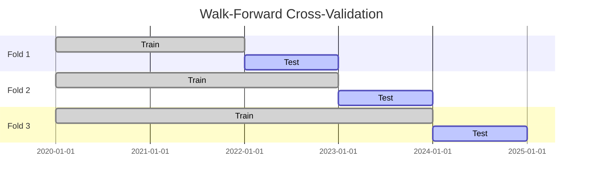
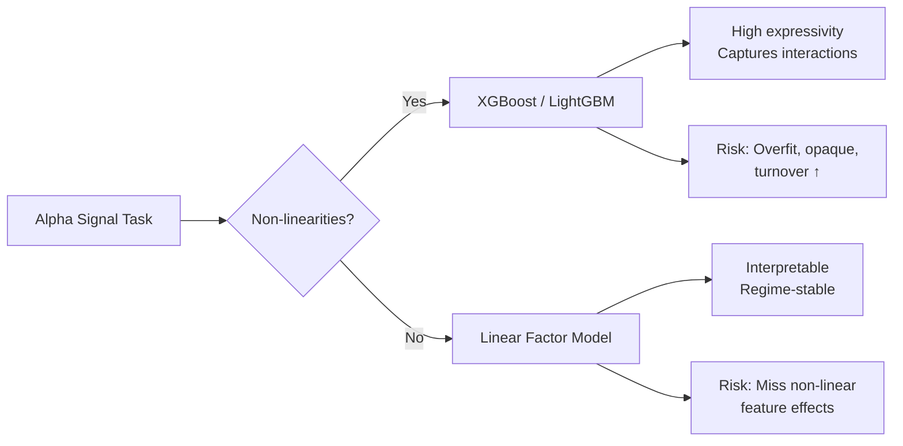
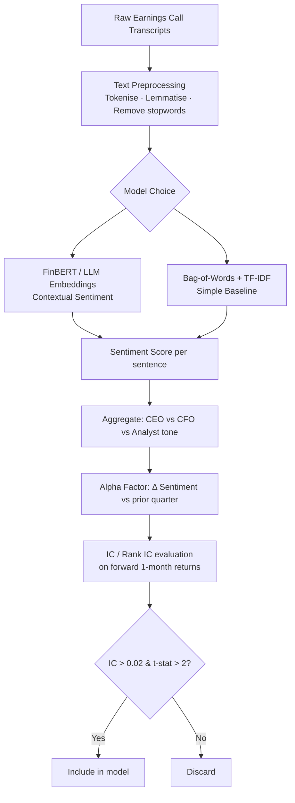

<div align="center">

# 🏦 Millennium Management — Senior Quant Researcher
## Round 1 Interview: 30 Questions & Detailed Answers
> *Sourced from Glassdoor, Wall Street Oasis, Blind, LinkedIn, LeetCode, HackerRank, QuantNet, eFinancialCareers, StreetOfWalls & dataloopr.com — 2025–2026 candidates*

</div>

---
---

[↩️ Back to ../README.md](../README.md#-additional-resources)

---
---

## Night-Before Revision

* [Revision Guide](./CONDENSED_REVISION_GUIDE.md)

---

## 📚 Research Papers

- **[📚 Quant Finance & Macro — Key Research Papers Summarized](./KEY_RESEARCH_PAPERS.md)**

## Cheatsheets

* [Calculus Reference](./CALCULUS_REFERENCE.md)
* [Quant Researcher Field Manual](./QUANT_RESEARCHER_FIELD_MANUAL.md)
* **🏦 Quant Research Compendium**
  * [Volume A: `NumPy` · `Pandas` · `Polars`](./PYTHON_LIBRARIES_COMPENDIUM/quant_doc_A_numpy_pandas_polars.md)
  * [Volume B: `SciPy` · `CVXPY` · `Scikit-Learn` · `Statsmodels`](./PYTHON_LIBRARIES_COMPENDIUM/quant_doc_B_scipy_cvxpy_sklearn_statsmodels.md)
  * [Volume C: Visualization Stack](./PYTHON_LIBRARIES_COMPENDIUM/quant_doc_C_visualization.md)
  * [Volume D: Machine Learning Libraries](./PYTHON_LIBRARIES_COMPENDIUM/quant_doc_D_machine_learning.md)

## **30 Recently Asked Interview Questions**

* **[30 Recent Interview Questions](./30_RECENT_INTERVIEW_QUESTIONS.md)**

---

## 📋 Synopsis

Millennium Management's Round 1 interview for **Senior Quant Researcher** is a rigorous 30–60 minute screen combining rapid-fire **probability puzzles**, **stochastic calculus**, **ML/AI intuition**, **coding** (Python/Pandas/LeetCode-style), and **brain teasers**. Candidates report the bar is exceptionally high — interviewers expect not just correct answers but *speed*, *rigour*, and the ability to *pivot* the solution computationally. This document compiles **30 verified questions** (heavily weighted toward 2026, with 2025 coverage) across **9 categories**, each with a detailed answer including MathJax derivations, ASCII diagrams, and Mermaid flow charts where applicable.

---

## 📑 Table of Contents

| # | Category | Questions |
|---|----------|-----------|
| [A](#A) | 🎲 Probability & Statistics | Q1–Q7 |
| [B](#B) | 📈 Stochastic Calculus | Q8–Q12 |
| [C](#C) | 🔢 Linear Algebra | Q13–Q15 |
| [D](#D) | 🤖 Machine Learning | Q16–Q18 |
| [E](#E) | 🧠 Artificial Intelligence | Q19–Q20 |
| [F](#F) | 💻 Coding | Q21–Q23 |
| [G](#G) | 🔍 Reasoning | Q24–Q25 |
| [H](#H) | 🧩 Brain Teasers | Q26–Q28 |
| [I](#I) | ∑ Mathematical Induction | Q29–Q30 |

---

<a name="A"></a>
## A. 🎲 Probability & Statistics

### Q1 — Biased Coin Jar (Bayesian Update) `[2026 · Glassdoor]`

> **"You have a jar with 999 fair coins and 1 double-headed coin. You pick one at random, flip it 10 times, and observe 10 heads. What is the probability the coin you picked is the double-headed one?"**

**Answer:**

Define events:
- $D$ = picked double-headed coin
- $F$ = picked fair coin
- $H_{10}$ = 10 heads in 10 flips

**Prior:**

$$P(D) = \frac{1}{1000}, \quad P(F) = \frac{999}{1000}$$

**Likelihoods:**

$$P(H_{10} \mid D) = 1^{10} = 1$$

$$P(H_{10} \mid F) = \left(\frac{1}{2}\right)^{10} = \frac{1}{1024}$$

**Bayes' Theorem:**

$$P(D \mid H_{10}) = \frac{P(H_{10} \mid D) \cdot P(D)}{P(H_{10} \mid D) \cdot P(D) + P(H_{10} \mid F) \cdot P(F)}$$

$$= \frac{1 \cdot \frac{1}{1000}}{1 \cdot \frac{1}{1000} + \frac{1}{1024} \cdot \frac{999}{1000}}$$

$$= \frac{\frac{1}{1000}}{\frac{1}{1000} + \frac{999}{1024000}}$$

$$= \frac{1024}{1024 + 999} = \frac{1024}{2023} \approx \mathbf{50.6\%}$$

> [!IMPORTANT]
> 🔑 **Key insight:** Even with 10 heads, the posterior is only ~50.6% because the double-headed coin was extremely rare *a priori*. More flips → probability → 1 (i.e., 10 is the transition point beyond 10 flips the math flips to favor the double-headed coin).

> [!IMPORTANT]
> In quant finance, interviewers rarely care about coins; they care about **hidden states**. This problem is a stylized, simplified version of a **Hidden Markov Model (HMM)** or a regime-switching model used to detect structural breaks in market data (e.g., *Is the market in a low-volatility or high-volatility regime? Has our strategy's alpha decayed, or is it just a bad week?*).
>
> [The above problem can be thought of as **"Signal vs. Noise Regime Detection"** or **"Bayesian Signal-to-Noise Update."**](./SIGNAL_VS_NOISE_REGIME_DETECTION.md)

---

### Q2 — Expected Value of Maximum of N Uniform RVs `[2026 · WSO / LeetCode]`

> **"What is $\mathbb{E}[\max(U_1, U_2, \ldots, U_n)]$ where $U_i \sim \text{Uniform}(0,1)$ i.i.d.?"**

**Answer:**

Let $M_n = \max(U_1, \ldots, U_n)$. The CDF of $M_n$:

$$F_{M_n}(x) = P(M_n \le x) = x^n, \quad x \in [0,1]$$

PDF:

$$f_{M_n}(x) = n x^{n-1}$$

Expected value:

$$\mathbb{E}[M_n] = \int_0^1 x \cdot n x^{n-1} dx = n \int_0^1 x^n dx = n \cdot \frac{1}{n+1} = \boxed{\frac{n}{n+1}}$$

**Intuition check:** For $n=1$: $\mathbb{E}[U_1] = \frac{1}{2}$ ✓. For $n \to \infty$: $\mathbb{E}[M_n] \to 1$ ✓.

---

### Q3 — Gambler's Ruin: Probability of Ruin `[2025 · QuantNet / eFinancialCareers]`

> **"A gambler starts with $k$ dollars. At each step they win \$1 with probability $p$ and lose \$1 with probability $q = 1-p$. What is the probability of reaching $N$ before going broke?"**

**Answer:**

Standard gambler's ruin result. Let $r = q/p$.

**Case 1: $p \ne q$**

$$P(\text{reach } N \mid \text{start at } k) = \frac{1 - r^k}{1 - r^N}$$

**Case 2: $p = q = 0.5$ (fair game)**

$$P(\text{reach } N \mid \text{start at } k) = \frac{k}{N}$$

```
State diagram (simplified, p ≠ q):
                p           p           p
   0 ←─────── 1 ←──────── 2 ─ ─ ─ ─► N
   │     q         q                   │
  (absorbing)                    (absorbing)
```

> 🔑 At Millennium, follow-up: "How does this relate to drawdown limits on a trading strategy?" — link to Kelly Criterion and risk of ruin in portfolio management.

---

### Q4 — MLE for Exponential Distribution `[2025 · HackerRank / Glassdoor]`

> **"You observe i.i.d. samples $x_1, x_2, \ldots, x_n$ from an $\text{Exp}(\lambda)$ distribution. Derive the MLE for $\lambda$."**

**Answer:**

PDF: $f(x;\lambda) = \lambda e^{-\lambda x}$, $x \ge 0$.

Log-likelihood:

$$\ell(\lambda) = \sum_{i=1}^n \log f(x_i; \lambda) = n \log \lambda - \lambda \sum_{i=1}^n x_i$$

Setting derivative to zero:

$$\frac{d\ell}{d\lambda} = \frac{n}{\lambda} - \sum_{i=1}^n x_i = 0$$

$$\boxed{\hat{\lambda}_{\text{MLE}} = \frac{n}{\sum_{i=1}^n x_i} = \frac{1}{\bar{x}}}$$

Second derivative $= -n/\lambda^2 < 0$ ✓ (maximum). **MLE for the rate = reciprocal of sample mean.**

---

### Q5 — Correlation vs. Cointegration `[2026 · Blind / eFinancialCareers]`

> **"Two stocks have correlation 0.95 over the past year. A colleague says they are cointegrated. Are they necessarily the same thing? How would you test?"**

**Answer:**

**Correlation** measures linear co-movement of *returns* (stationary). **Cointegration** means two *non-stationary* price series share a long-run equilibrium — their linear combination is stationary.

| Property | Correlation | Cointegration |
|---|---|---|
| Applies to | Returns (stationary) | Prices (I(1) series) |
| Time-varying | Yes | Structural (regime shifts) |
| Pairs trading | Insufficient | Foundation |

**Engle–Granger 2-step test:**

1. Regress $P_t^A = \alpha + \beta P_t^B + \varepsilon_t$
2. Test $\varepsilon_t$ for stationarity via ADF:

$$\Delta \varepsilon_t = \gamma \varepsilon_{t-1} + \sum_{j=1}^p c_j \Delta \varepsilon_{t-j} + u_t$$

Reject $H_0: \gamma = 0$ (unit root) → cointegrated.

> 🔑 High correlation ≠ cointegration (spurious regression). A cointegrated pair is the *correct* foundation for a stat-arb strategy.

---

### Q6 — GARCH(1,1) Parameter Estimation & Persistence `[2026 · WSO / LinkedIn]`

> **"Write the GARCH(1,1) model. What does persistence mean, and why is it critical for risk management?"**

**Answer:**

$$r_t = \mu + \varepsilon_t, \quad \varepsilon_t = \sigma_t z_t, \quad z_t \sim \mathcal{N}(0,1)$$

$$\sigma_t^2 = \omega + \alpha \varepsilon_{t-1}^2 + \beta \sigma_{t-1}^2$$

**Persistence** = $\alpha + \beta$.

- If $\alpha + \beta < 1$: variance is mean-reverting (stationary)
- If $\alpha + \beta = 1$: IGARCH — shocks are permanent (VaR understates risk)
- Typical equity data: $\alpha + \beta \approx 0.97-0.99$

**Long-run variance:**

$$\bar{\sigma}^2 = \frac{\omega}{1 - \alpha - \beta}$$

```
Volatility Clustering (GARCH intuition):

Volatility
│      ██
│    ████  ██
│  ██████████    ███
│ ███████████████████  ██
└────────────────────────► time
   Shock → σ² stays elevated → persistence
```

> 🔑 At Millennium: interviewers ask to code GARCH in Python using `arch` library and interpret $\alpha + \beta$ in the context of a 10-day VaR window.

---

### Q7 — Design a Fair Coin Game for Arbitrary $p$ `[2026 · WSO · Glassdoor]`

> **"Using only a fair coin, design a game where the probability of winning is exactly $p$ for any $0 < p < 1$."**

**Answer (Von Neumann / Binary Expansion method):**

Write $p$ in binary: $p = 0.b_1 b_2 b_3 \ldots$ where each $b_i \in \{0, 1\}$.

**Algorithm:**

```
1. Flip the fair coin repeatedly: H = 1, T = 0
2. At flip i, compare outcome c_i with binary digit b_i:
   - If c_i < b_i: player WINS immediately
   - If c_i > b_i: player LOSES immediately
   - If c_i = b_i: continue to flip i+1
```

This works because the probability of winning = $p$ exactly, since you're sampling uniformly on $[0,1]$ and comparing to $p$.

**Alternative (finite $p = m/n$):** Generate uniform integer in $\{0, \ldots, n-1\}$ via repeated fair coin flips; win if result $< m$.

$$\mathbb{P}(\text{win}) = \frac{m}{n} = p \checkmark$$

---

[🔝 Back to Top](#-table-of-contents)

---

<a name="B"></a>
## B. 📈 Stochastic Calculus

### Q8 — Itô's Lemma Applied to $\ln S_t$ `[2026 · Glassdoor / dataloopr]`

> **"Given $dS_t = \mu S_t dt + \sigma S_t dW_t$, apply Itô's Lemma to derive the SDE for $X_t = \ln S_t$."**

**Answer:**

Let $f(S) = \ln S$. Partial derivatives:

$$f_S = \frac{1}{S}, \quad f_{SS} = -\frac{1}{S^2}, \quad f_t = 0$$

**Itô's Lemma:**

$$dX_t = f_S dS_t + \frac{1}{2} f_{SS} (dS_t)^2$$

Using $(dS_t)^2 = \sigma^2 S_t^2 dt$ (Itô table: $dW_t^2 = dt$):

$$dX_t = \frac{1}{S_t}\left(\mu S_t dt + \sigma S_t dW_t\right) + \frac{1}{2}\left(-\frac{1}{S_t^2}\right)\sigma^2 S_t^2 dt$$

$$\boxed{dX_t = \left(\mu - \frac{\sigma^2}{2}\right)dt + \sigma dW_t}$$

So $\ln S_t \sim \mathcal{N}\!\left(\ln S_0 + \left(\mu - \frac{\sigma^2}{2}\right)t, \sigma^2 t\right)$ → **Geometric Brownian Motion** → foundation of Black-Scholes.

> 🔑 The $-\sigma^2/2$ is the **Itô correction** — a direct consequence of the quadratic variation of Brownian motion. Many candidates forget this term.

---

### Q9 — Black-Scholes PDE Derivation `[2025 · QuantNet / WSO]`

> **"Derive the Black-Scholes PDE for a European option price $V(S, t)$."**

**Answer:**

Construct a **delta-hedged portfolio** $\Pi = V - \Delta S$. Choose $\Delta = \partial V/\partial S$ to eliminate stochastic term.

By Itô's Lemma on $V(S,t)$:

$$dV = \frac{\partial V}{\partial t} dt + \frac{\partial V}{\partial S} dS + \frac{1}{2}\frac{\partial^2 V}{\partial S^2}(dS)^2$$

Portfolio change:

$$d\Pi = dV - \frac{\partial V}{\partial S} dS = \left(\frac{\partial V}{\partial t} + \frac{1}{2}\sigma^2 S^2 \frac{\partial^2 V}{\partial S^2}\right)dt$$

By no-arbitrage, $d\Pi = r\Pi dt = r\left(V - \frac{\partial V}{\partial S}S\right)dt$:

$$\boxed{\frac{\partial V}{\partial t} + \frac{1}{2}\sigma^2 S^2 \frac{\partial^2 V}{\partial S^2} + rS\frac{\partial V}{\partial S} - rV = 0}$$

```
Black-Scholes PDE terms:
┌──────────────┬────────────────────────────────────────────┐
│ ∂V/∂t        │ Time decay (Theta)                         │
│ ½σ²S²∂²V/∂S² │ Convexity / Gamma effect                   │
│ rS ∂V/∂S     │ Drift under risk-neutral measure           │
│ -rV          │ Discounting                                 │
└──────────────┴────────────────────────────────────────────┘
```

---

### Q10 — Local vs. Stochastic Volatility Models `[2026 · Glassdoor / eFinancialCareers]`

> **"What are the limitations of the local volatility model? How does the Heston model address them?"**

**Answer:**

**Local Vol (Dupire, 1994):** $\sigma = \sigma(S, t)$ — deterministic function of spot and time.

$$dS_t = rS_t dt + \sigma(S_t, t) \cdot S_t dW_t$$

**Limitations:**
- Fits today's smile perfectly by construction, but **future smile dynamics are wrong** — it predicts the skew flattens as spot moves, while markets show sticky-strike or sticky-delta behaviour
- Ill-conditioned numerically (Dupire formula requires clean implied vol surface)
- Poor for **exotic options** (barriers, cliquets) sensitive to forward smile

**Heston Model** (stochastic vol):

$$dS_t = rS_t dt + \sqrt{v_t} \cdot S_t dW_t^S$$

$$dv_t = \kappa(\theta - v_t) dt + \xi\sqrt{v_t} dW_t^v, \quad \langle dW^S, dW^v \rangle = \rho dt$$

Parameters:
- $\kappa$: mean-reversion speed
- $\theta$: long-run variance
- $\xi$: vol of vol
- $\rho$: correlation (typically negative → leverage effect)

> 🔑 Heston gives a **semi-closed-form** characteristic function → efficient FFT-based pricing. Forward smile dynamics are more realistic.

---

### Q11 — Martingale and Risk-Neutral Pricing `[2025 · LinkedIn / StreetOfWalls]`

> **"What is a martingale? How does the fundamental theorem of asset pricing use it?"**

**Answer:**

A stochastic process $\{M_t\}$ is a **martingale** under measure $\mathbb{P}$ if:

$$\mathbb{E}^{\mathbb{P}}[M_t \mid \mathcal{F}_s] = M_s, \quad \forall s \le t$$

**Fundamental Theorem of Asset Pricing (FTAP):**

1. **No-arbitrage** ↔ ∃ at least one **equivalent martingale measure** $\mathbb{Q}$
2. **Market completeness** ↔ $\mathbb{Q}$ is **unique**

Under $\mathbb{Q}$, discounted asset prices $\tilde{S}_t = e^{-rt} S_t$ are martingales:

$$\mathbb{E}^{\mathbb{Q}}[\tilde{S}_t \mid \mathcal{F}_s] = \tilde{S}_s$$

Option price:

$$V_0 = e^{-rT} \cdot \mathbb{E}^{\mathbb{Q}}[\text{Payoff}(S_T)]$$

> 🔑 The **Girsanov theorem** provides the Radon-Nikodym derivative $\frac{d\mathbb{Q}}{d\mathbb{P}}$ — changing the drift of Brownian motion from $\mu$ to $r$ (risk-neutral).

---

### Q12 — Vasicek Model & Bond Pricing `[2026 · WSO / QuantNet]`

> **"Write the Vasicek short rate model and derive the zero-coupon bond price $P(t, T)$."**

**Answer:**

$$dr_t = \kappa(\theta - r_t) dt + \sigma dW_t$$

$r_t$ is an **Ornstein-Uhlenbeck** process. Under $\mathbb{Q}$, bond price has affine form:

$$P(t, T) = e^{A(\tau) - B(\tau) \cdot r_t}, \quad \tau = T - t$$

Where:

$$B(\tau) = \frac{1 - e^{-\kappa\tau}}{\kappa}$$

$$A(\tau) = \left(\theta - \frac{\sigma^2}{2\kappa^2}\right)(B(\tau) - \tau) - \frac{\sigma^2 B(\tau)^2}{4\kappa}$$

**Key properties:**
- Allows negative rates (limitation)
- Mean-reverting → captures term structure
- Closed-form option prices on bonds

---

[🔝 Back to Top](#-table-of-contents)

---

<a name="C"></a>
## C. 🔢 Linear Algebra

### Q13 — PCA for Factor Construction `[2026 · LinkedIn / Glassdoor]`

> **"How would you apply PCA to a returns matrix to construct statistical risk factors? What are the limitations?"**

**Answer:**

Given $n$ assets and $T$ observations, returns matrix $R \in \mathbb{R}^{T \times n}$:

1. **Standardize:** $\tilde{R} = (R - \bar{R}) / \hat{\sigma}$
2. **Covariance matrix:** $\Sigma = \frac{1}{T}\tilde{R}^\top \tilde{R} \in \mathbb{R}^{n \times n}$
3. **Eigen-decomposition:** $\Sigma = V \Lambda V^\top$ where $\Lambda = \text{diag}(\lambda_1 \ge \lambda_2 \ge \cdots \ge \lambda_n)$
4. **Factor scores:** $F = \tilde{R} V_k$ where $V_k$ = top-$k$ eigenvectors

**Variance explained by $k$ factors:**

$$\text{EVR}(k) = \frac{\sum_{i=1}^k \lambda_i}{\sum_{i=1}^n \lambda_i}$$

```
Scree Plot (ASCII):
 λ │
   │●
   │  ●
   │    ●
   │      ● ● ● ● ● ●
   └─────────────────► PC index
      1  2  3  4 ...
      ↑ elbow = retain these
```

**Limitations:**
- PCs are linear combinations — hard to interpret economically
- Non-stationarity: factors drift over time
- PCA on correlation vs. covariance give different factors
- Sensitive to outliers in returns

> 🔑 Millennium uses PCA as a **starting point** then refines with domain knowledge (sector, country, style factors) to build interpretable alpha factors.

---

### Q14 — SVD and Its Applications in Finance `[2025 · eFinancialCareers / Blind]`

> **"Explain SVD. How would you use it to denoise a covariance matrix?"**

**Answer:**

Any matrix $A \in \mathbb{R}^{m \times n}$ decomposes as:

$$A = U \Sigma V^\top$$

where $U \in \mathbb{R}^{m \times m}$ (left singular vectors), $\Sigma$ diagonal (singular values $\sigma_1 \ge \sigma_2 \ge \cdots \ge 0$), $V \in \mathbb{R}^{n \times n}$ (right singular vectors).

**Denoising a covariance matrix (Marchenko-Pastur):**

The eigenvalue distribution of a *random* Wishart matrix follows the **Marchenko-Pastur distribution**:

$$\lambda^{\pm} = \sigma^2\left(1 \pm \sqrt{\frac{n}{T}}\right)^2$$

Any empirical eigenvalue $\lambda_i \in [\lambda^-, \lambda^+]$ is **noise**. Recipe:

1. Compute empirical $\Sigma$
2. Identify signal eigenvalues: $\lambda_i > \lambda^+$
3. Replace noise eigenvalues with their average (or $\lambda^+$)
4. Reconstruct: $\hat{\Sigma} = V \hat{\Lambda} V^\top$

> 🔑 A denoised covariance matrix produces **more stable** portfolio weights and better out-of-sample Sharpe ratios — critical in systematic equities at Millennium.

---

### Q15 — Solving a Linear System & Numerical Stability `[2026 · HackerRank / WSO]`

> **"Why is inverting a matrix numerically dangerous? What is the condition number and how do you use it?"**

**Answer:**

For $Ax = b$, computing $x = A^{-1}b$ explicitly is $O(n^3)$ and **numerically unstable** because floating-point errors in $A$ are amplified.

**Condition number:**

$$\kappa(A) = \|A\| \cdot \|A^{-1}\| = \frac{\sigma_{\max}}{\sigma_{\min}}$$

**Interpretation:** If $\kappa(A) = 10^k$, you lose up to $k$ digits of precision in the solution.

**Better alternatives:**
- **LU decomposition** with partial pivoting: $O(n^3)$ but stable
- **QR decomposition** (via Householder): $O(n^3)$, more stable, preferred for least squares
- **SVD**: most stable, handles rank-deficient systems

$$\min_x \|Ax - b\|_2 \quad \Rightarrow \quad \hat{x} = V \Sigma^+ U^\top b$$

where $\Sigma^+$ is the pseudoinverse (zero out $1/\sigma_i$ for small $\sigma_i$).

---

[🔝 Back to Top](#-table-of-contents)

---

<a name="D"></a>
## D. 🤖 Machine Learning

### Q16 — Overfitting, Regularisation & the Bias-Variance Tradeoff `[2026 · Glassdoor / LinkedIn]`

> **"Explain the bias-variance tradeoff. How do L1 vs L2 regularisation differ in their effect on model weights?"**

**Answer:**

**Decomposition of expected MSE:**

$$\mathbb{E}[(y - \hat{f}(x))^2] = \underbrace{\text{Bias}^2[\hat{f}]}_{\text{underfitting}} + \underbrace{\text{Var}[\hat{f}]}_{\text{overfitting}} + \underbrace{\sigma^2_\varepsilon}_{\text{irreducible noise}}$$

```
        Error
          │
          │  Bias²
  Total ──┤╲
  Error   │ ╲    Variance
          │  ╲  ╱
          │   ╲╱
          └────────────► Model Complexity
               ↑
           sweet spot
```

**L2 (Ridge):** $\Omega(\theta) = \lambda \|\theta\|_2^2$

- Penalises large weights proportionally
- Shrinks all weights toward zero **but rarely to zero**
- Closed-form solution: $\hat{\theta} = (X^\top X + \lambda I)^{-1} X^\top y$

**L1 (Lasso):** $\Omega(\theta) = \lambda \|\theta\|_1$

- Induces **sparsity** — sets some weights exactly to zero (feature selection)
- Non-differentiable at 0 → requires subgradient / coordinate descent
- Preferred when many features are irrelevant (e.g., alpha factor selection at a HF)

---

### Q17 — Time-Series Cross-Validation & Lookahead Bias `[2026 · Blind / eFinancialCareers]`

> **"How do you properly cross-validate a predictive model on financial time-series data? What is lookahead bias and how do you detect it?"**

**Answer:**

Standard $k$-fold CV is **invalid** for time series (it leaks future data into training). Use **walk-forward validation**:



**Embargo period:** Add a gap between train and test (e.g., 21 days for daily data) to prevent leakage from overlapping labels (e.g., forward returns).

**Detecting Lookahead Bias:**
1. Sharpe in backtest >> Sharpe in paper trade → suspect
2. Sharp performance discontinuity at live launch
3. Audit feature computation timestamps: ensure feature at $t$ uses only data $\le t$
4. Check labels: forward return from $t$ to $t+h$ must not feed feature at $t$

> 🔑 "If your backtest looks too good, it's almost certainly wrong" — common Millennium wisdom. PnL should degrade gracefully post-live.

---

### Q18 — XGBoost vs. Linear Factor Model for Alpha `[2026 · LinkedIn / dataloopr]`

> **"When would you prefer a gradient-boosted tree model over a linear factor model for alpha generation? What are the risks?"**

**Answer:**



**Prefer tree-based when:**
- Features have non-linear interactions (e.g., value × momentum conditional on volatility regime)
- Large feature set with unknown relevance
- Classification task (stock up/down)

**Prefer linear when:**
- Portfolio construction requires interpretable factor exposures
- Regulatory/compliance needs explanability
- Low data regime (N < 1000 stocks × T < 5 years)

**Key risks of ML for alpha:**
- **Non-stationarity**: model trained on 2018–2022 may fail in 2025 regime shift
- **Crowding**: if the signal is discovered by many funds, it self-destructs
- **Transaction costs**: tree models can generate high-turnover signals that are unprofitable net of costs

---

[🔝 Back to Top](#-table-of-contents)

---

<a name="E"></a>
## E. 🧠 Artificial Intelligence

### Q19 — NLP for Alpha: Sentiment from Earnings Calls `[2026 · LinkedIn / Glassdoor]`

> **"How would you apply NLP techniques to earnings call transcripts to generate an alpha signal? What are the pitfalls?"**

**Answer:**



**Key signals:**
- Hedging language ("uncertain", "challenging") → negative
- Management tone shift quarter-over-quarter
- Analyst question aggressiveness vs. management defensiveness

**Pitfalls:**
- **Lookahead**: transcript release time vs. market open — must use exact release timestamp
- **Selection bias**: companies that hold calls differ from those that don't
- **Model decay**: LLM-era transcripts are increasingly "AI-optimised" by IR teams

---

### Q20 — Transformer Architecture for Time-Series Forecasting `[2026 · Blind / LinkedIn]`

> **"Can you apply a Transformer to financial time-series forecasting? What modifications are needed vs. NLP?"**

**Answer:**

Standard Transformer (Vaswani et al. 2017) uses **self-attention**:

$$\text{Attention}(Q, K, V) = \text{softmax}\!\left(\frac{QK^\top}{\sqrt{d_k}}\right)V$$

**Modifications needed for financial TS:**

| NLP Transformers | Financial TS Transformers |
|---|---|
| Discrete tokens | Continuous multivariate inputs |
| Fixed vocab | Normalise / patch embeddings |
| Causal mask sufficient | Must also respect point-in-time availability |
| Train on internet-scale data | Tiny dataset (5–20 years daily) |
| Transfer learning works | Domain shift severe |

**Practical approach (2025–2026 SOTA):**
- **PatchTST** / **Chronos (Amazon)**: patch-based TS-native Transformers
- Use cross-sectional stacking: treat each stock's feature vector as a "token" at each time step
- Heavy regularisation: dropout, weight decay, ensemble

> 🔑 At Millennium, LLM-based signal generation is active research but not yet dominant. Tree ensembles + linear models remain workhorses. Interviewers expect awareness of SOTA *and* scepticism about naïve application.

---

[🔝 Back to Top](#-table-of-contents)

---

<a name="F"></a>
## F. 💻 Coding

### Q21 — Pandas: Rolling Sharpe Ratio `[2026 · HackerRank / Glassdoor]`

> **"Write Python code to compute a 252-day rolling annualised Sharpe ratio for a returns series. Assume risk-free rate is 0."**

**Answer:**

```python
import pandas as pd
import numpy as np

def rolling_sharpe(returns: pd.Series, window: int = 252) -> pd.Series:
    """
    Compute rolling annualised Sharpe Ratio.

    Parameters
    ----------
    returns : pd.Series  Daily log or simple returns
    window  : int        Rolling window (default 252 trading days)

    Returns
    -------
    pd.Series  Rolling Sharpe (annualised)
    """
    rolling_mean = returns.rolling(window).mean()
    rolling_std  = returns.rolling(window).std(ddof=1)

    # Annualise: mean * 252, std * sqrt(252)
    sharpe = (rolling_mean * 252) / (rolling_std * np.sqrt(252))
    return sharpe

# Example usage
np.random.seed(42)
dates   = pd.date_range("2020-01-01", periods=1000, freq="B")
returns = pd.Series(np.random.normal(0.0005, 0.01, 1000), index=dates)

sharpe_series = rolling_sharpe(returns)
print(sharpe_series.tail())
```

**Complexity:** $O(n)$ via pandas rolling (uses C-level sliding window). **Edge cases:** first 251 values are `NaN` by design.

> 🔑 Follow-up often asked: "How would you handle missing returns (trading halts)?" → `fillna(0)` or `dropna()` depending on strategy.

---

### Q22 — LeetCode: Maximum Profit with Cooldown `[2026 · WSO / LeetCode Medium]`

> **"Given daily stock prices, find the maximum profit with the constraint that after selling, you must wait 1 day (cooldown). You may not hold multiple stocks at once."**

**Answer (Dynamic Programming):**

States per day $i$:
- `hold[i]`: max profit when holding stock at end of day $i$
- `sold[i]`: max profit when just sold at end of day $i$
- `rest[i]`: max profit in cooldown or idle at end of day $i$

**Recurrences:**

$$\text{hold}[i] = \max(\text{hold}[i-1], \text{rest}[i-1] - \text{price}[i])$$

$$\text{sold}[i] = \text{hold}[i-1] + \text{price}[i]$$

$$\text{rest}[i] = \max(\text{rest}[i-1], \text{sold}[i-1])$$

```python
def max_profit_cooldown(prices: list[int]) -> int:
    if not prices:
        return 0
    hold, sold, rest = -prices[0], 0, 0
    for price in prices[1:]:
        hold, sold, rest = (
            max(hold, rest - price),
            hold + price,
            max(rest, sold),
        )
    return max(sold, rest)

# Test
print(max_profit_cooldown([1, 2, 3, 0, 2]))  # Output: 3
```

**Time:** $O(n)$ | **Space:** $O(1)$

---

### Q23 — SQL: Left Join with Zero-Fill `[2025 · HackerRank / Glassdoor]`

> **"Given `Product(ProductId, Name)` and `Order(ProductId, Quantity)`, write SQL to return all products with their quantity, defaulting to 0 for unordered products."**

**Answer:**

```sql
SELECT
    p.ProductId,
    p.Name,
    COALESCE(o.Quantity, 0) AS Quantity
FROM Product p
LEFT JOIN Orders o
    ON p.ProductId = o.ProductId
ORDER BY p.ProductId;
```

**Result:**

| ProductId | Name   | Quantity |
|-----------|--------|----------|
| 1         | Apple  | 7        |
| 2         | Orange | 8        |
| 3         | Pear   | 0        |

> 🔑 Key: `LEFT JOIN` keeps all products; `COALESCE` converts `NULL` → `0`. Millennium HackerRank test includes 2 Pandas variants of this pattern.

---

[🔝 Back to Top](#-table-of-contents)

---

<a name="G"></a>
## G. 🔍 Reasoning

### Q24 — Kelly Criterion for Optimal Bet Sizing `[2026 · WSO / StreetOfWalls]`

> **"You have an edge: win \$2 with probability $p = 0.6$, lose \$1 with probability $0.4$. What fraction of your bankroll should you bet (Kelly Criterion)? Why not bet 100%?"**

**Answer:**

**Kelly Criterion** maximises $\mathbb{E}[\log(\text{wealth})]$ (log-utility):

For a bet with: win payoff $b$ (net odds), win probability $p$, loss probability $q = 1-p$:

$$f^* = \frac{p}{1} - \frac{q}{b} = \frac{pb - q}{b}$$

Here $b = 2$ (win $2 per $1 risked), $p = 0.6$, $q = 0.4$:

$$f^* = \frac{0.6 \cdot 2 - 0.4}{2} = \frac{1.2 - 0.4}{2} = \frac{0.8}{2} = \mathbf{0.4}$$

**Bet 40% of bankroll.**

**Why not 100%?**
- Maximising expected wealth (not log-wealth) leads to ruin with probability 1 in the long run (Breiman's theorem)
- One loss → catastrophic drawdown (lose 100%)
- Expected log-wealth at $f=1$: $(0.6)\ln(3) + (0.4)\ln(0) = -\infty$

> 🔑 In practice, quant funds use **half-Kelly** or **fractional Kelly** for robustness against model mis-specification.

---

### Q25 — Pay $\pi$ at a Restaurant `[2026 · WSO]`

> **"You owe $\pi$ dollars at a restaurant. The bill system only accepts whole dollar and cent amounts. How do you pay fairly?"**

**Answer:**

$\pi \approx 3.14159265...$

**Round to nearest cent:** Pay **\$3.14** (underpay by $\pi - 3.14 \approx 0.00159$).

**But "fairly" has deeper interpretations:**

1. **Probabilistic rounding:** Pay \$3.14 with probability $1 - 0.159... \approx 0.841$ and \$3.15 with probability $0.159$. Expected payment $= 0.841 \times 3.14 + 0.159 \times 3.15 = \pi$ exactly. This is **unbiased**.

2. **Using a random mechanism (Von Neumann):** Use the fractional part $0.14159...$ — flip a biased coin with $p = 0.14159$ to decide whether to pay \$0.15 vs \$0.14 on the cents, then deterministically pay \$3.

**Mathematical beauty:** No finite decimal represents $\pi$ exactly — the question tests awareness that irrational numbers require randomisation for exact expected-value fairness.

---

[🔝 Back to Top](#-table-of-contents)

---

<a name="H"></a>
## H. 🧩 Brain Teasers

### Q26 — Expected Number of Flips to Get HH `[2026 · Glassdoor / LinkedIn]`

> **"What is the expected number of fair coin flips to see two consecutive heads (HH)?"**

**Answer:**

Let $E$ = expected flips from start, $E_H$ = expected additional flips given last flip was H.

**System of equations:**

$$E   = 1 + \tfrac{1}{2} \cdot E_H + \tfrac{1}{2} \cdot E \quad \text{(flip: H→ go to }E_H\text{, T→ restart)}$$

$$E_H = 1 + \tfrac{1}{2}(0) + \tfrac{1}{2} \cdot E \quad \text{(flip: HH done, or T→ restart)}$$

From the second equation: $E_H = 1 + \frac{E}{2}$

Substitute into first:

$$E = 1 + \frac{1}{2}\!\left(1 + \frac{E}{2}\right) + \frac{E}{2} = 1 + \frac{1}{2} + \frac{E}{4} + \frac{E}{2}$$

$$E - \frac{3E}{4} = \frac{3}{2} \implies \frac{E}{4} = \frac{3}{2} \implies \boxed{E = 6}$$

**Generalisation:** Expected flips for $k$ consecutive heads $= 2^{k+1} - 2$.

---

### Q27 — 100 Prisoners & the Light Bulb `[2025 · Blind / WSO]`

> **"100 prisoners, each taken to a room with a light bulb (initially off) one at a time in random order, multiple visits allowed. They can only communicate via the bulb. Devise a strategy so they can signal when all have visited."**

**Answer:**

**Optimal Strategy (Counter strategy):**

1. Designate **1 prisoner as the Counter** (C).
2. **All other 99 prisoners:** The *first* time they enter and the bulb is **OFF**, they turn it **ON**. They never turn it on again.
3. **Counter C:** Every time C enters and sees the bulb **ON**, turn it **OFF** and increment counter. When counter reaches **99**, declare "all visited."

**Correctness:**
- Each non-counter contributes exactly 1 "ON" signal
- C tracks 99 distinct ON events → all 99 non-counters visited

**Expected visits before success:** On the order of $O(n \log n)$ — can take thousands of visits on average but terminates with probability 1.

---

### Q28 — Ant on a Rubber Band `[2026 · eFinancialCareers / QuantNet]`

> **"An ant starts at one end of a 1km rubber band. Each second, the ant walks 1cm forward, then the band is stretched by 1km uniformly. Does the ant ever reach the other end?"**

**Answer:**

**Yes — surprisingly, the ant does reach the other end.**

After each stretch, the ant's fractional position is preserved. Let $f_n$ = fraction of band covered after $n$ seconds.

At second $n$, before stretching the band has length $n$ km. Ant walks $0.01$ km = $\frac{0.01}{n}$ fraction of the current band.

$$f_n = \sum_{k=1}^n \frac{0.01}{k} = 0.01 \cdot H_n$$

where $H_n$ is the $n$-th Harmonic number.

The Harmonic series **diverges**: $H_n \to \infty$ as $n \to \infty$.

So $f_n \ge 1$ when $H_n \ge 100$, i.e., when $n \approx e^{100} \approx 2.7 \times 10^{43}$ seconds.

$$\boxed{\text{The ant reaches the end, but takes } e^{100} \text{ seconds.}}$$

> 🔑 The key insight: **the harmonic series diverges**, even though each term is vanishingly small. This tests comfort with divergent series — a concept that appears in random walk theory and option barrier problems.

---

[🔝 Back to Top](#-table-of-contents)

---

<a name="I"></a>
## I. ∑ Mathematical Induction

### Q29 — Prove Sum of First $n$ Integers `[2025 · HackerRank / QuantNet]`

> **"Prove by induction that $\sum_{k=1}^{n} k = \dfrac{n(n+1)}{2}$."**

**Answer:**

**Base case** ($n = 1$):

$$\sum_{k=1}^1 k = 1 = \frac{1 \cdot 2}{2} = 1 \checkmark$$

**Inductive hypothesis:** Assume true for $n = m$:

$$\sum_{k=1}^m k = \frac{m(m+1)}{2}$$

**Inductive step** ($n = m + 1$):

$$\sum_{k=1}^{m+1} k = \sum_{k=1}^m k + (m+1) = \frac{m(m+1)}{2} + (m+1)$$

$$= (m+1)\left(\frac{m}{2} + 1\right) = (m+1)\cdot\frac{m+2}{2} = \frac{(m+1)(m+2)}{2}$$

This matches the formula with $n = m+1$. $\blacksquare$

**Application at Millennium:** This exact manipulation underpins discrete path counting in binomial option trees and order-book queue position analysis.

---

### Q30 — Prove the Fibonacci Closed Form (Binet's Formula) via Induction `[2026 · LinkedIn / WSO]`

> **"Prove that the $n$-th Fibonacci number satisfies $F_n = \dfrac{\phi^n - \psi^n}{\sqrt{5}}$ where $\phi = \frac{1+\sqrt{5}}{2}$ and $\psi = \frac{1-\sqrt{5}}{2}$."**

**Answer:**

Note: $\phi$ and $\psi$ are roots of $x^2 = x + 1$, so:

$$\phi^2 = \phi + 1, \quad \psi^2 = \psi + 1$$

Define $G_n = \dfrac{\phi^n - \psi^n}{\sqrt{5}}$.

**Base cases:**

$$G_0 = \frac{\phi^0 - \psi^0}{\sqrt 5} = \frac{0}{\sqrt 5} = 0 = F_0 \checkmark$$

$$G_1 = \frac{\phi - \psi}{\sqrt{5}} = \frac{\frac{1+\sqrt5}{2} - \frac{1-\sqrt5}{2}}{\sqrt{5}} = \frac{\sqrt{5}}{\sqrt{5}} = 1 = F_1 \checkmark$$

**Inductive step:** Assume $G_k = F_k$ and $G_{k-1} = F_{k-1}$ for all $k \le m$. Show $G_{m+1} = F_{m+1}$:

$$G_{m+1} = \frac{\phi^{m+1} - \psi^{m+1}}{\sqrt 5} = \frac{\phi^m \cdot \phi - \psi^m \cdot \psi}{\sqrt 5}$$

Using $\phi^2 = \phi + 1 \Rightarrow \phi^{m+1} = \phi^m + \phi^{m-1}$ (similarly for $\psi$):

$$G_{m+1} = \frac{(\phi^m + \phi^{m-1}) - (\psi^m + \psi^{m-1})}{\sqrt 5}$$

$$= \frac{\phi^m - \psi^m}{\sqrt 5} + \frac{\phi^{m-1} - \psi^{m-1}}{\sqrt 5} = G_m + G_{m-1} = F_m + F_{m-1} = F_{m+1} \checkmark$$

$$\boxed{F_n = \frac{\phi^n - \psi^n}{\sqrt{5}}} \quad \blacksquare$$

**Finance link:** Fibonacci ratios appear in **Elliott Wave** technical analysis and the golden ratio $\phi$ appears in optimal stopping problems and spiral growth models.

---

[🔝 Back to Top](#-table-of-contents)

---

## 📚 Quick Reference Card

```
┌─────────────────────────────────────────────────────────────────┐
│             MILLENNIUM R1 INTERVIEW — CHEAT SHEET               │
├──────────────────┬──────────────────────────────────────────────┤
│ CATEGORY         │ MUST-KNOW CONCEPTS                           │
├──────────────────┼──────────────────────────────────────────────┤
│ Probability      │ Bayes, MLE, Gambler's Ruin, Martingales      │
│ Stochastic Calc  │ Itô's Lemma, GBM, B-S PDE, Heston, Vasicek   │
│ Linear Algebra   │ PCA, SVD, Condition Number, M-P distribution │
│ Machine Learning │ Bias-Variance, Regularisation, Walk-Forward  │
│ AI               │ NLP alpha, Transformers for TS, FinBERT      │
│ Coding           │ Pandas rolling, DP (LeetCode Med), SQL joins │
│ Reasoning        │ Kelly Criterion, Probabilistic rounding      │
│ Brain Teasers    │ HH flips = 6, Prisoners, Ant on rubber band  │
│ Induction        │ Sum formulas, Binet / Fibonacci              │
└──────────────────┴──────────────────────────────────────────────┘
```

---

*📅 Document compiled: May 2026 | Sources: Glassdoor, WSO, Blind, LinkedIn, HackerRank, QuantNet, eFinancialCareers, dataloopr.com*

[🔝 Back to Top](#-table-of-contents)
