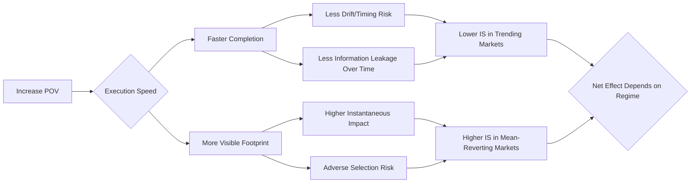

# **Execution Dynamics**
**Execution Dynamics** expected knowledge for a **Senior Quantitative Researcher**.

---
---

[↩️ Back to README.md](./README.md#-additional-resources)

---
---

## 📑 Table of Contents

| # | Section | Topics |
|---|---------|--------|
| 1 | [📈 Impact Scaling Laws — Linear vs Square-Root](#1--impact-scaling-laws--linear-vs-square-root) | Almgren linearity, square-root empirics, regime theory |
| 2 | [⚡ Participation Rate Dynamics](#2--participation-rate-dynamics) | POV curves, cost decomposition, non-monotonicity |
| 3 | [🤖 Algorithmic Execution & Information Leakage](#3--algorithmic-execution--information-leakage) | Optimal algos, fill-rate tapering, adverse selection |
| 4 | [📎 Quick Reference — Key Formulas Cheatsheet](#-quick-reference--key-formulas-cheatsheet) | Cheatsheet |

---

## 1. 📈 Impact Scaling Laws — Linear vs Square-Root

[↑ Back to Top](#-table-of-contents)

### 1.1 The Almgren Linearity Observation — Why It Holds in Narrow Samples

$$\text{If } \frac{Q}{\text{ADV}} \ll 1 \implies C \approx \alpha \cdot \frac{Q}{\text{ADV}} \quad (\text{locally linear})$$

**The key insight:** Almgren's dataset was concentrated in **small participation regimes**, where the true power-law curve appears approximately linear near the origin:

```
Market Impact (bps)
    │                                          ← True curve (square-root)
    │                                     ✦
    │                               ✦
    │                         ✦
    │                   ✦       ← Linear approximation valid here
    │             ✦ ✦
    │         ✦✦
    │     ✦✦✦
    │ ✦✦✦
    └────────────────────────────────────────
      0    5%   10%   20%   40%   60%  ADV%
              ▲
         Almgren's sample concentrated here ─ looks linear
```

### 1.2 The Square-Root Law (Industry Standard Baseline)

$$\boxed{C_{\text{impact}} \approx \sigma \cdot \sqrt{\frac{Q}{V_{\text{daily}}}}}$$

Where $V_{\text{daily}}$ is the expected daily trading volume. This is the **Loeb / Grinold-Kahn / Square-Root Impact** formula.

**Dimensional intuition:**
- $\sigma$ scales impact to units of price volatility
- $\sqrt{Q/V}$: doubling order size increases cost by $\sqrt{2} \approx 1.41\times$, not $2\times$ → **sublinear**

### 1.3 Regime-Dependent Curvature

| Participation Range | Impact Behaviour | Explanation |
|---------------------|-----------------|-------------|
| $\pi < 5\%$ | ~Linear | Order small vs. available liquidity; limited signalling |
| $5\% < \pi < 20\%$ | Square-root (sublinear) | Consuming displayed book; moderate impact |
| $\pi > 20\%$ | Convex / superlinear | Walking the book; adverse selection dominates |
| $\pi > 40\%$ | Sharply superlinear | You *are* the market; signalling catastrophic |

### 1.4 Empirical Testing Protocol

```python
# Pseudocode: Test linear vs. nonlinear impact scaling
for bin in participation_bins([0,5], [5,10], [10,20], [20,40], [40+]):
    fit_linear(impact ~ size_over_ADV)
    fit_sqrt(impact ~ sqrt(size_over_ADV) * vol)
    fit_power(impact ~ (size_over_ADV)**delta * vol)
    compare_OOS_MAE_by_bin()
    plot_impact_curve_by_bin()
# Validate: slope changes confirm regime-dependent functional form
```

---

## 2. ⚡ Participation Rate Dynamics

[↑ Back to Top](#-table-of-contents)

### 2.1 Cost Decomposition — Fixed Size, Varying POV

$$\underbrace{C_{\text{total}}(\pi)}_{\text{total execution cost}} = \underbrace{C_{\text{impact}}(\pi)}_{\uparrow \text{ with } \pi} + \underbrace{C_{\text{timing}}(\pi)}_{\downarrow \text{ with } \pi}$$

The **optimal participation rate** $\pi^*$ minimises total expected cost:

$$\pi^* = \arg\min_{\pi}\ \left[\ \underbrace{\eta \cdot \sigma \cdot \pi^{\gamma}}_{\text{impact term}} + \underbrace{\lambda \cdot \sigma^2 \cdot T(\pi)}_{\text{timing risk}}\ \right]$$

Where $T(\pi) = Q / (\pi \cdot V)$ is the time-to-complete as a function of POV.

### 2.2 The Non-Monotonic Cost Paradox

**Counterintuitive finding:** At very high participation rates, observed IS can *fall*.

```
Cost (IS bps)
    │
    │   ✦
    │     ✦
    │       ✦ ✦           ← timing risk dominates here if slow
    │            ✦  ✦
    │                ✦ ✦  ← aggressive fills faster, avoids drift
    │                      ✦
    └─────────────────────────────────────
      Low π              High π
```

**Three explanations for this paradox:**

1. **Selection Bias** — High-POV orders are chosen *when* liquidity is good or alpha is strong; the decision to be aggressive is endogenous.

2. **Opportunity Cost Dominance** — If price drifts strongly against you while waiting, faster (higher POV) execution avoids the drift and reduces total IS even if instantaneous impact is higher.

3. **Temporary vs. Permanent Impact** — Temporary impact reverts; if the order finishes fast and impact reverts, measured IS vs. arrival can be *lower* than a slow order that suffers drift.

### 2.3 The Information-Leakage Non-Monotonicity

```text
 INCREASE POV ──► EXECUTION SPEED
                         │
         ┌───────────────┴───────────────┐
         ▼                               ▼
 FASTER COMPLETION               MORE VISIBLE FOOTPRINT
         │                               │
   ┌─────┴─────┐                   ┌─────┴─────┐
   ▼           ▼                   ▼           ▼
LESS DRIFT/ LESS INFO            HIGHER INST.  ADVERSE
TIMING RISK LEAKAGE              IMPACT        SELECTION
   │           │                   │           │
   └─────┬─────┘                   └─────┬─────┘
         ▼                               ▼
 LOWER IS IN TRENDING            HIGHER IS IN MEAN-
       MARKETS                    REVERTING MARKETS
         │                               │
         └───────────────┬───────────────┘
                         ▼
           NET EFFECT DEPENDS ON REGIME
```



---

## 3. 🤖 Algorithmic Execution & Information Leakage

[↑ Back to Top](#-table-of-contents)

### 3.1 Why Algos Beat Naive Aggressive Participation

**The Paradox of Aggression:** Simply maximising participation rate is not optimal because:

$$\frac{\partial_\text{FillQuality}}{\partial_{\pi}} \xrightarrow{\pi \to \text{high}} 0^- \quad \text{(diminishing and eventually negative returns)}$$

**Fill-rate tapering mechanism:**

```
Phase 1: Low π
  You are invisible → passive fills against available liquidity
  Market does not reprice → low impact, good fills

Phase 2: Medium π
  Market detects informed flow → LPs widen spreads
  Adverse selection increases → fill quality degrades

Phase 3: High π
  Market fully recognizes large order → quotes pulled
  Price moves against → fill rate saturates, IS explodes
```

### 3.2 Optimal Algo Objective Function

$$\min_{\{x_t\}} \quad \mathbb{E}\!\left[\sum_{t=1}^{T} \underbrace{x_t \cdot P_t}_{\text{execution cost}} \right] + \lambda \cdot \text{Var}\!\left[\sum_{t} x_t \cdot P_t\right]$$

Subject to: $\sum_{t} x_t = Q$ (complete the order)

**VWAP schedule:** $x_t \propto V_t / \sum_s V_s$ (track volume profile)  
**IS minimising schedule:** $x_t^{\*} =$ solution to Almgren-Chriss PDE (trade off urgency vs. impact)

### 3.3 Algo Selection Decision Framework (Broker-Algo Tools)

| Market Condition | Preferred Algo | Rationale |
|-----------------|----------------|-----------|
| Low vol, deep book | VWAP / POV passive | Minimize footprint |
| High alpha urgency | IS / Arrival Price | Minimize drift |
| High vol, wide spread | Liquidity-seeking | Route to dark/midpoint |
| End-of-day, closing | MOC / Close | Minimize tracking error vs. close |
| Mean-reverting tape | Passive limit | Earn spread, avoid crossing |

---

## 📎 Quick Reference — Key Formulas Cheatsheet

[↑ Back to Top](#-table-of-contents)

<details>
<summary><strong>📎 Quick Reference — Key Formulas Cheatsheet</strong></summary>

$$\text{IS} = \frac{P_{\text{exec}} - P_{\text{arrival}}}{P_{\text{arrival}}}$$

$$C_{\text{impact}} \approx \sigma \cdot \sqrt{\frac{Q}{V_{\text{daily}}}} \quad \text{(square-root law)}$$

$$C_{\text{total}}(\pi) = \eta \cdot \sigma \cdot \pi^{\gamma} + \lambda \cdot \sigma^2 \cdot T(\pi) \quad \text{(impact + timing risk)}$$

$$Z = X - Y \sim \mathcal{N}(\mu_X - \mu_Y,\ \sigma_X^2 + \sigma_Y^2 - 2 \cdot \text{Cov}(X,Y))$$

$$\ln(1 + x) \approx x - \frac{x^2}{2} \quad \text{for small } x$$

$$\text{VaR}_{99\\%} \approx \mu - 2.326 \cdot \sigma$$


</details>

---
